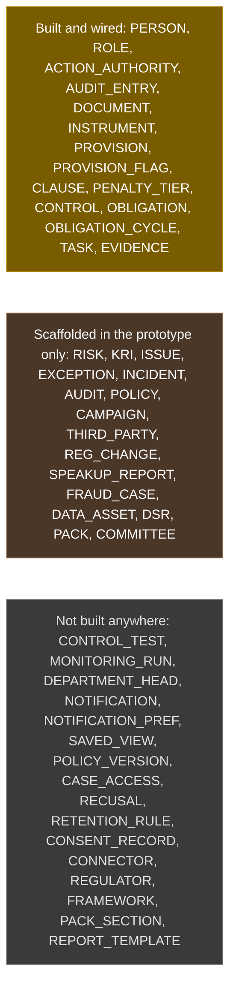

# Data model

Generated by Prototype to Product Kit v2.1 · 2026-08-27
Last updated: 2026-08-27

Every entity the build needs, every field, and whether each field is stored or
computed on read. Edited in place at every slice close-out.

**How to read a field row.** `Required` is whether the record can exist without
it. `Derived or stored` is the ruling: a **DERIVED** field is computed on read
and carries its formula, and it must never appear as a column. `Source` cites
the FRD section or the prototype element the field came from, or the migration
that already created it.

**Built columns.** A field marked `built` in `Source` already exists in
`apps/api/prisma/schema.prisma`. A field marked `proto` exists only in the
prototype's `src/types/index.ts`.

---

## 1. Entities

### M-01 Platform

Module note: [[M-01]] · every slice that touches these entities: [[traceability#2. Entities]]

#### E-01 Organization

| Field | Type | Required | Derived or stored | Example | Source |
|---|---|---|---|---|---|
| id | id | yes | stored | `cl9x2k...` | built |
| name | text | yes | stored | Sankalp Pension Funds Pvt. Ltd. | built |
| shortName | text, max 60 | yes | stored | Sankalp Pension Funds | FRD §7.4, built |
| timezone | text | yes | stored | Asia/Kolkata | FRD `BR-SCH-09`, built |
| locale | text | yes | stored | en-IN | FRD §17.7, built |
| financialCalendar | text | yes | stored | Apr to Mar | FRD §14.1 |
| createdAt | timestamp | yes | stored | 2026-08-23T04:11:00Z | built |

#### E-02 Organisation profile

What the firm **is**, which is what decides whether a provision binds it.

| Field | Type | Required | Derived or stored | Example | Source |
|---|---|---|---|---|---|
| id | id | yes | stored | `cl9x2k...` | built |
| organizationId | ref E-01 | yes | stored | `cl9x2k...` | built |
| legalForm | text | yes | stored | Private limited company | built |
| jurisdictions | text list | yes | stored | IN, IN-MH | built |
| capacities | text list | yes | stored | employer, pensionFundManager, dataFiduciary | built |
| registrations | map | no | stored | `{ "PT-MH": "27...", "PFRDA": "PFM/..." }` | built |
| thresholds | map | no | stored | `{ "ptAnnualLiability": 100000 }` | built |
| updatedAt | timestamp | yes | stored | 2026-08-25T09:00:00Z | built |

#### E-03 Person

| Field | Type | Required | Derived or stored | Example | Source |
|---|---|---|---|---|---|
| id | id | yes | stored | `cl9x2k...` | built |
| organizationId | ref E-01 | yes | stored | `cl9x2k...` | built |
| fullName | text | yes | stored | Anjali Deshmukh | FRD §4.2, built |
| jobTitle | text | yes | stored | Head of Compliance | FRD §4.2, built |
| email | text | no | stored | anjali.deshmukh@example.in | built |
| department | enum, 8 values | yes | stored | Compliance and Company Secretarial | FRD §4.5, built. The one place department is stored |
| lineOfDefence | enum First, Second, Third | yes | stored | Second | FRD §4.1, built |
| status | enum Active, Away, Invited, Suspended | yes | stored | Active | FRD §7.1, built |
| origin | enum reference, sample, earned | yes | stored | sample | FRD §18.2, built as `Origin` |
| initials | text | n/a | **DERIVED**, first letter of each name part | AD | proto `Person.initials` |
| isDepartmentHead | boolean | n/a | **DERIVED**, `E-07.personId = this.id` | true | FRD §4.13 |

#### E-04 Role

| Field | Type | Required | Derived or stored | Example | Source |
|---|---|---|---|---|---|
| code | text, max 24 | yes | stored | COMPLIANCE_MGR | FRD §4.4, built |
| name | text | yes | stored | Compliance Manager | FRD §4.4, built |
| description | text | yes | stored | Obligations, clause decisions, approvals | built |

Nine roles ship as reference data: EXEC, RISK_MGR, COMPLIANCE_MGR,
COMPLIANCE_ANALYST, CONTROL_OWNER, AUDITOR, ADMIN, AUDIT_CTTEE, RISK_CTTEE.

#### E-05 Person role

| Field | Type | Required | Derived or stored | Example | Source |
|---|---|---|---|---|---|
| personId | ref E-03 | yes | stored | `cl9x2k...` | FRD §4.2, built |
| roleCode | ref E-04 | yes | stored | COMPLIANCE_MGR | built |

Person to role is many to many. The build must not assume one role per person.

#### E-06 Action authority

The §4.10 matrix, held as data.

| Field | Type | Required | Derived or stored | Example | Source |
|---|---|---|---|---|---|
| action | text, max 48 | yes | stored | `clause.save` | FRD §4.10, built |
| roleCode | ref E-04 | yes | stored | COMPLIANCE_MGR | built |
| separationOfDuties | boolean | yes | stored | true | FRD `BR-AUT-05`, built |
| requiresDepartment | enum, 8 values | no | stored | Compliance and Company Secretarial | FRD `BR-AUT-02`, built |
| requiresLineOfDefence | enum First, Second, Third | no | stored | Second | FRD `BR-AUT-10`, §21.12 |

#### E-07 Department head

| Field | Type | Required | Derived or stored | Example | Source |
|---|---|---|---|---|---|
| department | enum, 8 values | yes | stored | Finance and Tax | FRD §4.13 |
| personId | ref E-03 | yes | stored | `cl9x2k...` | FRD §4.13 |
| effectiveFrom | date | yes | stored | 2026-04-01 | FRD §4.13, changes are audited |

#### E-08 Session

| Field | Type | Required | Derived or stored | Example | Source |
|---|---|---|---|---|---|
| id | id | yes | stored | `cl9x2k...` | built |
| personId | ref E-03 | yes | stored | `cl9x2k...` | built |
| createdAt | timestamp | yes | stored | 2026-08-27T06:00:00Z | built |
| expiresAt | timestamp | yes | stored | 2026-08-27T14:00:00Z | built |
| revokedAt | timestamp | no | stored | n/a | built |
| isLive | boolean | n/a | **DERIVED**, `revokedAt is null AND expiresAt > now` | true | FRD G-02 |

#### E-09 Audit entry

| Field | Type | Required | Derived or stored | Example | Source |
|---|---|---|---|---|---|
| id | id, `LOG-NNNNNNN` | yes | stored | `LOG-0000412` | FRD §7.4, built |
| seq | integer, unique | yes | stored | 412 | built. Gaps are themselves evidence of tampering |
| at | timestamp | yes | stored | 2026-08-27T06:14:22Z | FRD `BR-AUD-01`, built |
| actorId | ref E-03 | no | stored | `cl9x2k...` | built. Null means a system event |
| actorLabel | text | no | stored | Anjali Deshmukh | built |
| action | text, max 48 | yes | stored | `clause.save` | built |
| entityType | text, max 32 | yes | stored | SourceClause | built |
| entityId | text, max 48 | no | stored | `SRC-00231` | built |
| detail | map | no | stored | `{ "controlId": "CTRL-0273" }` | FRD `BR-AUD-05`, built. Never the substance of a confidential case |
| prevHash | text, 64 | no | stored | `9f2c...` | FRD `BR-AUD-02`, built |
| hash | text, 64 | yes | stored | `4ab1...` | built |
| chainIntact | boolean | n/a | **DERIVED**, recompute `hash` over content plus `prevHash` and compare | true | FRD `BR-AUD-02` |

#### E-10 Id sequence

| Field | Type | Required | Derived or stored | Example | Source |
|---|---|---|---|---|---|
| scope | text, max 16 | yes | stored | `CTRL` or `INC:2026` | FRD §7.4, built |
| value | integer | yes | stored | 273 | built |

#### E-11 Notification

| Field | Type | Required | Derived or stored | Example | Source |
|---|---|---|---|---|---|
| id | id | yes | stored | `cl9x2k...` | proto `NotificationItem` |
| recipientId | ref E-03 | yes | stored | `cl9x2k...` | FRD §11.3 |
| at | timestamp | yes | stored | 2026-08-27T05:59:00Z | FRD §11.3 |
| eventType | enum, 19 values | yes | stored | duty.overdue.day1 | FRD §11.3, one row per matrix line |
| title | text | yes | stored | Profession tax return overdue | proto |
| body | text | no | stored | OBL-0142 cycle 2026-06 is one day past due | proto |
| severity | enum info, warn, critical | yes | stored | warn | proto |
| entityType | text | no | stored | ObligationCycle | proto |
| entityId | text | no | stored | `OBL-0142.2026-06` | proto |
| channel | enum inApp, email, digest | yes | stored | inApp | FRD §11.3 |
| deliveredAt | timestamp | no | stored | 2026-08-27T05:59:04Z | FRD G-06, delivery confirmation |
| readAt | timestamp | no | stored | n/a | proto `read` |
| isUnread | boolean | n/a | **DERIVED**, `readAt is null` | true | proto |

#### E-12 Saved view

| Field | Type | Required | Derived or stored | Example | Source |
|---|---|---|---|---|---|
| id | id | yes | stored | `cl9x2k...` | proto `components/kit/SavedViews.tsx` |
| personId | ref E-03 | yes | stored | `cl9x2k...` | FRD §8.3 |
| surface | text | yes | stored | `/obligations` | proto |
| label | text, max 60 | yes | stored | My overdue duties | proto |
| filters | map | yes | stored | `{ "status": "overdue", "owner": "self" }` | proto |

### M-02 Source

Module note: [[M-02]] · every slice that touches these entities: [[traceability#2. Entities]]

#### E-13 Document

The bytes behind an instrument or a piece of evidence, addressed by content.

| Field | Type | Required | Derived or stored | Example | Source |
|---|---|---|---|---|---|
| sha256 | text, 64 | yes | stored | `74e407ade254...` | FRD G-14, built |
| byteSize | integer | yes | stored | 617832 | built |
| mimeType | text | yes | stored | application/pdf | built |
| pageCount | integer | no | stored | 34 | built |
| storedAt | timestamp | yes | stored | 2026-08-23T04:20:00Z | built |

#### E-14 Source instrument

| Field | Type | Required | Derived or stored | Example | Source |
|---|---|---|---|---|---|
| id | id, `INST-NNN` | yes | stored | `INST-024` | FRD §7.4, built |
| title | text | yes | stored | The Maharashtra State Tax on Professions, Trades, Callings and Employments Act, 1975 | built |
| shortTitle | text, max 60 | yes | stored | Maharashtra Profession Tax Act 1975 | FRD §7.4, built |
| citation | text | no | stored | Mah. XVI of 1975 | FRD §7.4, built |
| authority | text | yes | stored | Government of Maharashtra | FRD §5.1, built |
| regulator | ref E-78 | no | stored | `REG-003` | proto `SourceInstrument.regulator` |
| jurisdiction | text, max 8 | yes | stored | IN-MH | built |
| type | enum, 10 values | yes | stored | Act | FRD §7.1, built |
| issuedOn | date | no | stored | 1975-04-01 | built |
| effectiveFrom | date | no | stored | 1975-04-01 | built |
| version | text | no | stored | v2025.12 | proto `SourceInstrument.version` |
| status | enum InForce, Draft, Superseded, Repealed | yes | stored | InForce | FRD §7.1, built |
| documentSha256 | ref E-13 | no | stored | `74e407ade254...` | built |
| sourceUrl | text | no | stored | https://www.indiacode.nic.in/handle/123456789/21066 | built |
| retrievedAt | timestamp | no | stored | 2026-08-23T04:20:00Z | built |
| retrievalMethod | enum fetched, manualUpload | no | stored | manualUpload | FRD §5.2, built |
| textLayer | enum native, ocr, none | yes | stored | native | built |
| summary | text | no | stored | What this act covers, in plain language | proto `SourceInstrument.summary` |
| applicability | text | no | stored | How it affects the firm | proto `SourceInstrument.applicability` |
| origin | enum reference, sample, earned | yes | stored | earned | FRD §18.2, built as `Origin` |
| createdAt | timestamp | yes | stored | 2026-08-23T04:20:00Z | built |
| provisionCount | integer | n/a | **DERIVED**, count of E-16 with this `instrumentId` | 47 | FRD §7.2 |
| awaitingDecision | integer | n/a | **DERIVED**, count of E-16 where `classification = Duty AND promotedAt is null AND notApplicableAt is null` | 6 | FRD §5.1 step 1 |
| departments | enum list | n/a | **DERIVED**, the departments of the owners of every record citing a clause of this instrument | Finance and Tax | FRD §4.5, proto `lib/access.ts` |
| supersededBy | ref E-14 | n/a | **DERIVED**, the E-15 row of kind `supersedes` pointing at this instrument | `INST-031` | FRD §5.1 step 2 |

#### E-15 Instrument relation

| Field | Type | Required | Derived or stored | Example | Source |
|---|---|---|---|---|---|
| id | id | yes | stored | `cl9x2k...` | built |
| fromId | ref E-14 | yes | stored | `INST-024` | built |
| toId | ref E-14 | yes | stored | `INST-003` | built |
| kind | enum madeUnder, references, supersedes, amends | yes | stored | madeUnder | built |
| note | text | no | stored | The Rules supply the cadence section 6 defers to | built |

#### E-16 Source provision

Everything extracted from an instrument. No workflow and no queue: this tier is
the document, faithfully held.

| Field | Type | Required | Derived or stored | Example | Source |
|---|---|---|---|---|---|
| id | id, internal | yes | stored | `cl9x2k...` | built. Deliberately not user facing |
| instrumentId | ref E-14 | yes | stored | `INST-024` | built |
| clauseRef | text, max 32 | yes | stored | 6(2) | built |
| parentId | ref E-16 | no | stored | `cl9x2k...` | built |
| ordinal | integer | yes | stored | 14 | built |
| heading | text | yes | stored | Returns | built |
| verbatimText | text | yes | stored | Every employer registered under this Act shall furnish... | FRD `BR-EVD-07`, built. Never paraphrased |
| pageNumber | integer | no | stored | 11 | built |
| charStart | integer | no | stored | 18422 | built |
| charEnd | integer | no | stored | 19003 | built |
| classification | enum, 9 values | yes | stored | Duty | built |
| classifierConfidence | number 0 to 1 | no | stored | 0.82 | FRD `BR-AI-05`, built |
| dutyBearer | text | no | stored | every employer | built |
| bindsUs | enum yes, no, undetermined | yes | stored | yes | built |
| features | map | no | stored | `{ "modality": "shall" }` | built |
| classifierName | text | no | stored | deterministic-structural | FRD §13.4, built |
| classifierVersion | text | no | stored | 1.2.0 | built |
| classifierRuleset | text, 64 | no | stored | `a91f...` | FRD §13.4, built |
| classifiedAt | timestamp | no | stored | 2026-08-23T04:22:00Z | built |
| promotedAt | timestamp | no | stored | 2026-08-25T10:04:00Z | built |
| promotedById | ref E-03 | no | stored | `cl9x2k...` | built |
| notApplicableAt | timestamp | no | stored | n/a | FRD `BR-LFC-09`, built |
| notApplicableById | ref E-03 | no | stored | n/a | built |
| notApplicableReason | text | no | stored | The firm holds no premises in this state | FRD `BR-LFC-09`, built |
| specialistEngagedAt | timestamp | no | stored | n/a | FRD G-11, built |
| specialistEngagedById | ref E-03 | no | stored | n/a | built |
| origin | enum reference, sample, earned | yes | stored | earned | built |
| createdAt | timestamp | yes | stored | 2026-08-23T04:22:00Z | built |
| isPromotable | boolean | n/a | **DERIVED**, `classification = Duty AND bindsUs = yes AND no unresolved blocking E-17` | true | FRD `BR-AI-03`, built as a guard |
| decisionState | enum Undecided, Promoted, NotApplicable, SpecialistReview | n/a | **DERIVED**, from `promotedAt`, `notApplicableAt` and `specialistEngagedAt` | Promoted | FRD §5.1 |

#### E-17 Provision flag

Why a provision needs a human eye, with a lifecycle rather than a permanent badge.

| Field | Type | Required | Derived or stored | Example | Source |
|---|---|---|---|---|---|
| id | id | yes | stored | `cl9x2k...` | built |
| provisionId | ref E-16 | yes | stored | `cl9x2k...` | built |
| kind | enum, 7 values | yes | stored | CadenceUnspecified | built |
| detail | text | no | stored | The cadence is deferred to the Rules | built |
| blocking | boolean | yes | stored | true | built. Set from the kind, not by the raiser |
| raisedBy | enum system, person | yes | stored | system | built |
| raisedById | ref E-03 | no | stored | n/a | built |
| raisedAt | timestamp | yes | stored | 2026-08-23T04:22:00Z | built |
| ownerId | ref E-03 | no | stored | `cl9x2k...` | built |
| dueBy | date | no | stored | 2026-09-05 | FRD §5.27, built so the ladder has something to point at |
| resolvedAt | timestamp | no | stored | n/a | built |
| resolvedById | ref E-03 | no | stored | n/a | built |
| resolution | enum Resolved, Accepted | no | stored | n/a | FRD `BR-LFC-09`, built |
| resolutionNote | text | no | stored | n/a | built |
| resolvedByProvisionId | ref E-16 | no | stored | `cl9x2k...` | built |
| isOpen | boolean | n/a | **DERIVED**, `resolvedAt is null` | true | built |
| isOverdue | boolean | n/a | **DERIVED**, `dueBy < today AND resolvedAt is null` | false | FRD `BR-DRV-17` |

#### E-18 Source clause

A provision a person has promoted because it binds the firm. The tracked tier,
and the atomic unit the product manages.

| Field | Type | Required | Derived or stored | Example | Source |
|---|---|---|---|---|---|
| id | id, `SRC-NNNNN` | yes | stored | `SRC-00231` | FRD §7.4, built |
| provisionId | ref E-16, unique | yes | stored | `cl9x2k...` | built |
| instrumentId | ref E-14 | yes | stored | `INST-024` | built |
| clauseRef | text, max 32 | yes | stored | 6(2) | built |
| parentId | ref E-18 | no | stored | `SRC-00230` | built |
| ordinal | integer | yes | stored | 14 | built |
| title | text | yes | stored | Section 6(2), returns and payment of tax | built |
| shortTitle | text, max 60 | yes | stored | PT return and challan | FRD §7.4, built |
| verbatimText | text | yes | stored | Every employer registered under this Act shall furnish... | built |
| textHash | text, 64 | no | stored | `3c11...` | built. The words the decision was taken on |
| textDriftedAt | timestamp | no | stored | n/a | built. Set when re-extraction no longer matches |
| pageNumber | integer | no | stored | 11 | built |
| charStart | integer | no | stored | 18422 | built |
| charEnd | integer | no | stored | 19003 | built |
| state | enum Processing, Recommended, Saved, SpecialistReview, NotApplicable | yes | stored | Saved | FRD §7.3, built |
| extractionMethod | enum structural, model, manual | yes | stored | structural | built |
| extractionConfidence | number 0 to 1 | no | stored | 0.91 | built |
| requirement | text | no | stored | Furnish a return in Form III-B with a treasury challan | proto `SourceProvision.whatItMeans` |
| keyParts | text list | no | stored | Furnish the return, pay the tax, attach the challan | proto `SourceProvision.keyParts` |
| frequency | enum, 8 values | no | stored | Monthly | proto `SourceProvision.frequency` |
| applicabilityBasis | text | no | stored | The firm is a registered employer in Maharashtra | proto `SourceProvision.applicabilityBasis` |
| decidedAt | timestamp | no | stored | 2026-08-25T10:04:00Z | FRD `BR-LFC-09`, built |
| decidedById | ref E-03 | no | stored | `cl9x2k...` | built |
| decisionBasis | text | no | stored | Covered by the payroll statutory-deduction control | FRD `BR-LFC-09`, built |
| origin | enum reference, sample, earned | yes | stored | earned | built |
| createdAt | timestamp | yes | stored | 2026-08-25T10:04:00Z | built |
| severity | enum Critical, High, Medium, Low | n/a | **DERIVED**, the worst tier among this clause's E-20 rows | High | FRD §3, Requirement 6 |
| producedRecords | list | n/a | **DERIVED**, every E-24, E-21, E-23 and E-31 reachable forward from this clause | 1 control, 2 obligations | FRD `BR-LNK-02` |
| textHasDrifted | boolean | n/a | **DERIVED**, `textDriftedAt is not null` | false | built |

#### E-19 Clause link

| Field | Type | Required | Derived or stored | Example | Source |
|---|---|---|---|---|---|
| id | id | yes | stored | `cl9x2k...` | built |
| fromId | ref E-18 | yes | stored | `SRC-00231` | built |
| toId | ref E-18 | yes | stored | `SRC-00402` | built |
| kind | enum resolves, references, amends | yes | stored | resolves | built |
| note | text | no | stored | Rule 11 supplies the cadence section 6 defers to | built |

#### E-20 Penalty tier

| Field | Type | Required | Derived or stored | Example | Source |
|---|---|---|---|---|---|
| id | id | yes | stored | `cl9x2k...` | built |
| clauseId | ref E-18 | yes | stored | `SRC-00231` | built |
| ordinal | integer | yes | stored | 1 | built |
| description | text | yes | stored | Late filing within thirty days | built |
| amountMinor | integer | no | stored | 20000 | built. Minor units, never a float |
| currency | text, 3 | no | stored | INR | built |
| perDay | boolean | yes | stored | false | built |
| nonMonetary | text | no | stored | Personal disqualification of officers | built |
| sourceClauseId | ref E-18 | no | stored | `SRC-00233` | proto `PenaltyTier.sourceRef`, the clause stating the penalty where it differs |
| tierSeverity | enum Critical, High, Medium, Low | n/a | **DERIVED**, from `perDay`, `nonMonetary` and `amountMinor` against the configured bands | Medium | FRD Requirement 6 |

### M-03 Duty

Module note: [[M-03]] · every slice that touches these entities: [[traceability#2. Entities]]

#### E-21 Obligation

The standing duty. It has a cadence and no due date; its cycles carry the dates.

| Field | Type | Required | Derived or stored | Example | Source |
|---|---|---|---|---|---|
| id | id, `OBL-NNNN` | yes | stored | `OBL-0142` | FRD §7.4, built |
| title | text | yes | stored | Monthly profession tax return and payment, Maharashtra | built |
| shortTitle | text, max 60 | yes | stored | PT monthly return | FRD §7.4, built |
| regulator | text, max 32 | yes | stored | Maharashtra | built |
| origin kind | enum External, Internal | yes | stored | External | proto `Obligation.origin` |
| frequency | enum Weekly, Fortnightly, Monthly, Quarterly, HalfYearly, Annual, EventBased, Continuous | yes | stored | Monthly | FRD §5.5, built |
| ownerId | ref E-03 | yes | stored | `cl9x2k...` | built |
| checkerId | ref E-03 | no | stored | `cl9x2k...` | FRD `BR-AUT-04`, built. Nominated at creation |
| evidenceRequirement | text | no | stored | Treasury challan for the month | FRD `BR-EVD-06`, built |
| sourceClauseId | ref E-18 | no | stored | `SRC-00231` | FRD `BR-LNK-01`, built |
| policyId | ref E-55 | no | stored | `POL-046` | FRD `BR-LNK-01`. The provenance slot for an internal duty |
| state | enum Active, Retired | yes | stored | Active | FRD §7.3 |
| retiredAt | timestamp | no | stored | n/a | FRD §7.3, retirement is a governed act |
| retiredReason | text | no | stored | n/a | FRD `BR-LFC-09` |
| origin | enum reference, sample, earned | yes | stored | earned | built as `Origin` |
| createdAt | timestamp | yes | stored | 2026-08-25T10:20:00Z | built |
| department | enum, 8 values | n/a | **DERIVED**, `owner.department` | Finance and Tax | FRD `BR-SCP-01`, built by omission |
| currentCycle | ref E-22 | n/a | **DERIVED**, the E-22 row with the nearest `dueDate` that is not `Filed` | `OBL-0142.2026-06` | FRD §5.5 |
| onTimeRate | percentage | n/a | **DERIVED**, cycles filed on or before their due date over cycles that fell due in the period | 11 of 12 | FRD §10.1, `BR-SCH-04` |
| hasControl | boolean | n/a | **DERIVED**, at least one E-25 row links an active control | true | FRD §10.1 Duty coverage |

#### E-22 Obligation cycle

| Field | Type | Required | Derived or stored | Example | Source |
|---|---|---|---|---|---|
| id | id, `<dutyId>.<period>` | yes | stored | `OBL-0142.2026-06` | FRD §7.4, built. Never rendered inline |
| obligationId | ref E-21 | yes | stored | `OBL-0142` | built |
| period | text, max 8 | yes | stored | 2026M06 | built |
| dueDate | date | yes | stored | 2026-06-30 | built |
| state | enum Due, InReview, Filed | yes | stored | Due | FRD §7.3, built. There is deliberately no Overdue member |
| filedAt | timestamp | no | stored | n/a | built |
| origin | enum reference, sample, earned | yes | stored | earned | built |
| isOverdue | boolean | n/a | **DERIVED**, `dueDate < today AND state is not Filed` | true | FRD `BR-DRV-17`, built by omission |
| isDueSoon | boolean | n/a | **DERIVED**, `dueDate within 30 days AND state is not Filed` | false | FRD §10.1 |
| timing | enum onTime, late, pending | n/a | **DERIVED**, `filedAt <= dueDate` gives onTime, `filedAt > dueDate` gives late, otherwise pending | onTime | FRD `BR-SCH-04`, proto `lib/cycles.ts` |
| ladderRungsFired | list | n/a | **DERIVED**, the rungs of E-27-ladder whose offset against `dueDate` has passed | 7 days, 3 days | FRD `BR-ESC-01` |

#### E-23 Task

The one work item. Obligation cycles, remediation, campaigns, data-subject
request stages and attestations all use it.

| Field | Type | Required | Derived or stored | Example | Source |
|---|---|---|---|---|---|
| id | id, `TSK-NNNNN` | yes | stored | `TSK-01847` | FRD §7.4, built |
| title | text | yes | stored | Prepare and file the June profession tax return | built |
| shortTitle | text, max 60 | yes | stored | File PT return, June | FRD §7.4, built |
| completionPolicy | enum simple, acknowledge, evidence, makerChecker | yes | stored | evidence | FRD §5.4, built |
| state | enum Open, InProgress, Submitted, Returned, Done, Cancelled | yes | stored | Submitted | FRD §7.3, built |
| assigneeId | ref E-03 | yes | stored | `cl9x2k...` | built |
| checkerId | ref E-03 | no | stored | `cl9x2k...` | FRD `BR-AUT-04`, built |
| dueDate | date | no | stored | 2026-06-30 | built |
| seq | integer | no | stored | 2 | proto `ObligationSubStep.seq` |
| dependsOnTaskId | ref E-23 | no | stored | `TSK-01846` | proto `ObligationSubStep.dependsOnSeq` |
| cycleId | ref E-22 | no | stored | `OBL-0142.2026-06` | built |
| campaignId | ref E-57 | no | stored | `CMP-008` | FRD §7.1 |
| subjectType | text | no | stored | Risk | FRD §7.2, the campaign object this response is about |
| subjectId | text | no | stored | `RISK-0140` | FRD §7.2 |
| clauseRef | ref E-18 | no | stored | `SRC-00231` | proto `ObligationSubStep.clauseRef` |
| submittedAt | timestamp | no | stored | 2026-06-28T11:02:00Z | built |
| completedAt | timestamp | no | stored | n/a | built |
| returnReason | text | no | stored | The challan is for May, not June | FRD `BR-LFC-10` |
| origin | enum reference, sample, earned | yes | stored | earned | built |
| createdAt | timestamp | yes | stored | 2026-06-01T00:00:00Z | built |
| isOverdue | boolean | n/a | **DERIVED**, `dueDate < today AND state is not Done or Cancelled` | false | FRD `BR-DRV-17`, built by omission |
| displayLabel | text | n/a | **DERIVED**, `Done` reads Verified under `evidence`, Acknowledged under `acknowledge`, Approved under `makerChecker`, Done under `simple` | Verified | FRD §5.4 |
| canSubmit | boolean | n/a | **DERIVED**, `completionPolicy is not evidence OR at least one E-32 row exists` | true | FRD `BR-EVD-01`, built as a guard |
| department | enum, 8 values | n/a | **DERIVED**, `assignee.department` | Finance and Tax | FRD `BR-SCP-01` |

### M-04 Control

Module note: [[M-04]] · every slice that touches these entities: [[traceability#2. Entities]]

#### E-24 Control

| Field | Type | Required | Derived or stored | Example | Source |
|---|---|---|---|---|---|
| id | id, `CTRL-NNNN` | yes | stored | `CTRL-0273` | FRD §7.4, built |
| title | text | yes | stored | Payroll statutory deduction, computation and deposit | built |
| shortTitle | text, max 60 | yes | stored | Payroll statutory deduction | FRD §7.4, built |
| description | text | no | stored | The control activity, what must be done | built |
| ownerId | ref E-03 | yes | stored | `cl9x2k...` | built |
| type | enum Preventive, Detective | yes | stored | Preventive | built |
| automation | enum CCM, Manual | yes | stored | Manual | built |
| frequency | enum, 8 values | no | stored | Monthly | proto `Control.frequency` |
| origin | enum reference, sample, earned | yes | stored | earned | built |
| createdAt | timestamp | yes | stored | 2026-08-25T10:10:00Z | built |
| latestTest | ref E-27 | n/a | **DERIVED**, the E-27 row with the greatest `testedOn` | `2026-06-30 Pass` | FRD §5.8 |
| result | enum Pass, Partial, Fail | n/a | **DERIVED**, `latestTest.result` | Pass | FRD §5.8. The prototype stores this |
| testIsCurrent | boolean | n/a | **DERIVED**, `latestTest.testedOn` falls inside one `frequency` interval of today | true | FRD §10.1 Control pass rate |
| nextDue | date | n/a | **DERIVED**, `latestTest.testedOn` plus one `frequency` interval | 2026-07-31 | FRD §5.8 |
| evidenceCount | integer | n/a | **DERIVED**, count of E-33 rows | 14 | FRD `BR-DRV`, proto stores it |
| clausesByAct | map | n/a | **DERIVED**, the E-25 rows grouped by `clause.instrumentId` | 2 acts, 5 clauses | FRD `BR-LNK-04`, built in the read |
| department | enum, 8 values | n/a | **DERIVED**, `owner.department` | HR and Labour | FRD `BR-SCP-01` |
| openIssueCount | integer | n/a | **DERIVED**, count of E-45 rows with `sourceRef = this.id` and state not Resolved | 1 | FRD §5.9 |

#### E-25 Control clause

| Field | Type | Required | Derived or stored | Example | Source |
|---|---|---|---|---|---|
| controlId | ref E-24 | yes | stored | `CTRL-0273` | built |
| clauseId | ref E-18 | yes | stored | `SRC-00231` | FRD §7.2, built. Many to many |

#### E-26 Control framework reference

| Field | Type | Required | Derived or stored | Example | Source |
|---|---|---|---|---|---|
| id | id | yes | stored | `cl9x2k...` | built |
| controlId | ref E-24 | yes | stored | `CTRL-0273` | built |
| framework | text, max 32 | yes | stored | ISO 27001 | built |
| ref | text, max 48 | yes | stored | A.5.31 | built |
| clauseId | ref E-18 | no | stored | `SRC-00231` | proto `mappedFrameworkRefs.sourceRef` |

#### E-27 Control test

Neither the prototype nor the current schema holds a test history. FRD §5.8 makes
it the first thing an auditor asks for.

| Field | Type | Required | Derived or stored | Example | Source |
|---|---|---|---|---|---|
| id | id | yes | stored | `cl9x2k...` | FRD §5.8 |
| controlId | ref E-24 | yes | stored | `CTRL-0273` | FRD §5.8 |
| testedOn | timestamp | yes | stored | 2026-06-30T09:00:00Z | FRD §5.8 step 3 |
| testerId | ref E-03 | yes | stored | `cl9x2k...` | FRD §5.8 |
| method | text | yes | stored | Sample of 25 payroll runs against challan receipts | FRD §5.8 step 2 |
| populationSize | integer | no | stored | 312 | FRD §5.8 step 2 |
| sampleSize | integer | no | stored | 25 | FRD §5.8 step 2 |
| result | enum Pass, Partial, Fail | yes | stored | Pass | FRD §5.8 step 3 |
| note | text | yes | stored | Two runs late by one day, both with challans | FRD §5.8 step 3 |
| raisedIssueId | ref E-45 | no | stored | n/a | FRD `BR-LFC-11` |
| isIndependent | boolean | n/a | **DERIVED**, `tester.id is not control.ownerId` | false | FRD §5.8 alternate path, §21.12 |

#### E-28 Monitoring rule

| Field | Type | Required | Derived or stored | Example | Source |
|---|---|---|---|---|---|
| id | id | yes | stored | `cl9x2k...` | proto `lib/ccm.ts` |
| controlId | ref E-24 | yes | stored | `CTRL-0273` | FRD §5.9 |
| feedId | ref E-79 | yes | stored | `CON-004` | FRD §5.9 preconditions |
| populationDefinition | text | yes | stored | All critical vulnerabilities on production assets | FRD §5.9 |
| passCondition | text | yes | stored | Remediated inside fourteen days of detection | FRD §5.9 |
| runFrequency | enum, 8 values | yes | stored | Daily | FRD §5.9 |
| serviceLevelDays | integer | no | stored | 14 | proto `FailingItem` age against the service level |
| status | enum Passing, Failing, Degraded | n/a | **DERIVED**, whole population passes gives Passing, items fail gives Failing, feed unavailable gives Degraded | Failing | FRD `BR-DRV-09` |
| lastRunAt | timestamp | n/a | **DERIVED**, the greatest `E-29.at` | 2026-08-27T02:00:00Z | FRD §12.2 |

#### E-29 Monitoring run

| Field | Type | Required | Derived or stored | Example | Source |
|---|---|---|---|---|---|
| id | id | yes | stored | `cl9x2k...` | FRD §5.9 step 1 |
| ruleId | ref E-28 | yes | stored | `cl9x2k...` | FRD §5.9 |
| at | timestamp | yes | stored | 2026-08-27T02:00:00Z | FRD §5.9 |
| passCount | integer | yes | stored | 178 | FRD §5.9 step 1 |
| failCount | integer | yes | stored | 3 | FRD §5.9 step 1 |
| feedReachable | boolean | yes | stored | true | FRD `BR-DRV-09` |
| evidenceId | ref E-31 | no | stored | `EVD-00649` | FRD §5.9 step 2 |
| raisedIssueId | ref E-45 | no | stored | `ISS-26-0233` | FRD §5.9 step 5 |

#### E-30 Monitoring failing item

| Field | Type | Required | Derived or stored | Example | Source |
|---|---|---|---|---|---|
| id | id | yes | stored | `cl9x2k...` | proto `FailingItem` |
| runId | ref E-29 | yes | stored | `cl9x2k...` | FRD §5.9 step 4 |
| itemRef | text | yes | stored | SPF-FA-DB-02, CVE-2026-1188 | proto |
| firstFailedAt | timestamp | yes | stored | 2026-08-05T02:00:00Z | FRD §5.9 step 4 |
| excludedAt | timestamp | no | stored | n/a | FRD §5.9 alternate path, a governed configuration change |
| excludedReason | text | no | stored | n/a | FRD `BR-LFC-09` |
| ageAgainstServiceLevel | integer | n/a | **DERIVED**, days between `firstFailedAt` and now, against `rule.serviceLevelDays` | 22 of 14 | FRD §5.9 step 4 |

### M-05 Evidence

Module note: [[M-05]] · every slice that touches these entities: [[traceability#2. Entities]]

#### E-31 Evidence

| Field | Type | Required | Derived or stored | Example | Source |
|---|---|---|---|---|---|
| id | id, `EVD-NNNNN` | yes | stored | `EVD-00649` | FRD §7.4, built |
| title | text | yes | stored | Treasury challan, profession tax, June 2026 | built |
| shortTitle | text, max 60 | yes | stored | PT challan June 2026 | FRD §7.4, built |
| kind | enum Screenshot, Log, ConfigExport, Attestation, FilingAck, Minute, Challan, Other | yes | stored | Challan | built |
| capturedAt | timestamp | yes | stored | 2026-06-28T11:00:00Z | built |
| capturedById | ref E-03 | no | stored | `cl9x2k...` | built |
| capturedBySystem | text | no | stored | n/a | built. Set instead of `capturedById` for a feed |
| capturedOnBehalfOfId | ref E-03 | no | stored | n/a | FRD `BR-EVD-05` |
| documentSha256 | ref E-13 | no | stored | `fd30bcbe...` | FRD G-14, built |
| state | enum Submitted, Verified | yes | stored | Verified | FRD §7.3, built |
| verifiedAt | timestamp | no | stored | 2026-06-29T08:12:00Z | built |
| verifiedById | ref E-03 | no | stored | `cl9x2k...` | built |
| verificationNote | text | no | stored | Challan matches the June period and the amount filed | FRD §5.6 step 4 |
| periodCovered | text | no | stored | 2026M06 | FRD §5.6 step 4, the right period |
| origin | enum reference, sample, earned | yes | stored | earned | built |
| createdAt | timestamp | yes | stored | 2026-06-28T11:00:00Z | built |
| isAutoCaptured | boolean | n/a | **DERIVED**, `capturedBySystem is not null` | false | FRD `BR-EVD-03`, built by omission |
| frameworkRefs | list | n/a | **DERIVED**, the E-26 rows of every control this evidence links to | ISO 27001 A.5.31 | FRD `BR-EVD-04` |
| linkedFrom | list | n/a | **DERIVED**, every E-32 and E-33 row pointing at this evidence | 1 task, 1 control | FRD `BR-EVD-04` |

#### E-32 Task evidence

| Field | Type | Required | Derived or stored | Example | Source |
|---|---|---|---|---|---|
| taskId | ref E-23 | yes | stored | `TSK-01847` | built |
| evidenceId | ref E-31 | yes | stored | `EVD-00649` | built |

#### E-33 Control evidence

| Field | Type | Required | Derived or stored | Example | Source |
|---|---|---|---|---|---|
| controlId | ref E-24 | yes | stored | `CTRL-0273` | built |
| evidenceId | ref E-31 | yes | stored | `EVD-00649` | built |

### M-06 Risk

Module note: [[M-06]] · every slice that touches these entities: [[traceability#2. Entities]]

#### E-34 Risk

| Field | Type | Required | Derived or stored | Example | Source |
|---|---|---|---|---|---|
| id | id, `RISK-NNNN` | yes | stored | `RISK-0140` | FRD §7.4, built |
| title | text | yes | stored | Statutory payroll deduction missed or deposited late | built |
| shortTitle | text, max 60 | yes | stored | Payroll deduction default | FRD §7.4, built |
| description | text | no | stored | What could prevent the firm meeting its objectives here | proto `Risk.description` |
| domain | enum IT, Cyber, Operational, Investment, Compliance, ThirdParty | yes | stored | Compliance | built |
| ownerId | ref E-03 | yes | stored | `cl9x2k...` | built |
| likelihood | integer 1 to 5 | yes | stored | 3 | built |
| impact | integer 1 to 5 | yes | stored | 4 | built |
| identificationKind | enum RCSA, AuditFinding, Incident, RegulatoryChange, ControlFailure, Manual | yes | stored | AuditFinding | proto `RiskIdentification.kind` |
| identificationRef | text | no | stored | `FND-26-027` | proto `RiskIdentification.ref` |
| identifiedOn | date | yes | stored | 2026-04-18 | proto |
| identifiedById | ref E-03 | yes | stored | `cl9x2k...` | proto |
| identificationMethod | text | yes | stored | Half-yearly assessment workshop, Operational | proto |
| delegateId | ref E-03 | no | stored | n/a | proto `RiskOwnership.delegate` |
| lineOfDefence | enum First, Second, Third | yes | stored | Second | proto `RiskOwnership.lod`. Stored, so a second-line owned risk is explicit |
| reviewFrequency | enum Quarterly, HalfYearly, Annual | yes | stored | Quarterly | proto |
| nextReviewOn | date | yes | stored | 2026-09-30 | proto. Drives the review ladder |
| origin | enum reference, sample, earned | yes | stored | earned | built |
| createdAt | timestamp | yes | stored | 2026-04-18T00:00:00Z | built |
| inherent | integer 1 to 25 | n/a | **DERIVED**, `likelihood` times `impact` | 12 | FRD §22 glossary. The prototype stores it |
| residual | integer 1 to 25 | n/a | **DERIVED**, see DECISION NEEDED [[decisions#DN-009 How is one risk's residual score worked out\|DN-009]] | 6 | FRD §22. The prototype stores it, and the FRD never defines the formula |
| stage | enum, 11 values | n/a | **DERIVED**, from acceptance, approval state, review outcome and the state and evidence of every remediation action | In execution | FRD `BR-DRV-01`, proto `deriveRiskStage` |
| projectedResidual | integer 1 to 25 | n/a | **DERIVED**, `residual` minus the reduction still to be banked by open actions, floored at the minimum | 4 | FRD `BR-DRV-14` |
| worstIndicatorBand | enum Green, Amber, Red | n/a | **DERIVED**, the worst band across the E-42 rows on this risk | Amber | FRD `BR-DRV-16` |
| isAboveTarget | boolean | n/a | **DERIVED**, `residual > treatment.targetResidual` | true | proto `isAboveTarget` |
| department | enum, 8 values | n/a | **DERIVED**, `owner.department` | Risk | FRD `BR-SCP-01` |
| residualAt(instant) | integer 1 to 25 | n/a | **DERIVED**, `residual` plus the reduction of every action completed after that instant, capped at `inherent` | 9 at 2026-03-31 | FRD `BR-DRV-07` |

#### E-35 Risk control

| Field | Type | Required | Derived or stored | Example | Source |
|---|---|---|---|---|---|
| riskId | ref E-34 | yes | stored | `RISK-0140` | built |
| controlId | ref E-24 | yes | stored | `CTRL-0273` | FRD §7.2, built. Many to many |

#### E-36 Risk treatment

| Field | Type | Required | Derived or stored | Example | Source |
|---|---|---|---|---|---|
| riskId | ref E-34 | yes | stored | `RISK-0140` | proto `RiskTreatment` |
| decision | enum Mitigate, Accept, Transfer, Avoid | yes | stored | Mitigate | FRD §5.12 step 3 |
| rationale | text | yes | stored | Why this option was chosen | FRD §5.12 step 3 |
| targetResidual | integer 1 to 25 | yes | stored | 4 | FRD §5.12 step 3 |
| targetDate | date | yes | stored | 2026-12-31 | FRD §5.12 step 3 |

#### E-37 Remediation action

| Field | Type | Required | Derived or stored | Example | Source |
|---|---|---|---|---|---|
| id | id, `ACT-NNNN` | yes | stored | `ACT-0312` | FRD §7.4 |
| riskId | ref E-34 | yes | stored | `RISK-0140` | proto `RiskAction` |
| seq | integer | yes | stored | 1 | proto |
| title | text | yes | stored | Automate the challan reconciliation | proto |
| shortTitle | text, max 60 | yes | stored | Automate challan reconciliation | FRD §7.4 |
| taskId | ref E-23 | yes | stored | `TSK-01902` | FRD §5.4, the action's work item |
| dueDate | date | yes | stored | 2026-09-30 | proto |
| residualContribution | integer | yes | stored | 3 | proto. The residual points removed once this lands |
| issueId | ref E-45 | no | stored | `ISS-26-0233` | proto `RiskAction.issueId` |
| dependsOnSeq | integer | no | stored | n/a | proto |
| state | enum NotStarted, InProgress, Done | n/a | **DERIVED**, projected from `task.state` | InProgress | FRD §7.3 |
| isOverdue | boolean | n/a | **DERIVED**, `dueDate < today AND state is not Done` | false | FRD `BR-DRV-17` |
| isEvidenced | boolean | n/a | **DERIVED**, `task` carries at least one verified E-31 | false | FRD §5.12 step 6 |

#### E-38 Action milestone

| Field | Type | Required | Derived or stored | Example | Source |
|---|---|---|---|---|---|
| id | id | yes | stored | `cl9x2k...` | proto `RiskActionMilestone` |
| actionId | ref E-37 | yes | stored | `ACT-0312` | proto |
| label | text | yes | stored | Reconciliation script in test | proto |
| dueDate | date | yes | stored | 2026-08-15 | proto |
| doneAt | timestamp | no | stored | 2026-08-12T14:00:00Z | proto `done` as a boolean |

#### E-39 Risk review

| Field | Type | Required | Derived or stored | Example | Source |
|---|---|---|---|---|---|
| id | id | yes | stored | `cl9x2k...` | proto `RiskReview` |
| riskId | ref E-34 | yes | stored | `RISK-0140` | proto |
| reviewerId | ref E-03 | yes | stored | `cl9x2k...` | FRD §5.12 step 7 |
| outcome | enum Pending, Endorsed, Returned | yes | stored | Endorsed | proto |
| reviewedOn | timestamp | no | stored | 2026-08-20T10:00:00Z | proto |
| note | text | no | stored | Actions land before the target date | FRD `BR-LFC-10` |

#### E-40 Risk approval

| Field | Type | Required | Derived or stored | Example | Source |
|---|---|---|---|---|---|
| id | id | yes | stored | `cl9x2k...` | proto `RiskApproval` |
| riskId | ref E-34 | yes | stored | `RISK-0140` | proto |
| makerId | ref E-03 | yes | stored | `cl9x2k...` | FRD `BR-AUT-04` |
| checkerId | ref E-03 | yes | stored | `cl9x2k...` | FRD `BR-AUT-04`, nominated at creation |
| state | enum Drafted, Submitted, Approved, Returned | yes | stored | Submitted | FRD §5.7 |
| submittedOn | timestamp | no | stored | 2026-08-21T09:00:00Z | proto |
| approvedOn | timestamp | no | stored | n/a | proto |
| returnReason | text | no | stored | n/a | FRD `BR-LFC-10` |
| canSubmit | boolean | n/a | **DERIVED**, no E-37 row on this risk is still open | false | FRD `BR-LFC-03` |

#### E-41 Risk acceptance

| Field | Type | Required | Derived or stored | Example | Source |
|---|---|---|---|---|---|
| id | id | yes | stored | `cl9x2k...` | proto `RiskAcceptance` |
| riskId | ref E-34 | yes | stored | `RISK-0140` | proto |
| proposedById | ref E-03 | yes | stored | `cl9x2k...` | FRD §5.13 step 1 |
| acceptedById | ref E-03 | no | stored | `cl9x2k...` | FRD `BR-AUT-07`, never the owner |
| acceptedOn | timestamp | no | stored | 2026-05-02T11:00:00Z | proto |
| rationale | text | yes | stored | No proportionate action exists this cycle | FRD §5.13 step 1 |
| compensatingControlId | ref E-24 | no | stored | `CTRL-0188` | proto |
| expiresOn | date | yes | stored | 2026-11-02 | FRD §5.13. An acceptance always expires |
| renewalCount | integer | yes | stored | 0 | FRD §5.13 step 4 |
| closedOn | timestamp | no | stored | n/a | FRD §5.13 step 4 |
| expiryState | enum Active, ExpiringSoon, Lapsed, Closed | n/a | **DERIVED**, from `expiresOn` against a 30-day warning window | Active | FRD `BR-DRV-08`, `BR-ESC-07` |

#### E-42 Key risk indicator

| Field | Type | Required | Derived or stored | Example | Source |
|---|---|---|---|---|---|
| id | id, `KRI-NNN` | yes | stored | `KRI-027` | FRD §7.4 |
| riskId | ref E-34 | yes | stored | `RISK-0140` | proto `KRI.riskId` |
| name | text | yes | stored | Payroll runs deposited after the statutory date | proto |
| shortTitle | text, max 60 | yes | stored | Late payroll deposits | FRD §7.4 |
| metricSource | enum, 9 values | yes | stored | Manual | proto `KriSource` |
| unit | text | yes | stored | count | proto |
| direction | enum higherIsWorse, lowerIsWorse | yes | stored | higherIsWorse | FRD `BR-DRV-02`, proto |
| thresholdGreen | number | yes | stored | 0 | proto |
| thresholdAmber | number | yes | stored | 1 | proto |
| thresholdRed | number | yes | stored | 3 | proto |
| ownerId | ref E-03 | yes | stored | `cl9x2k...` | proto |
| frequency | enum Daily, Weekly, Fortnightly, Monthly, Quarterly | yes | stored | Monthly | proto |
| rationale | text | yes | stored | What the board is being told this number means | proto |
| currentValue | number | n/a | **DERIVED**, the `value` of the E-43 row with the greatest `at` | 2 | proto stores it |
| band | enum Green, Amber, Red | n/a | **DERIVED**, from `currentValue`, the three thresholds and `direction` | Amber | FRD `BR-DRV-02` |
| lastRefreshedAt | timestamp | n/a | **DERIVED**, the greatest `E-43.at` | 2026-08-01T00:00:00Z | proto stores it |
| isStale | boolean | n/a | **DERIVED**, `lastRefreshedAt` older than one `frequency` interval | false | FRD §5.15 alternate path. A stale green is not a green |
| nextRefreshDue | date | n/a | **DERIVED**, `lastRefreshedAt` plus one `frequency` interval | 2026-09-01 | proto |

#### E-43 Indicator reading

| Field | Type | Required | Derived or stored | Example | Source |
|---|---|---|---|---|---|
| id | id | yes | stored | `cl9x2k...` | proto `KriReading` |
| kriId | ref E-42 | yes | stored | `KRI-027` | proto |
| period | text | yes | stored | 2026M07 | proto |
| value | number | yes | stored | 2 | proto |
| at | timestamp | yes | stored | 2026-08-01T00:00:00Z | proto |
| capturedById | ref E-03 | no | stored | `cl9x2k...` | FRD §5.15 step 1 |
| capturedBySystem | text | no | stored | n/a | FRD §5.15 step 1 |

#### E-44 Appetite policy

| Field | Type | Required | Derived or stored | Example | Source |
|---|---|---|---|---|---|
| domain | enum, 6 values | yes | stored | Compliance | proto `APPETITE_POLICY` |
| statement | text | yes | stored | The board carries no appetite for a missed statutory filing | proto |
| greenCeiling | integer 1 to 25 | yes | stored | 8 | proto `ToleranceBand` |
| redFloor | integer 1 to 25 | yes | stored | 14 | proto |
| approvedOn | date | yes | stored | 2026-04-01 | FRD §14.1, a board decision |
| aggregateResidual | integer 1 to 25 | n/a | **DERIVED**, the mean residual of the worst fifth of risks in the domain, minimum three | 11 | FRD `BR-DRV-05` |
| status | enum WithinAppetite, AtTolerance, OutsideAppetite | n/a | **DERIVED**, `aggregateResidual` against `greenCeiling` and `redFloor` | AtTolerance | FRD `BR-DRV-06` |

### M-07 Remediation

Module note: [[M-07]] · every slice that touches these entities: [[traceability#2. Entities]]

#### E-45 Issue

A tracked weakness needing remediation, from any source.

| Field | Type | Required | Derived or stored | Example | Source |
|---|---|---|---|---|---|
| id | id, `ISS-YY-NNNN` | yes | stored | `ISS-26-0233` | FRD §7.4 |
| title | text | yes | stored | Three critical vulnerabilities past the patch window | proto `Issue.title` |
| shortTitle | text, max 60 | yes | stored | 3 critical CVEs past window | FRD §7.4 |
| source | enum ControlFailure, AuditFinding, Incident, Investigation | yes | stored | ControlFailure | FRD §5.22. The prototype's fifth value `Exception` is removed, see D-002 |
| sourceRef | text | yes | stored | `CTRL-0273` | proto |
| severity | enum Critical, High, Medium, Low | yes | stored | Critical | proto |
| ownerId | ref E-03 | yes | stored | `cl9x2k...` | proto |
| dueDate | date | yes | stored | 2026-09-10 | proto |
| raisedAt | timestamp | yes | stored | 2026-08-27T02:00:05Z | FRD `BR-DRV-12` |
| state | enum Open, InProgress, Resolved | yes | stored | Open | FRD §7.3 |
| resolvedAt | timestamp | no | stored | n/a | proto |
| resolvedById | ref E-03 | no | stored | n/a | FRD §5.22 step 4 |
| resolutionNote | text | no | stored | n/a | FRD `BR-LFC-09` |
| origin | enum reference, sample, earned | yes | stored | earned | FRD §18.2 |
| ageDays | integer | n/a | **DERIVED**, `raisedAt` to now, or to `resolvedAt` | 41 | FRD `BR-DRV-12`. The prototype stores it |
| isOverdue | boolean | n/a | **DERIVED**, `dueDate < today AND state is not Resolved` | false | FRD `BR-DRV-17` |
| slaDays | integer | n/a | **DERIVED**, from `severity` against the configured bands | 14 | FRD §10.1 Issues closed within SLA |
| isPastSla | boolean | n/a | **DERIVED**, `ageDays > slaDays AND state is not Resolved` | false | FRD §10.1 |
| department | enum, 8 values | n/a | **DERIVED**, `owner.department` | IT and Information Security | FRD `BR-SCP-01` |

#### E-46 Exception

An approved, time-boxed, compensated deviation from a control or an obligation.
First class, with its own lifecycle. It is not a subtype of issue.

| Field | Type | Required | Derived or stored | Example | Source |
|---|---|---|---|---|---|
| id | id, `EXC-YY-NNN` | yes | stored | `EXC-26-041` | FRD §7.4 |
| subjectType | enum Control, Obligation | yes | stored | Control | FRD §5.14, §7.2. The deviation is always from something nameable |
| subjectId | text | yes | stored | `CTRL-0273` | FRD §7.2 |
| title | text | yes | stored | Patch window suspended during the core migration | FRD §8.2 |
| shortTitle | text, max 60 | yes | stored | Patch window suspended | FRD §7.4 |
| reason | text | yes | stored | The estate is frozen for the fortnight of the migration | FRD §5.14 step 1 |
| compensatingControlId | ref E-24 | no | stored | `CTRL-0188` | FRD §5.14 step 1 |
| severity | enum Critical, High, Medium, Low | yes | stored | High | FRD §5.14 step 1 |
| issueId | ref E-45 | no | stored | n/a | FRD §7.2. A proactive exception has none, and that is a first-class path |
| requestedById | ref E-03 | yes | stored | `cl9x2k...` | FRD §5.14 step 1 |
| requestedOn | timestamp | yes | stored | 2026-08-10T09:00:00Z | FRD §5.14 |
| approvedById | ref E-03 | no | stored | `cl9x2k...` | FRD `BR-AUT-05`, never the requester |
| approvedOn | timestamp | no | stored | 2026-08-11T14:00:00Z | FRD §5.14 step 2 |
| refusedOn | timestamp | no | stored | n/a | FRD §5.14 step 2 |
| refusalReason | text | no | stored | n/a | FRD `BR-LFC-09` |
| expiresOn | date | yes | stored | 2026-09-15 | FRD §5.14. An exception always expires |
| renewalCount | integer | yes | stored | 0 | FRD `BR-AUT-11` |
| closedOn | timestamp | no | stored | n/a | FRD §5.14 step 4 |
| closureNote | text | no | stored | n/a | FRD `BR-LFC-09` |
| convertedToAcceptanceId | ref E-41 | no | stored | n/a | FRD §5.14 step 6 |
| origin | enum reference, sample, earned | yes | stored | earned | FRD §18.2 |
| state | enum Requested, Active, ExpiringSoon, Expired, Converted, Closed | n/a | **DERIVED**, from `approvedOn`, `closedOn`, `convertedToAcceptanceId` and `expiresOn` against a 7-day warning window | Active | FRD `BR-DRV-08`, §7.3 |
| requiredApproverRole | enum, 9 values | n/a | **DERIVED**, from `renewalCount`: the second renewal requires the Executive | EXEC | FRD `BR-AUT-11` |
| isReportedByName | boolean | n/a | **DERIVED**, `renewalCount > 2` | false | FRD `BR-AUT-11`, named in the Audit Committee pack |
| department | enum, 8 values | n/a | **DERIVED**, the department of the subject's owner | IT and Information Security | FRD `BR-SCP-01` |

### M-08 Incident

Module note: [[M-08]] · every slice that touches these entities: [[traceability#2. Entities]]

#### E-47 Incident

| Field | Type | Required | Derived or stored | Example | Source |
|---|---|---|---|---|---|
| id | id, `INC-YY-NNNN` | yes | stored | `INC-26-0411` | FRD §7.4 |
| title | text | yes | stored | Credential stuffing against the subscriber portal | proto `Incident.title` |
| shortTitle | text, max 60 | yes | stored | Portal credential stuffing | FRD §7.4 |
| summary | text | yes | stored | What happened, in the responder's words | proto |
| classification | enum Critical, High, Medium, Low | yes | stored | Critical | FRD §5.10 step 2 |
| detectedAt | timestamp | yes | stored | 2026-08-27T03:26:00Z | FRD `BR-SCH-06`. Every clock starts here |
| source | enum, 5 values | yes | stored | Splunk SIEM | proto `Incident.source` |
| ownerId | ref E-03 | yes | stored | `cl9x2k...` | proto |
| state | enum Open, Contained, Closed | yes | stored | Open | FRD §7.3 |
| containedAt | timestamp | no | stored | n/a | FRD §7.3 |
| closedAt | timestamp | no | stored | n/a | FRD `BR-LFC-05` |
| closureNote | text | no | stored | n/a | FRD `BR-LFC-09` |
| subscriberImpacting | boolean | yes | stored | true | FRD §5.10 step 3. Decides which tracks are created |
| personalDataInvolved | boolean | yes | stored | true | FRD §5.10 step 3 |
| personalDataDiscoveredAt | timestamp | no | stored | 2026-08-27T07:40:00Z | FRD `BR-SCH-07`. The most legally sensitive clock start |
| cyberEnabled | boolean | yes | stored | true | FRD §5.10 step 3 |
| assets | text list | yes | stored | SPF-WEB-EDGE-02 | proto |
| origin | enum reference, sample, earned | yes | stored | earned | FRD §18.2 |
| canClose | boolean | n/a | **DERIVED**, no required E-48 row is unfiled | false | FRD `BR-LFC-05` |
| nearestClock | ref E-48 | n/a | **DERIVED**, the live E-48 row with the soonest `deadline` | the six-hour track | FRD §10.1 Nearest regulator clock |
| netLoss | integer | n/a | **DERIVED**, `E-50.grossLoss` minus `E-50.recovery`, floored at zero | 1450000 | FRD `BR-DRV-04` |
| department | enum, 8 values | n/a | **DERIVED**, `owner.department` | IT and Information Security | FRD `BR-SCP-01` |

#### E-48 Regulator track

| Field | Type | Required | Derived or stored | Example | Source |
|---|---|---|---|---|---|
| id | id | yes | stored | `cl9x2k...` | proto `RegulatorTrack` |
| parentType | enum Incident, FraudCase | yes | stored | Incident | FRD §7.2 |
| parentId | text | yes | stored | `INC-26-0411` | FRD §7.2 |
| regulatorId | ref E-78 | yes | stored | `REG-002` | proto |
| clockLabel | text | yes | stored | Six-hour cyber direction | proto |
| windowHours | integer | yes | stored | 6 | FRD §14.1, configurable per regulator |
| clockStartedAt | timestamp | yes | stored | 2026-08-27T03:26:00Z | FRD `BR-SCH-06` |
| clockStartBasis | enum detection, discovery | yes | stored | detection | FRD `BR-SCH-07`. The divergence is recorded explicitly |
| required | boolean | yes | stored | true | FRD §5.10 step 3 |
| requiredBasis | text | yes | stored | Cyber-enabled and subscriber impacting | FRD `BR-LFC-09` |
| output | text | yes | stored | Annexure I incident report | proto |
| state | enum Pending, Drafted, Filed | yes | stored | Drafted | FRD §7.3 |
| draftedAt | timestamp | no | stored | 2026-08-27T05:02:00Z | FRD §5.10 step 7 |
| filedById | ref E-03 | no | stored | n/a | FRD §5.10 step 8, separation of duties applies |
| filedAt | timestamp | no | stored | n/a | FRD §5.10 step 8 |
| acknowledgementEvidenceId | ref E-31 | no | stored | n/a | FRD G-12 |
| notReportableBasis | text | no | stored | n/a | FRD §5.10 alternate path, `BR-LFC-09` |
| deadline | timestamp | n/a | **DERIVED**, `clockStartedAt` plus `windowHours` | 2026-08-27T09:26:00Z | FRD §11.2 |
| isBreached | boolean | n/a | **DERIVED**, `deadline < now AND state is not Filed`. Sticky once true | false | FRD `BR-SCH-08` |
| remaining | duration | n/a | **DERIVED**, `deadline` minus now, animated client side from a fixed deadline | 03:11:42 | FRD §17.2 |

#### E-49 Timeline event

| Field | Type | Required | Derived or stored | Example | Source |
|---|---|---|---|---|---|
| id | id | yes | stored | `cl9x2k...` | proto `TimelineEvent` |
| parentType | enum Incident, FraudCase, Risk, SpeakUpReport | yes | stored | Incident | proto |
| parentId | text | yes | stored | `INC-26-0411` | proto |
| at | timestamp | yes | stored | 2026-08-27T03:31:00Z | proto |
| actorId | ref E-03 | no | stored | `cl9x2k...` | proto |
| actorSystem | text | no | stored | Splunk SIEM | proto `channel` |
| kind | enum detect, triage, contain, notify, evidence, note | yes | stored | contain | proto |
| text | text | yes | stored | Edge rate limiting applied to the affected paths | proto |

#### E-50 Loss event

| Field | Type | Required | Derived or stored | Example | Source |
|---|---|---|---|---|---|
| id | id | yes | stored | `cl9x2k...` | proto `LossEvent` |
| parentType | enum Incident, FraudCase | yes | stored | Incident | FRD §5.11 |
| parentId | text | yes | stored | `INC-26-0411` | FRD §5.11 |
| category | enum, 7 values | yes | stored | Business disruption and system failures | FRD §5.11, the standard taxonomy |
| grossLoss | integer, minor units | yes | stored | 180000000 | FRD §5.11 step 2 |
| currency | text, 3 | yes | stored | INR | proto |
| recovery | integer, minor units | yes | stored | 35000000 | FRD §5.11 step 3 |
| accountingRef | text | no | stored | JV-2026-08-3311 | proto |
| recognisedOn | date | no | stored | 2026-08-30 | proto |
| netLoss | integer | n/a | **DERIVED**, `grossLoss` minus `recovery`, floored at zero | 145000000 | FRD `BR-DRV-04`. Never keyed |

### M-09 Assurance

Module note: [[M-09]] · every slice that touches these entities: [[traceability#2. Entities]]

#### E-51 Audit

| Field | Type | Required | Derived or stored | Example | Source |
|---|---|---|---|---|---|
| id | id, `AUD-YY-NNN` | yes | stored | `AUD-26-004` | FRD §7.4 |
| title | text | yes | stored | Information systems audit, fund accounting | proto `Audit.title` |
| shortTitle | text, max 60 | yes | stored | IS audit, fund accounting | FRD §7.4 |
| type | text | yes | stored | Internal | proto |
| auditor | text | yes | stored | Lakshmi Rao | proto |
| period | text | yes | stored | Q2 FY2026-27 | proto |
| scope | text | yes | stored | What is in and out of scope | proto |
| state | enum Planned, InProgress, Reporting, Closed | yes | stored | InProgress | FRD §7.3 |
| planEntryId | ref E-52 | no | stored | `APE-26-016` | FRD §7.2 |
| origin | enum reference, sample, earned | yes | stored | earned | FRD §18.2 |
| unescalatedFailures | integer | n/a | **DERIVED**, count of E-53 rows with `result = Fail AND findingId is null` | 1 | FRD §5.21 alternate path |

#### E-52 Audit plan entry

| Field | Type | Required | Derived or stored | Example | Source |
|---|---|---|---|---|---|
| id | id, `APE-YY-NNN` | yes | stored | `APE-26-016` | FRD §7.4 |
| auditableEntity | text | yes | stored | Payroll and statutory deductions | proto |
| shortTitle | text, max 60 | yes | stored | Payroll and statutory deductions | FRD §7.4 |
| linkedRiskIds | ref E-34 list | yes | stored | `RISK-0140` | proto. The rationale grounded in the register |
| lastAudited | date | no | stored | 2025-11-14 | proto |
| plannedQuarter | enum Q1, Q2, Q3, Q4 | yes | stored | Q2 | proto |
| fy | text | yes | stored | FY2026-27 | proto |
| auditorId | ref E-03 | yes | stored | `cl9x2k...` | proto |
| auditType | text | yes | stored | Internal | proto |
| state | enum Planned, InProgress, Complete, Deferred | yes | stored | Planned | FRD §7.3 |
| deferredReason | text | no | stored | n/a | FRD `BR-LFC-09` |
| cadenceBasis | text | no | stored | Annual, sector guideline | proto |
| priority | enum High, Medium, Low | n/a | **DERIVED**, from the residuals of `linkedRiskIds` | High | proto stores it |
| isDue | boolean | n/a | **DERIVED**, `plannedQuarter` has started | true | FRD `BR-DRV-11`. The delivery denominator is entries due to date |

#### E-53 Working paper

| Field | Type | Required | Derived or stored | Example | Source |
|---|---|---|---|---|---|
| id | id, `WPR-NNNNN` | yes | stored | `WPR-00124` | FRD §7.4 |
| auditId | ref E-51 | yes | stored | `AUD-26-004` | proto |
| reference | text | yes | stored | WP-03 | proto. What the auditor cites in the report |
| controlTested | ref E-24 | no | stored | `CTRL-0273` | proto |
| objective | text | yes | stored | Whether every payroll run deposited on time | proto |
| procedure | text | yes | stored | Trace a sample of runs to treasury challans | proto |
| populationSize | integer | no | stored | 312 | proto |
| sampleSize | integer | no | stored | 25 | proto |
| sampleBasis | enum Random, Judgemental, FullPopulation | no | stored | Random | proto |
| result | enum Pass, Fail, Partial, NotApplicable | yes | stored | Fail | FRD §7.3 |
| testerId | ref E-03 | yes | stored | `cl9x2k...` | proto |
| testedOn | timestamp | yes | stored | 2026-08-14T10:00:00Z | proto |
| conclusion | text | yes | stored | Two of twenty-five runs deposited late | proto |
| findingId | ref E-54 | no | stored | `FND-26-027` | FRD §7.2. One finding per paper |
| isUnescalated | boolean | n/a | **DERIVED**, `result = Fail AND findingId is null` | false | FRD §5.21 alternate path |
| isIndependent | boolean | n/a | **DERIVED**, `tester.id is not controlTested.ownerId` | true | FRD `BR-AUT-10`, §21.12 |

#### E-54 Audit finding

| Field | Type | Required | Derived or stored | Example | Source |
|---|---|---|---|---|---|
| id | id, `FND-YY-NNN` | yes | stored | `FND-26-027` | FRD §7.4 |
| auditId | ref E-51 | yes | stored | `AUD-26-004` | proto |
| workingPaperId | ref E-53 | yes | stored | `WPR-00124` | FRD §5.21 step 5. A finding always has a test behind it |
| title | text | yes | stored | Payroll deposits made after the statutory date | proto |
| shortTitle | text, max 60 | yes | stored | Late payroll deposits | FRD §7.4 |
| severity | enum Critical, High, Medium, Low | yes | stored | High | proto |
| raisedAt | timestamp | yes | stored | 2026-08-15T09:00:00Z | FRD §10.1 findings ageing |
| issueId | ref E-45 | yes | stored | `ISS-26-0233` | FRD §7.2. Every open finding has exactly one issue |
| state | enum Open, InRemediation, Closed | yes | stored | InRemediation | FRD §7.3 |
| verifiedById | ref E-03 | no | stored | n/a | FRD `BR-LFC-07`. Closure requires the auditor to verify |
| verifiedAt | timestamp | no | stored | n/a | FRD `BR-LFC-07` |
| isRepeat | boolean | yes | stored | false | FRD §5.21 alternate path |
| ageDays | integer | n/a | **DERIVED**, `raisedAt` to now, or to `verifiedAt` | 12 | FRD `BR-DRV-12` |
| ageBand | enum 0to30, 31to90, 91to180, over180 | n/a | **DERIVED**, from `ageDays` | 0to30 | FRD §10.1 findings ageing |

### M-10 Policy

Module note: [[M-10]] · every slice that touches these entities: [[traceability#2. Entities]]

#### E-55 Policy

| Field | Type | Required | Derived or stored | Example | Source |
|---|---|---|---|---|---|
| id | id, `POL-NNN` | yes | stored | `POL-046` | FRD §7.4 |
| title | text | yes | stored | Investment research and review policy | proto `Policy.title` |
| shortTitle | text, max 60 | yes | stored | Investment research and review | FRD §7.4 |
| category | text | yes | stored | Investment | proto |
| ownerId | ref E-03 | yes | stored | `cl9x2k...` | proto |
| state | enum Draft, InReview, Published | yes | stored | Published | FRD §7.3 |
| nextReview | date | yes | stored | 2027-03-31 | proto |
| origin | enum reference, sample, earned | yes | stored | earned | FRD §18.2 |
| currentVersion | ref E-56 | n/a | **DERIVED**, the E-56 row with the greatest `publishedOn` | v3.5 | FRD `BR-LFC-06` |
| attestationRate | percentage | n/a | **DERIVED**, responses whose recorded version equals `currentVersion.label`, over the population | 94 of 120 | FRD `BR-DRV-13` |
| isReviewOverdue | boolean | n/a | **DERIVED**, `nextReview < today` | false | FRD `BR-DRV-17`, §5.18 alternate path |
| department | enum, 8 values | n/a | **DERIVED**, `owner.department` | Investment Compliance | FRD `BR-SCP-01` |

#### E-56 Policy version

| Field | Type | Required | Derived or stored | Example | Source |
|---|---|---|---|---|---|
| id | id | yes | stored | `cl9x2k...` | FRD §5.18 step 3 |
| policyId | ref E-55 | yes | stored | `POL-046` | FRD §5.18 |
| label | text | yes | stored | v3.5 | proto `Policy.version` |
| documentSha256 | ref E-13 | no | stored | `8c11...` | FRD G-14 |
| submittedById | ref E-03 | yes | stored | `cl9x2k...` | FRD §5.18 step 2 |
| approvedById | ref E-03 | no | stored | `cl9x2k...` | FRD `BR-AUT-05`, never the submitter |
| publishedOn | date | no | stored | 2026-06-01 | proto `approvedOn` |
| clauseIds | ref E-18 list | no | stored | `SRC-00402` | FRD `BR-LNK-01`. The clauses behind the policy |
| controlIds | ref E-24 list | no | stored | `CTRL-0273` | FRD §5.18 step 4 |

### M-11 Campaign

Module note: [[M-11]] · every slice that touches these entities: [[traceability#2. Entities]]

#### E-57 Campaign

| Field | Type | Required | Derived or stored | Example | Source |
|---|---|---|---|---|---|
| id | id, `CMP-NNN` | yes | stored | `CMP-008` | FRD §7.4 |
| type | enum Assessment, Attestation, Diligence | yes | stored | Assessment | FRD §7.1, proto `CampaignType` |
| title | text | yes | stored | Half-yearly operational risk assessment | proto |
| shortTitle | text, max 60 | yes | stored | H1 operational assessment | FRD §7.4 |
| period | text | yes | stored | H1 FY2026-27 | proto |
| scopeDomains | enum list | no | stored | Operational | proto `CampaignScope.domains` |
| scopeDepartments | enum list | no | stored | Risk | proto |
| scopeObjectIds | text list | yes | stored | `RISK-0140`, `RISK-0141` | proto. The objects the campaign fans out over |
| launchedById | ref E-03 | yes | stored | `cl9x2k...` | proto |
| launchedOn | timestamp | yes | stored | 2026-07-01T00:00:00Z | proto |
| dueOn | date | yes | stored | 2026-07-31 | proto |
| obligationId | ref E-21 | no | stored | `OBL-0155` | proto. The recurring duty this cycle discharges |
| state | enum Open, InReview, Closed | yes | stored | Open | FRD §7.3 |
| closedOn | timestamp | no | stored | n/a | proto |
| certificateEvidenceId | ref E-31 | no | stored | n/a | FRD §5.16 step 6 |
| origin | enum reference, sample, earned | yes | stored | earned | FRD §18.2 |
| progress | ratio | n/a | **DERIVED**, E-23 rows in `Done` over E-23 rows in scope | 14 of 22 | FRD `BR-DRV-10` |
| overdueCount | integer | n/a | **DERIVED**, E-23 rows where `dueOn < today AND state is not Done` | 3 | FRD `BR-DRV-10`, `BR-DRV-17` |
| canClose | boolean | n/a | **DERIVED**, every E-23 row in scope is `Done` or `Cancelled` | false | FRD §5.16 step 6 |

#### E-58 Campaign response

The type-specific payload on a campaign task. The container never reads inside it.

| Field | Type | Required | Derived or stored | Example | Source |
|---|---|---|---|---|---|
| id | id | yes | stored | `cl9x2k...` | proto `CampaignTask.response` |
| taskId | ref E-23, unique | yes | stored | `TSK-01960` | FRD §7.1 |
| type | enum Assessment, Attestation, Diligence | yes | stored | Assessment | FRD §7.1 |
| payload | map | yes | stored | see the three payload shapes below | proto |
| evidenceIds | ref E-31 list | no | stored | `EVD-00701` | proto |

**Assessment payload** (proto `RcsaResponse`): `stillRelevant` boolean ·
`proposedLikelihood` 1 to 5 · `proposedImpact` 1 to 5 · `proposedResidual` 1 to
25 · `priorResidual` 1 to 25, stamped at submission · `proposedTreatment` enum ·
`controls` list of `{ controlId, effectiveness, comment }` where `comment` is
required whenever `effectiveness` is not `Effective` · `rationale` text ·
`emergingConcern` text.

**Attestation payload** (proto `AttestationResponse`): `version` text, the exact
version acknowledged · `acknowledged` boolean · `answers` list of
`{ questionId, chosen, correct }` · `comprehensionScore` percentage ·
`declaration` of `{ kind, detail, exceptionId }` where `kind` is one of
`ConflictOfInterest`, `CannotComply`, `ClarificationNeeded`.

**Diligence payload** (proto `VendorDdResponse`): `financialsReviewed` boolean ·
`assuranceCurrent` boolean · `assuranceGap` text · `dataProcessingAgreement`
boolean · `subOutsourcingDisclosed` boolean · `subOutsourcingNotes` text ·
`exitPlanTested` boolean · `incidentsInPeriod` integer · `slaBreaches` integer ·
`proposedCriticality` enum · `recommendation` enum `Continue`,
`ContinueWithConditions`, `Remediate`, `Exit` · `conditions` text · `rationale`
text.

### M-12 Third party

Module note: [[M-12]] · every slice that touches these entities: [[traceability#2. Entities]]

#### E-59 Third party

| Field | Type | Required | Derived or stored | Example | Source |
|---|---|---|---|---|---|
| id | id, `VND-NNN` | yes | stored | `VND-024` | FRD §7.4 |
| name | text | yes | stored | Central record-keeping agency | proto `Vendor.name` |
| shortTitle | text, max 60 | yes | stored | Central record-keeping agency | FRD §7.4 |
| category | enum, 7 values | yes | stored | Registrar and CRA | proto |
| criticality | enum Material, Important, Standard | yes | stored | Material | proto |
| state | enum Onboarding, Active, UnderReview, Terminated | yes | stored | Active | FRD §7.3 |
| ownerId | ref E-03 | yes | stored | `cl9x2k...` | proto |
| contractRef | text | yes | stored | CTR-2024-118 | proto |
| contractStart | date | yes | stored | 2024-04-01 | proto |
| contractEnd | date | yes | stored | 2027-03-31 | proto |
| annualSpendMinor | integer | yes | stored | 41200000 | proto `annualSpendLakh` |
| jurisdiction | text | yes | stored | IN | proto. Data localisation bites here |
| dataAccess | enum list | yes | stored | PRAN, KYC | proto |
| subOutsourcing | text list | yes | stored | Cloud hosting, ABC Ltd | proto. The disclosed fourth parties |
| exitPlanDocumented | boolean | yes | stored | true | proto |
| exitPlanTestedOn | date | no | stored | 2026-02-14 | proto |
| exitPlanRto | text | yes | stored | 72 hours | proto |
| rightToAudit | boolean | yes | stored | true | proto |
| dataProcessingAgreement | boolean | yes | stored | true | proto |
| onboardedOn | date | yes | stored | 2024-04-01 | proto |
| lastDueDiligenceOn | date | no | stored | 2025-09-30 | proto |
| dueDiligenceFrequency | enum Annual, HalfYearly, Biennial | yes | stored | Annual | proto |
| origin | enum reference, sample, earned | yes | stored | earned | FRD §18.2 |
| tier | enum Critical, High, Medium, Low | n/a | **DERIVED**, from every attribute below, with every point attributed | High | FRD `BR-DRV-03` |
| tierDrivers | list | n/a | **DERIVED**, `{ label, points }` per driver, sorted by points | Assurance lapsed, 4 points | FRD `BR-DRV-03`, proto `vendorRating` |
| assuranceState | enum Current, Expiring, Lapsed, Absent | n/a | **DERIVED**, from the latest-expiring E-61 row | Expiring | FRD `BR-DRV-03` |
| diligenceState | enum Current, Overdue, Never | n/a | **DERIVED**, `lastDueDiligenceOn` plus `dueDiligenceFrequency` against today | Overdue | FRD `BR-DRV-03` |
| criticalityMismatch | boolean | n/a | **DERIVED**, a service is Material while the arrangement is not | false | FRD `BR-DRV-03`. The mismatch is itself the finding |
| nextDiligenceOn | date | n/a | **DERIVED**, `lastDueDiligenceOn` plus `dueDiligenceFrequency` | 2026-09-30 | FRD §5.19 step 5 |
| department | enum, 8 values | n/a | **DERIVED**, `owner.department` | Investment Compliance | FRD `BR-SCP-01` |

#### E-60 Third-party service

| Field | Type | Required | Derived or stored | Example | Source |
|---|---|---|---|---|---|
| id | id | yes | stored | `cl9x2k...` | proto `VendorService` |
| vendorId | ref E-59 | yes | stored | `VND-024` | proto |
| name | text | yes | stored | Subscriber record keeping | proto |
| criticality | enum Material, Important, Standard | yes | stored | Material | proto. Criticality is per service as well as per arrangement |
| rto | text | yes | stored | 4 hours | proto |
| controlIds | ref E-24 list | no | stored | `CTRL-0188` | proto |

#### E-61 Third-party assurance

| Field | Type | Required | Derived or stored | Example | Source |
|---|---|---|---|---|---|
| id | id | yes | stored | `cl9x2k...` | proto `VendorAssurance` |
| vendorId | ref E-59 | yes | stored | `VND-024` | proto |
| kind | enum, 5 values | yes | stored | SOC 2 Type II | proto |
| reference | text | yes | stored | SOC2-2025-0418 | proto |
| issuedOn | date | yes | stored | 2025-04-18 | proto |
| expiresOn | date | yes | stored | 2026-04-17 | proto |
| evidenceId | ref E-31 | no | stored | `EVD-00512` | proto |
| qualifications | text | no | stored | Two exceptions in the access-review control | proto |
| expiryState | enum Active, ExpiringSoon, Expired | n/a | **DERIVED**, from `expiresOn` against a 60-day warning window | Expired | FRD `BR-ESC-07`, `BR-DRV-08` |
| isInForce | boolean | n/a | **DERIVED**, this is the latest-expiring row for the vendor | true | FRD §7.2 |

### M-13 Regulatory change

Module note: [[M-13]] · every slice that touches these entities: [[traceability#2. Entities]]

#### E-62 Regulatory change

| Field | Type | Required | Derived or stored | Example | Source |
|---|---|---|---|---|---|
| id | id, `RCM-YY-NNN` | yes | stored | `RCM-26-118` | FRD §7.4 |
| summary | text | yes | stored | Table 4 of the monthly return is restructured | proto `RegulatoryChange.summary` |
| shortTitle | text, max 60 | yes | stored | Monthly return, Table 4 restructured | FRD §7.4 |
| detail | text | yes | stored | The full text of what changed | proto |
| source | enum RegulatoryIntelligenceFeed, RegulatorCircular, AgentRun | yes | stored | RegulatoryIntelligenceFeed | proto |
| regulatorId | ref E-78 | yes | stored | `REG-005` | proto |
| publishedAt | date | yes | stored | 2026-08-19 | proto |
| capturedAt | timestamp | yes | stored | 2026-08-20T02:00:00Z | FRD §5.3 step 1 |
| instrumentId | ref E-14 | no | stored | `INST-031` | proto. Set when registered against an existing instrument |
| ownerId | ref E-03 | yes | stored | `cl9x2k...` | proto |
| state | enum Assessed, InProgress, Closed | yes | stored | InProgress | FRD §7.3 |
| acknowledgedById | ref E-03 | no | stored | `cl9x2k...` | FRD §5.3 step 4 |
| acknowledgedAt | timestamp | no | stored | 2026-08-20T09:14:00Z | FRD §5.3 step 4 |
| noImpactBasis | text | no | stored | n/a | FRD `BR-LFC-09`. No impact is a decision, not an absence |
| closedAt | timestamp | no | stored | n/a | FRD `BR-LFC-08` |
| promotedProvisionId | ref E-16 | no | stored | n/a | FRD §5.3 step 6. A genuinely new duty enters the pipeline |
| origin | enum reference, sample, earned | yes | stored | earned | FRD §18.2 |
| canClose | boolean | n/a | **DERIVED**, every E-63 row is acknowledged | false | FRD `BR-LFC-08` |

#### E-63 Change impact

| Field | Type | Required | Derived or stored | Example | Source |
|---|---|---|---|---|---|
| id | id | yes | stored | `cl9x2k...` | FRD §5.3 step 2 |
| changeId | ref E-62 | yes | stored | `RCM-26-118` | FRD §5.3 |
| targetType | enum Obligation, Control, Policy | yes | stored | Obligation | FRD §7.2 |
| targetId | text | yes | stored | `OBL-0142` | FRD §7.2 |
| notifiedOwnerAt | timestamp | yes | stored | 2026-08-20T02:00:05Z | FRD §5.3 step 3 |
| acknowledgedById | ref E-03 | no | stored | `cl9x2k...` | FRD `BR-LFC-08` |
| acknowledgedAt | timestamp | no | stored | n/a | FRD `BR-LFC-08` |
| patchedAt | timestamp | no | stored | n/a | FRD §5.3 step 5 |
| patchNote | text | no | stored | n/a | FRD §5.3 step 5 |

### M-14 Investigations

Module note: [[M-14]] · every slice that touches these entities: [[traceability#2. Entities]]

#### E-64 Speak-up report

| Field | Type | Required | Derived or stored | Example | Source |
|---|---|---|---|---|---|
| id | id, `WBR-YY-NNN` | yes | stored | `WBR-26-008` | FRD §7.4 |
| reference | text | yes | stored | SPF-9F2K-4TQ | proto. The only handle the reporter is given |
| anonymous | boolean | yes | stored | true | proto |
| channel | enum, 5 values | yes | stored | Web portal, anonymous | proto `WbChannel` |
| category | enum, 9 values | yes | stored | Financial misstatement | proto `WbCategory` |
| severity | enum Critical, High, Medium, Low | yes | stored | High | proto |
| receivedAt | timestamp | yes | stored | 2026-08-02T14:22:00Z | proto |
| summary | text | yes | stored | The reporter's account, held as written | proto |
| allegationAgainst | text | yes | stored | Fund accounting team lead | proto. A role or a team at intake, never a name |
| allegationDepartment | enum, 8 values | no | stored | Finance and Tax | FRD `BR-SCP-07`. Needed so recusal can be computed |
| namedPersonIds | ref E-03 list | no | stored | empty | FRD `BR-SCP-07`. Populated only once an allegation is substantiated |
| stage | enum Received, Acknowledged, UnderTriage, Investigation, AwaitingOutcome, Remediation, Closed, Rejected | yes | stored | Investigation | FRD §7.3 |
| outcome | enum Substantiated, PartiallySubstantiated, Unsubstantiated, OutOfScope, Withdrawn | no | stored | n/a | FRD §5.24 |
| acknowledgeBy | timestamp | yes | stored | 2026-08-09T14:22:00Z | FRD §5.24. The first of two clocks |
| acknowledgedOn | timestamp | no | stored | 2026-08-04T10:00:00Z | proto |
| feedbackBy | timestamp | yes | stored | 2026-11-02T14:22:00Z | FRD §5.24. The second clock |
| triagedById | ref E-03 | no | stored | `cl9x2k...` | proto |
| triagedOn | timestamp | no | stored | 2026-08-05T11:00:00Z | proto |
| investigatorId | ref E-03 | no | stored | `cl9x2k...` | proto |
| assignedOn | timestamp | no | stored | 2026-08-05T11:05:00Z | proto |
| restricted | boolean | yes | stored | true | FRD `BR-SCP-05`, proto `Confidential.restricted` |
| retaliationWatch | boolean | yes | stored | true | FRD §5.24 step 8 |
| retaliationReviewedOn | timestamp | no | stored | 2026-08-20T09:00:00Z | FRD §5.24 step 8, reviewed every ninety days |
| linkedFraudCaseId | ref E-69 | no | stored | n/a | FRD `BR-LNK-09` |
| closedOn | timestamp | no | stored | n/a | proto |
| closureNote | text | no | stored | n/a | FRD `BR-LFC-12` |
| origin | enum reference, sample, earned | yes | stored | earned | FRD §18.2 |
| acknowledgementState | enum Met, Due, Breached | n/a | **DERIVED**, `acknowledgedOn` against `acknowledgeBy` | Met | FRD §10.1 speak-up service levels |
| feedbackState | enum Met, Due, Breached | n/a | **DERIVED**, `closedOn` against `feedbackBy` | Due | FRD §10.1 |
| daysWaiting | integer | n/a | **DERIVED**, `receivedAt` to now, or to `closedOn` | 25 | FRD §10.1 |
| retaliationReviewDue | date | n/a | **DERIVED**, `retaliationReviewedOn` plus ninety days | 2026-11-18 | FRD §5.24 step 8 |
| canClose | boolean | n/a | **DERIVED**, `outcome` is set and substantive feedback is recorded | false | FRD `BR-LFC-12` |

The reporter's identity is not a field on this entity. See E-66.

#### E-65 Speak-up message

| Field | Type | Required | Derived or stored | Example | Source |
|---|---|---|---|---|---|
| id | id | yes | stored | `cl9x2k...` | proto `WbMessage` |
| reportId | ref E-64 | yes | stored | `WBR-26-008` | proto |
| at | timestamp | yes | stored | 2026-08-06T09:00:00Z | proto |
| from | enum Reporter, EthicsOffice | yes | stored | EthicsOffice | proto |
| text | text | yes | stored | We have assigned an investigator | proto |

#### E-66 Sealed identity

The platform records that an identity is held and who could unseal it. The
identity itself is never a field, so no screen, export, search index or log can
leak it.

| Field | Type | Required | Derived or stored | Example | Source |
|---|---|---|---|---|---|
| id | id | yes | stored | `cl9x2k...` | proto `SealedIdentity` |
| reportId | ref E-64, unique | yes | stored | `WBR-26-008` | FRD `BR-DAT-02` |
| custodianId | ref E-03 | yes | stored | `cl9x2k...` | FRD `BR-DAT-02` |
| unsealableByIds | ref E-03 list | yes | stored | two person ids | FRD `BR-DAT-02`. Jointly |
| unsealedOn | timestamp | no | stored | n/a | FRD §5.24 step 9 |
| unsealedById | ref E-03 | no | stored | n/a | FRD §5.24 step 9, separation of duties applies |
| unsealReason | text | no | stored | n/a | FRD `BR-LFC-09` |
| isSealed | boolean | n/a | **DERIVED**, `unsealedOn is null` | true | FRD `BR-DAT-02` |

#### E-67 Case access entry

The ethics office is a named list of people, not a role.

| Field | Type | Required | Derived or stored | Example | Source |
|---|---|---|---|---|---|
| caseType | enum SpeakUpReport, FraudCase | yes | stored | SpeakUpReport | FRD §4.12 |
| caseId | text | yes | stored | `WBR-26-008` | FRD §4.12 |
| personId | ref E-03 | yes | stored | `cl9x2k...` | FRD `BR-SCP-05`. Access is by person, never by role |
| basis | enum EthicsOffice, StatutoryCommitteeAccess, AssignedInvestigator, Sponsor | yes | stored | EthicsOffice | FRD §4.12 |

#### E-68 Recusal

| Field | Type | Required | Derived or stored | Example | Source |
|---|---|---|---|---|---|
| caseType | enum SpeakUpReport, FraudCase | yes | stored | SpeakUpReport | FRD §4.12 |
| caseId | text | yes | stored | `WBR-26-008` | FRD §4.12 |
| personId | ref E-03 | yes | stored | `cl9x2k...` | FRD `BR-SCP-06` |
| basis | enum NamedInAllegation, LeadsAllegedDepartment, Declared | yes | stored | LeadsAllegedDepartment | FRD `BR-SCP-07` |
| recordedAt | timestamp | yes | stored | 2026-08-05T11:00:00Z | FRD §4.12. Recusal is recorded, not merely observed |

Rows of basis `NamedInAllegation` and `LeadsAllegedDepartment` are **computed**
from `E-64.namedPersonIds` and `E-64.allegationDepartment` against E-07, and
written at triage so the trail shows who stood down and why. See DECISION
NEEDED [[decisions#DN-012 Who stands down when an allegation names a team rather than a person|DN-012]] for what the computation reads when the allegation names a team
rather than a person.

#### E-69 Fraud case

| Field | Type | Required | Derived or stored | Example | Source |
|---|---|---|---|---|---|
| id | id, `FRD-YY-NNN` | yes | stored | `FRD-26-005` | FRD §7.4 |
| title | text | yes | stored | Duplicate vendor payments through a cloned master record | proto |
| shortTitle | text, max 60 | yes | stored | Duplicate vendor payments | FRD §7.4 |
| scheme | enum, 7 values | yes | stored | Procurement fraud | proto `FraudScheme` |
| detection | enum, 8 values | yes | stored | Reconciliation break | proto `FraudDetection` |
| sourceRef | text | no | stored | `CTRL-0273` | proto. The record that raised it |
| detectedOn | timestamp | yes | stored | 2026-07-14T00:00:00Z | proto |
| openedOn | timestamp | yes | stored | 2026-07-15T09:00:00Z | proto |
| stage | enum Reported, Triage, Investigation, RecoveryAndAction, Closed | yes | stored | Investigation | FRD §7.3 |
| outcome | enum Substantiated, PartiallySubstantiated, Unsubstantiated, Inconclusive | no | stored | n/a | proto |
| severity | enum Critical, High, Medium, Low | yes | stored | High | proto |
| investigatorId | ref E-03 | yes | stored | `cl9x2k...` | proto |
| sponsorId | ref E-03 | yes | stored | `cl9x2k...` | proto. The second line sponsoring the case |
| estimatedLossMinor | integer | yes | stored | 4200000 | proto `estimatedLossLakh` |
| restricted | boolean | yes | stored | true | FRD `BR-SCP-05` |
| whistleblowerRef | text | no | stored | SPF-9F2K-4TQ | FRD `BR-LNK-09`. The reference code and nothing else |
| linkedIncidentId | ref E-47 | no | stored | n/a | proto |
| disciplinaryAction | text | no | stored | n/a | FRD §5.23 step 9 |
| recoveryAction | text | no | stored | n/a | FRD §5.23 step 9 |
| closedOn | timestamp | no | stored | n/a | proto |
| closureNote | text | no | stored | n/a | FRD `BR-LFC-09` |
| origin | enum reference, sample, earned | yes | stored | earned | FRD §18.2 |
| targetDays | integer | n/a | **DERIVED**, 45 for a critical case, 90 otherwise | 90 | FRD §5.23 step 4 |
| targetDate | date | n/a | **DERIVED**, `openedOn` plus `targetDays` | 2026-10-13 | FRD §5.23 step 4 |
| isOverdue | boolean | n/a | **DERIVED**, `targetDate < today AND stage is not Closed` | false | FRD `BR-DRV-17` |
| netLoss | integer | n/a | **DERIVED**, `E-50.grossLoss` minus `E-50.recovery`, floored at zero | 3100000 | FRD `BR-DRV-04` |
| wasProactivelyDetected | boolean | n/a | **DERIVED**, `detection` is one of the firm's own control-driven values | true | FRD `BR-DRV-15` |

#### E-70 Fraud subject

| Field | Type | Required | Derived or stored | Example | Source |
|---|---|---|---|---|---|
| id | id | yes | stored | `cl9x2k...` | proto `FraudSubject` |
| caseId | ref E-69 | yes | stored | `FRD-26-005` | proto |
| ref | text | yes | stored | Subject A, fund accounting | proto. Held by reference until substantiated |
| internal | boolean | yes | stored | true | proto |
| suspendedAt | timestamp | no | stored | n/a | proto `suspended` as a boolean |

#### E-71 Fraud indicator

| Field | Type | Required | Derived or stored | Example | Source |
|---|---|---|---|---|---|
| id | id | yes | stored | `cl9x2k...` | proto `FraudIndicator` |
| caseId | ref E-69 | yes | stored | `FRD-26-005` | proto |
| label | text | yes | stored | Two vendor masters with the same bank account | proto |
| observedOn | timestamp | yes | stored | 2026-07-14T00:00:00Z | proto |
| source | text | yes | stored | Fund accounting reconciliation | proto |
| value | text | no | stored | 2 matches | proto |

#### E-72 Fraud regulator track

The shape of the case decides which tracks exist, not whoever remembers. This
entity shares its lifecycle with E-48 and reuses it: a fraud track is an E-48 row
with `parentType = FraudCase`, plus the two fields below.

| Field | Type | Required | Derived or stored | Example | Source |
|---|---|---|---|---|---|
| trackId | ref E-48 | yes | stored | `cl9x2k...` | FRD §5.23 step 5 |
| referralThresholdBasis | text | no | stored | Loss above the board criminal-referral threshold | proto `FraudRegulatoryTrack.basis` |
| externalReference | text | no | stored | EOW/2026/1187 | proto |
### M-15 Data governance

Module note: [[M-15]] · every slice that touches these entities: [[traceability#2. Entities]]

#### E-73 Data asset

| Field | Type | Required | Derived or stored | Example | Source |
|---|---|---|---|---|---|
| id | id, `DAS-NNN` | yes | stored | `DAS-120` | FRD §7.4 |
| name | text | yes | stored | Subscriber KYC records | proto `DataAsset.name` |
| shortTitle | text, max 60 | yes | stored | Subscriber KYC records | FRD §7.4 |
| store | text | yes | stored | KYC DB | proto |
| piiTypes | enum list | yes | stored | PRAN, KYC, Bank | proto |
| classification | enum Restricted, Confidential, Internal | yes | stored | Restricted | proto |
| retentionRuleId | ref E-75 | yes | stored | `RET-004` | FRD `BR-DAT-03` |
| ownerId | ref E-03 | yes | stored | `cl9x2k...` | FRD §7.1 |
| recordCount | integer | yes | stored | 4186902 | proto |
| origin | enum reference, sample, earned | yes | stored | earned | FRD §18.2 |
| consentPosition | map | n/a | **DERIVED**, counts of E-76 rows by `basis` for this asset | 82 per cent captured | proto stores `consentStatus` |

#### E-74 Data-subject request

| Field | Type | Required | Derived or stored | Example | Source |
|---|---|---|---|---|---|
| id | id, `DSR-YY-NNN` | yes | stored | `DSR-26-014` | FRD §7.4 |
| principalRef | text | yes | stored | PRAN ending 4471, masked | FRD `BR-DAT-01`, proto `Dsar.pran` |
| type | enum Access, Erasure, Correction, Nomination, Portability | yes | stored | Erasure | proto |
| raisedAt | timestamp | yes | stored | 2026-08-11T09:00:00Z | proto |
| dueDate | date | yes | stored | 2026-09-10 | proto |
| ownerId | ref E-03 | yes | stored | `cl9x2k...` | proto |
| note | text | no | stored | The principal asks for full erasure | proto |
| state | enum Open, InReview, Fulfilled, OnHold | yes | stored | InReview | proto |
| partialRefusalBasis | text | no | stored | Statutory retention of contribution records | FRD §5.25 alternate path |
| auditRecordEvidenceId | ref E-31 | no | stored | n/a | FRD §5.25 step 5 |
| origin | enum reference, sample, earned | yes | stored | earned | FRD §18.2 |
| stageTasks | ref E-23 list | n/a | **DERIVED**, the E-23 rows whose `subjectId` is this request | 5 stages, 3 done | FRD §7.1. Each stage is a Task |
| totalStages | integer | n/a | **DERIVED**, 5 for Erasure, 3 otherwise | 5 | FRD §5.25 |
| completedStages | integer | n/a | **DERIVED**, count of stage tasks in `Done` | 3 | FRD §7.3. The prototype stores `step` |
| isBreached | boolean | n/a | **DERIVED**, `dueDate < today AND state is not Fulfilled` | false | FRD `BR-DRV-17`, §5.25 alternate path |

#### E-75 Retention rule

| Field | Type | Required | Derived or stored | Example | Source |
|---|---|---|---|---|---|
| id | id | yes | stored | `RET-004` | FRD §14.1 |
| store | text | yes | stored | KYC DB | FRD `BR-DAT-03` |
| description | text | yes | stored | Contribution records held for ten years after account closure | FRD `BR-DAT-03` |
| periodMonths | integer | yes | stored | 120 | FRD `BR-DAT-03` |
| statutoryBasis | ref E-18 | no | stored | `SRC-00412` | FRD `BR-DAT-03`. The rule cited on a refusal |
| isFloor | boolean | yes | stored | true | FRD `BR-DAT-05`. The audit log's floor cannot be shortened by anyone |

#### E-76 Consent record

| Field | Type | Required | Derived or stored | Example | Source |
|---|---|---|---|---|---|
| id | id | yes | stored | `cl9x2k...` | FRD §8.2 data governance |
| dataAssetId | ref E-73 | yes | stored | `DAS-120` | FRD §8.2 |
| principalRef | text | yes | stored | PRAN ending 4471, masked | FRD `BR-DAT-01` |
| basis | enum Captured, Partial, Legacy | yes | stored | Captured | proto `DataAsset.consentStatus` |
| capturedAt | timestamp | no | stored | 2025-02-11T00:00:00Z | FRD §8.2 |
| withdrawnAt | timestamp | no | stored | n/a | FRD §8.2 |

### M-16 Administration

Module note: [[M-16]] · every slice that touches these entities: [[traceability#2. Entities]]

#### E-77 Framework

| Field | Type | Required | Derived or stored | Example | Source |
|---|---|---|---|---|---|
| id | id | yes | stored | `FRW-002` | FRD §14.1 |
| name | text, max 32 | yes | stored | ISO 27001 | proto `Framework` |
| enabled | boolean | yes | stored | true | FRD §14.1 |
| version | text | no | stored | 2022 edition | proto |
| origin | enum reference, sample, earned | yes | stored | reference | FRD §18.2 |

#### E-78 Regulator

| Field | Type | Required | Derived or stored | Example | Source |
|---|---|---|---|---|---|
| id | id | yes | stored | `REG-002` | FRD §14.1 |
| name | text | yes | stored | The national cyber-incident authority | proto `Regulator` |
| shortTitle | text, max 60 | yes | stored | Cyber incident authority | FRD §7.4 |
| enabled | boolean | yes | stored | true | FRD §14.1 |
| escalationOwnerId | ref E-03 | yes | stored | `cl9x2k...` | FRD §14.1 |
| reportingWindows | list | yes | stored | `{ label, hours, triggerCondition, clockStartBasis }` per window | FRD §14.1, `BR-SCH-07` |
| origin | enum reference, sample, earned | yes | stored | reference | FRD §18.2 |

#### E-79 Connector

| Field | Type | Required | Derived or stored | Example | Source |
|---|---|---|---|---|---|
| id | id | yes | stored | `CON-004` | FRD §12.1 |
| name | text | yes | stored | Vulnerability management | proto `Integrations` page |
| connectorClass | enum, 11 values | yes | stored | VulnerabilityManagement | FRD §12.1 |
| direction | enum in, out, both | yes | stored | in | FRD §12.1 |
| enabled | boolean | yes | stored | true | FRD §14.1 |
| isSimulated | boolean | yes | stored | true | FRD §8.2. A simulated spoke is labelled simulated |
| syncCadence | text | no | stored | Every four hours | FRD §14.1 |
| fieldMapping | map | no | stored | `{ "severity": "cvss_band" }` | FRD §14.1 |
| lastSyncAt | timestamp | no | stored | 2026-08-27T02:00:00Z | FRD §12.2 |
| lastSyncError | text | no | stored | n/a | FRD §12.2 |
| origin | enum reference, sample, earned | yes | stored | reference | FRD §18.2 |
| isStale | boolean | n/a | **DERIVED**, `lastSyncAt` older than one `syncCadence` interval | false | FRD §12.2, §17.6 |

#### E-80 Notification preference

| Field | Type | Required | Derived or stored | Example | Source |
|---|---|---|---|---|---|
| personId | ref E-03 | yes | stored | `cl9x2k...` | FRD §14.1 |
| eventType | enum, 19 values | yes | stored | duty.overdue.day1 | FRD §11.3 |
| channels | enum list | yes | stored | inApp, email | FRD §11.3 |
| digest | enum immediate, daily, weekly | yes | stored | immediate | FRD §11.3 |

#### E-81 Committee

| Field | Type | Required | Derived or stored | Example | Source |
|---|---|---|---|---|---|
| id | id | yes | stored | `CTE-003` | FRD §4.7 |
| name | text | yes | stored | Audit Committee | proto `data/committees.ts` |
| shortTitle | text, max 60 | yes | stored | Audit Committee | FRD §7.4 |
| cadence | enum, 8 values | yes | stored | Quarterly | FRD §4.7 |
| quorum | integer | yes | stored | 3 | FRD §4.7 |
| chairId | ref E-03 | yes | stored | `cl9x2k...` | FRD §4.7 |
| memberIds | ref E-03 list | yes | stored | four person ids | FRD §4.7 |
| constitutionalBasis | text | yes | stored | The audit-committee provision of the companies legislation | FRD §10.3 |
| obligationId | ref E-21 | no | stored | `OBL-0160` | FRD §5.26 step 7. The meeting duty a pack discharges |
| origin | enum reference, sample, earned | yes | stored | sample | FRD §18.2 |
| nextMeetingOn | date | n/a | **DERIVED**, the earliest undischarged `E-22.dueDate` on `obligationId` | 2026-09-18 | FRD §11.1 |

### M-18 Sector pack

Module note: [[M-18]] · every slice that touches these entities: [[traceability#2. Entities]]

#### E-82 Pack

| Field | Type | Required | Derived or stored | Example | Source |
|---|---|---|---|---|---|
| id | id, `PCK-NNN` | yes | stored | `PCK-012` | FRD §7.4 |
| audience | enum Board, AuditCommittee, RiskCommittee, Management | yes | stored | AuditCommittee | FRD §10.3 |
| committeeId | ref E-81 | no | stored | `CTE-003` | FRD §10.3 |
| period | text | yes | stored | Q2 FY2026-27 | proto `GeneratedPack.period` |
| basis | text | yes | stored | The audit-committee provision of the companies legislation | FRD §5.26 step 3 |
| basisIsBestPractice | boolean | yes | stored | false | FRD §10.3. Overclaiming a statutory basis is itself a failure |
| narrative | text | no | stored | The drafted narrative | proto |
| preparedById | ref E-03 | yes | stored | `cl9x2k...` | FRD §5.26 |
| approvedById | ref E-03 | no | stored | `cl9x2k...` | FRD `BR-AUT-06`, never the preparer |
| approvedOn | timestamp | no | stored | n/a | FRD §5.26 step 5 |
| returnReason | text | no | stored | n/a | FRD `BR-LFC-10` |
| issuedOn | timestamp | no | stored | n/a | FRD §5.26 step 6 |
| snapshot | map | no | stored | the numbers as at issue | FRD §5.26 alternate path |
| evidenceId | ref E-31 | no | stored | n/a | FRD §5.26 step 7 |
| state | enum Composed, NarrativeDrafted, Approved, Issued | n/a | **DERIVED**, from `narrative`, `approvedOn` and `issuedOn` | NarrativeDrafted | FRD §7.3 |

#### E-83 Pack section

| Field | Type | Required | Derived or stored | Example | Source |
|---|---|---|---|---|---|
| id | id | yes | stored | `cl9x2k...` | FRD §5.26 step 2 |
| packId | ref E-82 | yes | stored | `PCK-012` | FRD §5.26 |
| sectionKey | text | yes | stored | exceptions | proto `lib/packs.ts` |
| ordinal | integer | yes | stored | 4 | proto |
| moduleRequired | text | yes | stored | M-07 Remediation | FRD §5.26 alternate path |
| content | list | n/a | **DERIVED**, the live query behind this section, run at read time | 11 exceptions, 2 over threshold | FRD §10.3. Never a stored table |
| isAvailable | boolean | n/a | **DERIVED**, `moduleRequired` is built | true | FRD §5.26. An absent section, never an empty heading |

#### E-84 Report template

| Field | Type | Required | Derived or stored | Example | Source |
|---|---|---|---|---|---|
| id | id | yes | stored | `RPT-007` | FRD §10.4 |
| module | text | yes | stored | M-03 Duty | proto `components/kit/reports.ts` |
| label | text | yes | stored | Obligations due in the next quarter | proto |
| roles | enum list | yes | stored | CompMgr, Analyst | FRD §10.4 |
| basisText | text | yes | stored | Internal management review | FRD §10.4 |
| origin | enum reference, sample, earned | yes | stored | reference | FRD §18.2 |

---

## 2. The derived or stored ruling

Every DERIVED field in one list, with its formula. Storing any of these is wrong
the moment the clock moves.

| Rule | Field | Formula | FRD rule |
|---|---|---|---|
| DRV-01 | E-34 `stage` | From acceptance, approval state, review outcome, and the state and evidence of every remediation action | `BR-DRV-01` |
| DRV-02 | E-42 `band` | From `currentValue`, the three thresholds and `direction`. Higher-is-worse makes green a ceiling; lower-is-worse makes green a floor | `BR-DRV-02` |
| DRV-03 | E-59 `tier`, `tierDrivers` | From criticality, material services, criticality mismatch, personal-data classes and the processing agreement, assurance currency, diligence currency, exit-plan documentation and testing, right to audit, fourth parties, jurisdiction and linked incidents, with every point attributed | `BR-DRV-03` |
| DRV-04 | E-50 `netLoss`, E-47 `netLoss`, E-69 `netLoss` | `grossLoss` minus `recovery`, floored at zero | `BR-DRV-04` |
| DRV-05 | E-44 `aggregateResidual` | The mean residual of the worst fifth of risks in the domain, minimum three | `BR-DRV-05` |
| DRV-06 | E-44 `status` | `aggregateResidual` against `greenCeiling` and `redFloor` | `BR-DRV-06` |
| DRV-07 | E-34 `residualAt(instant)` | `residual` plus the reduction of every action completed after that instant, capped at `inherent` | `BR-DRV-07` |
| DRV-08 | E-46 `state`, E-41 `expiryState`, E-61 `expiryState` | From the expiry date against the applicable warning window: 7 days for an exception, 30 for an acceptance, 60 for an assurance report | `BR-DRV-08`, `BR-ESC-07` |
| DRV-09 | E-28 `status` | Whole population passes gives Passing; items fail gives Failing; feed unreachable gives Degraded | `BR-DRV-09` |
| DRV-10 | E-57 `progress`, `overdueCount`, `canClose` | From the campaign's tasks | `BR-DRV-10` |
| DRV-11 | E-52 `isDue`, and audit plan delivery | Plan entries complete over plan entries due to date, never the full-year total | `BR-DRV-11` |
| DRV-12 | E-45 `ageDays`, E-54 `ageDays`, `ageBand` | `raisedAt` to now, or to resolution | `BR-DRV-12` |
| DRV-13 | E-55 `attestationRate` | Responses whose recorded version equals the policy's current version, over the population | `BR-DRV-13` |
| DRV-14 | E-34 `projectedResidual` | `residual` minus the reduction still to be banked by open actions, floored at the minimum | `BR-DRV-14` |
| DRV-15 | E-69 `wasProactivelyDetected`, and the proactive detection rate | Cases found by the firm's own controls over all cases | `BR-DRV-15` |
| DRV-16 | E-34 `worstIndicatorBand` | The worst band across the indicators on the risk | `BR-DRV-16` |
| DRV-17 | E-22 `isOverdue`, E-23 `isOverdue`, E-37 `isOverdue`, E-45 `isOverdue`, E-17 `isOverdue`, E-55 `isReviewOverdue`, E-69 `isOverdue`, E-74 `isBreached` | Due date has passed and the state is not terminal | `BR-DRV-17` |
| DRV-18 | Every trend series | The metric's own definition evaluated at past instants over dated records. The final point equals the live value | `BR-DRV-18` |
| DRV-19 | E-03 `initials`, E-24 `evidenceCount`, E-24 `result`, E-34 `inherent`, E-42 `currentValue`, E-42 `lastRefreshedAt`, E-52 `priority`, E-74 `completedStages` | Each is stored by the prototype and must not be. The formula is in the entity table | `BR-DRV` |
| DRV-20 | Every entity's `department` | The department of the record's owner. Person is the only place a department is stored | `BR-SCP-01` |
| DRV-21 | E-18 `severity`, E-20 `tierSeverity` | The worst penalty tier on the clause, by the severity-from-penalty rule | FRD §3, Requirement 6 |
| DRV-22 | E-21 `onTimeRate` | Cycles filed on or before their due date, over cycles that fell due in the period. Unfiled and late both count against | `BR-SCH-04`, §10.1 |
| DRV-23 | E-24 `testIsCurrent`, and the control pass rate | Controls whose latest completed test is a clean Pass, over controls with a current test on record. Partial is not a pass; untested is in neither side | §10.1 |
| DRV-24 | E-21 `hasControl`, and duty coverage | Live obligations with at least one active control mapped, over all live obligations | §10.1 |
| DRV-25 | E-48 `deadline`, `isBreached`, `remaining` | `clockStartedAt` plus `windowHours`. Breach is sticky | `BR-SCH-06`, `BR-SCH-08` |
| DRV-26 | E-46 `requiredApproverRole`, `isReportedByName` | From the renewal count. The second renewal requires the Executive; beyond the second it is reported by name | `BR-AUT-11` |
| DRV-27 | E-64 `acknowledgementState`, `feedbackState`, `daysWaiting` | The two clocks against their windows, counted honestly for every viewer including sealed cases | §10.1, `BR-SCP-08` |
| DRV-28 | E-68 rows of computed basis | Anyone named in the allegation, and anyone leading the department the allegation points at | `BR-SCP-07` |
| DRV-29 | E-09 `chainIntact` | Recompute the hash over the entry content plus the previous hash and compare | `BR-AUD-02` |
| DRV-30 | E-16 `isPromotable` | The provision is a Duty, binds the firm, and carries no unresolved blocking flag | `BR-AI-03` |
| DRV-31 | E-23 `canSubmit` | The policy is not `evidence`, or at least one evidence item is attached | `BR-EVD-01` |
| DRV-32 | E-40 `canSubmit` | No remediation action on the risk is still open | `BR-LFC-03` |
| DRV-33 | E-47 `canClose` | No required regulator track is unfiled | `BR-LFC-05` |
| DRV-34 | E-62 `canClose` | Every impacted record is acknowledged | `BR-LFC-08` |
| DRV-35 | E-64 `canClose` | An outcome is set and substantive feedback is recorded | `BR-LFC-12` |
| DRV-36 | E-45 `slaDays`, `isPastSla` | From severity against the configured bands | §10.1 |
| DRV-37 | E-79 `isStale` | `lastSyncAt` older than one sync cadence | §12.2, §17.6 |
| DRV-38 | E-83 `content`, `isAvailable` | The live query behind the section, and whether its module is built | §10.3, §5.26 |

Three derivations the FRD names but does not define precisely enough to build.
Each is a DECISION NEEDED, not a guess: [[decisions#DN-009 How is one risk's residual score worked out|DN-009]] (an individual risk's residual),
[[decisions#DN-008 What turns a penalty into a severity|DN-008]] (the severity-from-penalty bands behind DRV-21) and [[decisions#DN-010 How much does each thing about a supplier count toward its risk tier|DN-010]] (the
third-party tier's point weights behind DRV-03).

---

## 3. Relationships

`demonstrated` means the prototype actually shows the relationship at that
cardinality with more than one instance. `implied` means the prototype shows one
of something, or none, and the cardinality comes from the FRD or from the shape
of the data.

| ID | From | To | Cardinality | Demonstrated or implied | Note |
|---|---|---|---|---|---|
| REL-01 | Organization | Person | 1 : many | demonstrated | 23 people in the seed |
| REL-02 | Organization | Organisation profile | 1 : 1 | implied | one profile exists; multi-tenancy is out of scope until §21.10 |
| REL-03 | Person | Role | many : many | implied | the prototype's switcher binds one role per selection; FRD §4.2 requires the union |
| REL-04 | Role | Action authority | 1 : many | demonstrated | the matrix carries several actions per role |
| REL-05 | Department | Department head | 1 : 1 | implied | the prototype infers a head from `lineManagerOf`; no head record exists |
| REL-06 | Person | Session | 1 : many | demonstrated | the dev identity bar mints one per impersonation |
| REL-07 | Person | Audit entry | 1 : many | demonstrated | every action names its actor |
| REL-08 | Any record | Audit entry | 1 : many | demonstrated | the log is navigable by entity |
| REL-09 | Person | Notification | 1 : many | implied | the prototype's bell is global, not per person |
| REL-10 | Person | Saved view | 1 : many | demonstrated | saved views are per surface |
| REL-11 | Document | Instrument | 1 : many | implied | the fixture set gives one document per instrument; content addressing allows reuse |
| REL-12 | Document | Evidence | 1 : many | implied | evidence has no payload in the prototype |
| REL-13 | Instrument | Provision | 1 : many | demonstrated | the PT Act yields dozens |
| REL-14 | Instrument | Instrument | many : many, through instrument relation | demonstrated | the PT Rules are made under the PT Act; the circular supersedes its predecessor and cites its parent |
| REL-15 | Provision | Provision | 1 : many, self, hierarchy | demonstrated | section 6 carries 6(1), 6(2), 6(3) |
| REL-16 | Provision | Provision flag | 1 : many | demonstrated | one provision carries several flags |
| REL-17 | Provision | Clause | 1 : 0..1 | demonstrated | a clause exists only where a provision was promoted |
| REL-18 | Clause | Clause | 1 : many, self, hierarchy | demonstrated | the clause tree mirrors the provision tree |
| REL-19 | Clause | Clause | many : many, through clause link | demonstrated | rule 11 resolves the cadence section 6 defers to |
| REL-20 | Clause | Penalty tier | 1 : many | demonstrated | section 6(3) carries two tiers |
| REL-21 | Clause | Control | many : many | demonstrated | the heart of map once, satisfy many |
| REL-22 | Clause | Obligation | 1 : many | implied | the prototype shows one duty per clause; FRD §7.2 allows several |
| REL-23 | Policy | Control | 1 : many | demonstrated | policies are operationalised by controls |
| REL-24 | Policy | Clause | many : many | implied | the prototype shows a single `sourceRefs` list per policy |
| REL-25 | Policy | Policy version | 1 : many | implied | the prototype holds one version string, not a history |
| REL-26 | Policy | Obligation | 1 : many | demonstrated | the investment research review is a policy-driven duty |
| REL-27 | Control | Control framework reference | 1 : many, typically 2 to 4 | demonstrated | every seeded control carries 2 to 4 |
| REL-28 | Control | Obligation | many : many | implied | the prototype links one control per duty; FRD §7.2 rules it many to many |
| REL-29 | Control | Control test | 1 : many | implied | the prototype holds `lastTested` and one `result`, plus a session-only history |
| REL-30 | Control | Monitoring rule | 1 : 0..1 | demonstrated | 40 of 273 controls are monitored |
| REL-31 | Monitoring rule | Monitoring run | 1 : many | implied | the prototype shows one current run per rule |
| REL-32 | Monitoring run | Monitoring failing item | 1 : many | demonstrated | the patch-window run names three failing items |
| REL-33 | Obligation | Obligation cycle | 1 : many | implied | the prototype folds duty and cycle into one record |
| REL-34 | Obligation cycle | Task | 1 : many, at least 1 | demonstrated | multi-step duties fan into one task per step |
| REL-35 | Task | Evidence | 1 : many | demonstrated | one task carries several artifacts |
| REL-36 | Control | Evidence | 1 : many | demonstrated | the evidence ledger is per control per period |
| REL-37 | Risk | Control | many : many | demonstrated | one control mitigates several risks |
| REL-38 | Risk | Risk treatment | 1 : 1 | demonstrated | every seeded risk carries one |
| REL-39 | Risk | Remediation action | 1 : many | demonstrated | treatment plans carry several actions |
| REL-40 | Remediation action | Task | 1 : 1 | implied | the prototype's action is its own object, not a task |
| REL-41 | Remediation action | Action milestone | 1 : many | demonstrated | actions carry milestones |
| REL-42 | Risk | Risk review | 1 : many | implied | the prototype holds one review, not a history |
| REL-43 | Risk | Risk approval | 1 : many | implied | the prototype holds one approval, not a history |
| REL-44 | Risk | Risk acceptance | 1 : many | implied | the prototype holds at most one acceptance |
| REL-45 | Risk | Key risk indicator | 1 : many | demonstrated | 27 indicators across the register |
| REL-46 | Key risk indicator | Indicator reading | 1 : many, at least 6 | demonstrated | every seeded indicator carries at least six readings |
| REL-47 | Key risk indicator | Control | many : many | demonstrated | an indicator measures the effectiveness of several controls |
| REL-48 | Risk domain | Appetite policy | 1 : 1 | demonstrated | six domains, six tolerance bands |
| REL-49 | Risk | Incident | many : many | demonstrated | an incident realises one or more risks |
| REL-50 | Risk | Issue | 1 : many | demonstrated | remediation raises issues |
| REL-51 | Incident | Regulator track | 1 : many | demonstrated | the marquee incident carries three |
| REL-52 | Incident | Timeline event | 1 : many | demonstrated | one unified timeline |
| REL-53 | Incident | Loss event | 1 : 0..1 | demonstrated | some incidents book a loss |
| REL-54 | Incident | Issue | 1 : many | demonstrated | remedial actions land in the one register |
| REL-55 | Incident | Control | many : many | demonstrated | the control failure that caused it |
| REL-56 | Fraud case | Regulator track | 1 : many | demonstrated | a case's shape decides its tracks |
| REL-57 | Fraud case | Loss event | 1 : 0..1 | implied | the prototype holds confirmed and recovered amounts inline |
| REL-58 | Fraud case | Fraud subject | 1 : many | demonstrated | subjects held by reference |
| REL-59 | Fraud case | Fraud indicator | 1 : many | demonstrated | red flags observed in the data |
| REL-60 | Fraud case | Issue | 1 : many | demonstrated | remediation raised into the one register |
| REL-61 | Fraud case | Risk | many : many | demonstrated | a substantiated case pushes its outcome into the register |
| REL-62 | Speak-up report | Fraud case | 1 : 0..1 | demonstrated | conversion carries the reference code and nothing else |
| REL-63 | Speak-up report | Speak-up message | 1 : many | demonstrated | two-way contact through the reference code |
| REL-64 | Speak-up report | Sealed identity | 1 : 0..1 | demonstrated | present only where the reporter identified themselves |
| REL-65 | Speak-up report or fraud case | Case access entry | 1 : many | implied | the prototype holds a single global ethics-office list |
| REL-66 | Speak-up report or fraud case | Recusal | 1 : many | demonstrated | recusals are held on the record |
| REL-67 | Audit | Audit finding | 1 : many | demonstrated | 27 findings across 18 audits |
| REL-68 | Audit | Working paper | 1 : many | demonstrated | 124 papers |
| REL-69 | Working paper | Audit finding | 1 : 0..1 | demonstrated | a failed paper with no finding is surfaced as an exception |
| REL-70 | Audit finding | Issue | 1 : 1 | demonstrated | every open finding has exactly one remediation issue |
| REL-71 | Audit plan entry | Audit | 1 : 0..1 | demonstrated | plan versus actual |
| REL-72 | Audit plan entry | Risk | many : many | demonstrated | the risk-based rationale |
| REL-73 | Issue | Control | many : many | demonstrated | the controls involved |
| REL-74 | Exception | Control or Obligation, its subject | 1 : 1 | implied | the prototype's exception is an issue with a deviation record attached |
| REL-75 | Exception | Issue | 1 : 0..1 | implied | a proactive exception has none, and the prototype cannot express that |
| REL-76 | Exception | Risk acceptance | 1 : 0..1 | implied | conversion on expiry is not built |
| REL-77 | Campaign | Task | 1 : many, one per in-scope object | demonstrated | the fan-out |
| REL-78 | Task | Campaign response | 1 : 0..1 | demonstrated | the type-specific payload |
| REL-79 | Campaign | Obligation | 1 : 0..1 | demonstrated | the recurring duty the cycle discharges |
| REL-80 | Campaign task | Risk, Policy or Third party | 1 : 1 | demonstrated | the object being assessed |
| REL-81 | Third party | Third-party service | 1 : many | demonstrated | criticality is per service as well as per arrangement |
| REL-82 | Third party | Third-party assurance | 1 : many | demonstrated | the one in force is the latest expiring |
| REL-83 | Third party | Risk, Control, Incident | many : many | demonstrated | linked from the arrangement |
| REL-84 | Regulatory change | Change impact | 1 : many | demonstrated | the impact set |
| REL-85 | Change impact | Obligation, Control or Policy | 1 : 1 | demonstrated | one row per impacted record |
| REL-86 | Regulatory change | Instrument | 1 : 0..1 | demonstrated | registered against an existing instrument |
| REL-87 | Data asset | Retention rule | many : 1 | implied | the prototype holds a retention string per asset |
| REL-88 | Data asset | Consent record | 1 : many | implied | the prototype holds a single consent status per asset |
| REL-89 | Data-subject request | Task | 1 : many, 5 for erasure and 3 otherwise | implied | the prototype holds a step counter |
| REL-90 | Committee | Obligation | 1 : 0..1 | implied | the meeting duty a pack discharges |
| REL-91 | Pack | Pack section | 1 : many | demonstrated | sections per audience |
| REL-92 | Pack | Evidence | 1 : 1 | implied | the prototype issues a pack but files no evidence |
| REL-93 | Pack | Committee | many : 1 | demonstrated | four audiences, five committees |
| REL-94 | Regulator | Regulator track | 1 : many | demonstrated | each track names its regulator |
| REL-95 | Regulator | Instrument | 1 : many | demonstrated | instruments carry a mapped regulator |
| REL-96 | Connector | Monitoring rule | 1 : many | demonstrated | a rule is bound to a feed |
| REL-97 | Connector | Evidence | 1 : many | demonstrated | auto-captured evidence names its feed |
| REL-98 | Framework | Control framework reference | 1 : many | demonstrated | four frameworks across the library |
| REL-99 | Person | Notification preference | 1 : many | implied | the prototype has no per-person preference |
| REL-100 | Report template | Module | many : 1 | demonstrated | templates are role-scoped and module-scoped |

---

## 4. Identifiers

The format each entity uses, and what the prototype rendered before it.

| Entity | Format | Example | What the prototype rendered |
|---|---|---|---|
| Source instrument | `INST-NNN` | `INST-024` | `INST-EPF-1952` |
| Source provision | internal, never rendered | n/a | rendered as the clause id |
| Source clause | `SRC-NNNNN` | `SRC-00231` | `SRC-PFRDA-INV-COMMITTEE`, 23 characters |
| Policy | `POL-NNN` | `POL-046` | `POL-INV-RESEARCH-01` |
| Control | `CTRL-NNNN` | `CTRL-0273` | `CTRL-PCI-6.3.3` |
| Obligation | `OBL-NNNN` | `OBL-0142` | `OBL-PFRDA-Q1-07` |
| Obligation cycle | `<dutyId>.<period>` | `OBL-0142.2026-06` | not modelled |
| Task | `TSK-NNNNN` | `TSK-01847` | `OBL-LAB-JUN26-04-S1` |
| Evidence | `EVD-NNNNN` | `EVD-00649` | `EVD-2026-0412` |
| Risk | `RISK-NNNN` | `RISK-0140` | `RISK-INV-0070` |
| Remediation action | `ACT-NNNN` | `ACT-0312` | `RACT-INV-0070-1` |
| Key risk indicator | `KRI-NNN` | `KRI-027` | `KRI-OPS-04` |
| Third party | `VND-NNN` | `VND-024` | `VND-0041` |
| Campaign | `CMP-NNN` | `CMP-008` | `CMP-RCSA-01` |
| Data asset | `DAS-NNN` | `DAS-120` | `DA-0120` |
| Working paper | `WPR-NNNNN` | `WPR-00124` | `WP-AUD-IS-2026-01-03` |
| Committee pack | `PCK-NNN` | `PCK-012` | not identified |
| Audit log entry | `LOG-NNNNNNN` | `LOG-0000412` | `LOG-001` |
| Incident | `INC-YY-NNNN` | `INC-26-0411` | `INC-2026-0411` |
| Issue | `ISS-YY-NNNN` | `ISS-26-0233` | `ISS-2026-0233` |
| Exception | `EXC-YY-NNN` | `EXC-26-041` | carried an `ISS-` id |
| Audit | `AUD-YY-NNN` | `AUD-26-004` | `AUD-IS-2026-01` |
| Audit plan entry | `APE-YY-NNN` | `APE-26-016` | `PLAN-FY2627-04` |
| Audit finding | `FND-YY-NNN` | `FND-26-027` | `FND-2026-027` |
| Regulatory change | `RCM-YY-NNN` | `RCM-26-118` | `RCM-2026-118` |
| Fraud case | `FRD-YY-NNN` | `FRD-26-005` | `FRD-2026-007` |
| Speak-up report | `WBR-YY-NNN` | `WBR-26-008` | `WB-2026-014` |
| Data-subject request | `DSR-YY-NNN` | `DSR-26-014` | `DSAR-2026-014` |

Two rules govern every one of them. **Nothing exceeds eleven characters**, so an
identifier column can be fixed width and never reflow. **No segment carries
meaning**, because meaning changes and identifiers must not: a control's
framework, a duty's regulator and a risk's domain are fields, filters and
columns, never id segments. Meaning lives in `title`, in the required
`shortTitle` of at most sixty characters, and in `citation`.

Identifiers are allocated from `E-10 Id sequence` inside the mutation
transaction, and are never reused, including after deletion.

---

## 5. Origin

Every entity carries an origin from the first migration, so sample data is
purgeable in one action and nothing real depends on it.

| Value | Meaning | Purgeable |
|---|---|---|
| `reference` | Ships with every install, including production. The platform does not function without it | no |
| `sample` | Invented so a demonstration has something to show | yes, as a set |
| `earned` | Produced by the system doing its job, or ingested from a real source | no |

| Entity | Origin values it may hold |
|---|---|
| E-01 Organization, E-02 Organisation profile | `reference`, `sample` |
| E-03 Person, E-07 Department head | `reference`, `sample`, `earned` |
| E-04 Role, E-06 Action authority | `reference` only |
| E-05 Person role | inherits the person's |
| E-08 Session, E-09 Audit entry, E-10 Id sequence, E-11 Notification, E-12 Saved view | `earned` only |
| E-13 Document | `sample`, `earned` |
| E-14 Source instrument, E-16 Source provision, E-17 Provision flag, E-18 Source clause, E-19 Clause link, E-20 Penalty tier, E-15 Instrument relation | `sample`, `earned` |
| E-21 Obligation, E-22 Obligation cycle, E-23 Task | `sample`, `earned` |
| E-24 Control, E-25 to E-30 | `reference` for a shipped control library, `sample`, `earned` |
| E-31 Evidence, E-32, E-33 | `sample`, `earned` |
| E-34 Risk, E-35 to E-43 | `sample`, `earned` |
| E-44 Appetite policy | `reference`, `sample`, `earned` |
| E-45 Issue, E-46 Exception | `sample`, `earned` |
| E-47 to E-50 Incident and loss | `sample`, `earned` |
| E-51 to E-54 Assurance | `sample`, `earned` |
| E-55 Policy, E-56 Policy version | `sample`, `earned` |
| E-57 Campaign, E-58 Campaign response | `sample`, `earned` |
| E-59 to E-61 Third party | `sample`, `earned` |
| E-62 Regulatory change, E-63 Change impact | `sample`, `earned` |
| E-64 to E-71 Investigations | `sample`, `earned` |
| E-73 to E-76 Data governance | `sample`, `earned` |
| E-77 Framework, E-78 Regulator | `reference`, `sample` |
| E-79 Connector, E-80 Notification preference | `reference`, `sample`, `earned` |
| E-81 Committee | `sample`, `earned` |
| E-82 to E-84 Packs and templates | `reference` for templates, `sample`, `earned` for packs |

The migration in this repo names the three values `ingested`, `user` and
`sample`. Two changes are needed and both are cheap now. `ingested` and `user`
collapse into `earned`, because the distinction they carry (a feed captured it
rather than a person keying it) is already recorded on the record itself, on
`E-31.capturedBySystem` and `E-14.retrievalMethod`. And a `reference` member is
added, because the roles and the authority matrix currently carry no origin at
all while being exactly the thing that must never be purged.

---

## 6. The fiction list

Properties of the prototype's data that exist only because a person invented
them. Each is a delta waiting to happen when real data arrives.

**The world is staged around one instant.**

| ID | The fiction | What breaks |
|---|---|---|
| FIC-01 | Every date in the seed is an offset from the moment the app loads, so the world is always mid-flight | Nothing in production may depend on an anchor. Every ledger, every age, every countdown and every period comparison in the prototype is staged, and none of it is a requirement |
| FIC-02 | The marquee incident's six-hour clock reads 03:11:42 remaining on first paint, on any date | A real incident is usually quiet, sometimes breached, and occasionally three minutes old. Screens tuned to one dramatic value look wrong at every other value |
| FIC-03 | Past cycles, past test results and past readings are generated backwards from the anchor | History accrues from go-live. Until enough exists, a window must read "since go-live, n months" and never a back-filled curve |
| FIC-04 | The three cockpit trend series come from a seeded random generator and are shaped to land on the headline value | A synthesised curve in front of a committee is a fabricated record. Every series must be its own metric evaluated at past instants |
| FIC-05 | The enterprise risk headline is the constant `7.8` on a `/10` scale that matches nothing else in the product, with the trend string `up` hard coded beside it | There is no scale conversion that makes this honest. It is replaced by an enterprise residual on the register's own 1 to 25 scale |
| FIC-06 | Assets under management, the subscriber count and the regulatory-update count are three constants | These are inputs from systems the platform does not yet read. They read as authoritative and are not |

**The counts and the distributions were chosen.**

| ID | The fiction | What breaks |
|---|---|---|
| FIC-07 | 273 controls with results dealt from a fixed pile of exactly 220 Pass, 30 Partial and 10 Fail | The pass rate is a decision, not a measurement. A real library has untested controls, which the prototype has none of, and untested is neither pass nor fail |
| FIC-08 | 217 obligations with statuses dealt from exactly 9 Overdue, 23 Due, 28 In review and 120 Filed | The cockpit's overdue count is a seed constant that no action can move to zero and no action can move to fifty |
| FIC-09 | Every control maps to between two and four framework references, always | Real control libraries have controls that map to nothing, and controls that map to eleven references |
| FIC-10 | Every one of the 140 risks carries a complete lifecycle: identification, ownership, treatment, actions, review and approval | Real registers are full of half-filled records. Every stage ribbon, every derived stage and every empty state is untested against a risk that was raised yesterday |
| FIC-11 | Every one of the 27 indicators carries at least six readings | A new indicator has one reading or none. The sparkline, the delta and the worsening test have never met that case |
| FIC-12 | Every audit finding has exactly one linked remediation issue, seeded that way | The finding-to-issue link is asserted by the seed, not produced by the workflow |
| FIC-13 | Every campaign task carries a completed response | A live campaign is mostly unstarted tasks. Every distribution chart on the campaign screen has never rendered a mostly-empty campaign |
| FIC-14 | Every third party carries at least one assurance report | The tier derivation's `Absent` branch has no instance in the seed |
| FIC-15 | 22 instruments and 67 clauses | A firm with 8,000 statutory changes a year holds hundreds of instruments and thousands of clauses. The Source Library sorts and groups in the browser |

**The data was made tidy.**

| ID | The fiction | What breaks |
|---|---|---|
| FIC-16 | No table is ever empty, anywhere. This was a deliberate seeding aesthetic | Day one is empty. A filter that matches nothing is empty. A module not yet deployed is empty. A quiet period is empty. Those are four different messages and the prototype has none of them |
| FIC-17 | Numbers are deliberately non-round, because round numbers read as invented in a demo | Real systems produce 100 per cent, 0 open items and round totals. Decorating a value to look organic is the opposite of credibility |
| FIC-18 | Every percentage is rendered bare, with no denominator | `96.2%` is banned. `96.2% of 254 tested controls` ships |
| FIC-19 | Every person is Active. Nobody is Away, Invited or Suspended | The queue of an absent owner is the case delegation exists for, and it has never been exercised |
| FIC-20 | Every record has an owner, and every owner is in exactly one department | Migration produces records with no owner and owners who have left. The department boundary derives from an owner that may be absent |
| FIC-21 | Every obligation has a source reference, and every source reference resolves | FRD §18.2 says a migrated obligation whose clause is unknown is marked as lacking provenance. The prototype has no such state and no screen for it |
| FIC-22 | No duplicates anywhere: no two instruments with the same citation, no two vendors with similar names, no two clauses with the same reference | Deduplication is the first real problem of ingestion and of migration, and nothing in the prototype touches it |
| FIC-23 | Titles are short enough to sit on one line in a table | Real instrument titles run past 120 characters. The prototype renders full titles in lists, so every register reflows on real data |
| FIC-24 | Nothing ever fails: no feed outage, no partial extraction, no rejected filing, no conflicting edit | `Degraded`, unverified extraction, a refused filing and a concurrent write are four real states with no seeded instance |
| FIC-25 | Everything reconciles: the finding count equals the issue count, the evidence count equals the ledger rows, the heat map totals equal the register | Reconciliation is what a real system loses first. Every one of these equalities is a seed property, not an invariant the code enforces |

**The volumes assume one browser holds the world.**

| ID | The fiction | What breaks |
|---|---|---|
| FIC-26 | Every screen loads the entire seed on mount and filters in memory | FRD §17.1 sizes evidence at hundreds of thousands of items and the audit log at millions. Server-side filtering, sorting and pagination are required on every register |
| FIC-27 | Command search scans every record in memory | Search must be server side, full text, and scoped to the caller's access |
| FIC-28 | The heat map lays out 140 risks in 25 cells | Low thousands of risks needs a different cell treatment, and the prototype's layout has never seen one |
| FIC-29 | Sealed cases are filtered in the browser, so their bodies are already in the client | The count is honest; the confidentiality is not. This is the one fiction that is also a defect |
| FIC-30 | The reminder ladder is computed for display and has never sent anything to anyone | The firm's claim to have chased is the point of the module, and nothing has ever been chased |

---

## 7. The erDiagram

```mermaid
erDiagram
    ORGANIZATION ||--o{ PERSON : employs
    ORGANIZATION ||--|| ORG_PROFILE : "is described by"
    PERSON }o--o{ ROLE : holds
    PERSON_ROLE }o--|| PERSON : links
    PERSON_ROLE }o--|| ROLE : links
    ROLE ||--o{ ACTION_AUTHORITY : permits
    PERSON ||--o{ DEPARTMENT_HEAD : heads
    PERSON ||--o{ SESSION : opens
    PERSON ||--o{ AUDIT_ENTRY : acts
    PERSON ||--o{ NOTIFICATION : receives
    PERSON ||--o{ SAVED_VIEW : keeps
    PERSON ||--o{ NOTIFICATION_PREF : sets

    DOCUMENT ||--o{ INSTRUMENT : "holds bytes for"
    DOCUMENT ||--o{ EVIDENCE : "holds bytes for"
    INSTRUMENT ||--o{ PROVISION : "is broken into"
    INSTRUMENT ||--o{ INSTRUMENT_RELATION : "relates from"
    INSTRUMENT ||--o{ CLAUSE : "is cited as"
    PROVISION ||--o{ PROVISION : "contains"
    PROVISION ||--o{ PROVISION_FLAG : raises
    PROVISION ||--o| CLAUSE : "is promoted to"
    CLAUSE ||--o{ CLAUSE : contains
    CLAUSE ||--o{ CLAUSE_LINK : "links from"
    CLAUSE ||--o{ PENALTY_TIER : "carries"
    CLAUSE ||--o{ CONTROL_CLAUSE : satisfied_by
    CONTROL ||--o{ CONTROL_CLAUSE : satisfies
    CLAUSE ||--o{ OBLIGATION : creates
    CLAUSE }o--o{ POLICY_VERSION : "is cited by"

    POLICY ||--o{ POLICY_VERSION : "is published as"
    POLICY ||--o{ OBLIGATION : mandates
    POLICY_VERSION ||--o{ CONTROL : "is operationalised by"

    CONTROL ||--o{ CONTROL_FRAMEWORK_REF : "maps to"
    FRAMEWORK ||--o{ CONTROL_FRAMEWORK_REF : "is mapped by"
    CONTROL ||--o{ CONTROL_TEST : "is tested by"
    CONTROL ||--o| MONITORING_RULE : "is monitored by"
    CONNECTOR ||--o{ MONITORING_RULE : feeds
    MONITORING_RULE ||--o{ MONITORING_RUN : runs
    MONITORING_RUN ||--o{ MONITORING_FAILING_ITEM : names
    CONTROL ||--o{ CONTROL_EVIDENCE : "is proven by"
    EVIDENCE ||--o{ CONTROL_EVIDENCE : proves
    CONTROL ||--o{ OBLIGATION_CONTROL : discharges
    OBLIGATION ||--o{ OBLIGATION_CONTROL : "is discharged by"

    OBLIGATION ||--o{ OBLIGATION_CYCLE : recurs_as
    OBLIGATION_CYCLE ||--|{ TASK : performed_by
    TASK ||--o{ TASK_EVIDENCE : "is proven by"
    EVIDENCE ||--o{ TASK_EVIDENCE : proves
    PERSON ||--o{ TASK : "is assigned"
    PERSON ||--o{ EVIDENCE : captures

    RISK ||--o{ RISK_CONTROL : "is mitigated by"
    CONTROL ||--o{ RISK_CONTROL : mitigates
    RISK ||--|| RISK_TREATMENT : "is treated by"
    RISK_TREATMENT ||--o{ REMEDIATION_ACTION : plans
    REMEDIATION_ACTION ||--|| TASK : "is performed as"
    REMEDIATION_ACTION ||--o{ ACTION_MILESTONE : tracks
    RISK ||--o{ RISK_REVIEW : "is reviewed by"
    RISK ||--o{ RISK_APPROVAL : "is approved by"
    RISK ||--o{ RISK_ACCEPTANCE : "may be accepted by"
    RISK ||--o{ KRI : "is warned by"
    KRI ||--|{ KRI_READING : measures
    APPETITE_POLICY ||--o{ RISK : bounds

    ISSUE }o--o{ CONTROL : concerns
    CONTROL_TEST ||--o| ISSUE : raises
    MONITORING_RUN ||--o| ISSUE : raises
    AUDIT_FINDING ||--|| ISSUE : "is remediated by"
    INCIDENT ||--o{ ISSUE : raises
    FRAUD_CASE ||--o{ ISSUE : raises
    EXCEPTION ||--o| ISSUE : "may cite"
    EXCEPTION ||--o| RISK_ACCEPTANCE : "may convert to"
    CONTROL ||--o{ EXCEPTION : "is deviated from"
    OBLIGATION ||--o{ EXCEPTION : "is deviated from"
    REMEDIATION_ACTION ||--o| ISSUE : "is tracked by"

    INCIDENT ||--o{ REGULATOR_TRACK : engages
    FRAUD_CASE ||--o{ REGULATOR_TRACK : engages
    REGULATOR ||--o{ REGULATOR_TRACK : "is reported to"
    REGULATOR ||--o{ INSTRUMENT : issues
    INCIDENT ||--o{ TIMELINE_EVENT : records
    FRAUD_CASE ||--o{ TIMELINE_EVENT : records
    INCIDENT ||--o| LOSS_EVENT : books
    FRAUD_CASE ||--o| LOSS_EVENT : books
    INCIDENT }o--o{ RISK : realises
    INCIDENT }o--o{ CONTROL : "was caused by"

    AUDIT_PLAN_ENTRY ||--o| AUDIT : "is delivered as"
    AUDIT_PLAN_ENTRY }o--o{ RISK : "is justified by"
    AUDIT ||--o{ WORKING_PAPER : tests
    WORKING_PAPER ||--o| AUDIT_FINDING : escalates_to
    WORKING_PAPER }o--o| CONTROL : tests
    AUDIT ||--o{ AUDIT_FINDING : reports

    CAMPAIGN ||--|{ TASK : "fans out as"
    TASK ||--o| CAMPAIGN_RESPONSE : carries
    CAMPAIGN ||--o| OBLIGATION : discharges
    CAMPAIGN_RESPONSE }o--o| RISK : reassesses
    CAMPAIGN_RESPONSE }o--o| POLICY : attests
    CAMPAIGN_RESPONSE }o--o| THIRD_PARTY : diligences

    THIRD_PARTY ||--|{ TP_SERVICE : provides
    THIRD_PARTY ||--o{ TP_ASSURANCE : evidences
    THIRD_PARTY }o--o{ RISK : drives
    THIRD_PARTY }o--o{ INCIDENT : involves

    REG_CHANGE ||--o{ CHANGE_IMPACT : computes
    CHANGE_IMPACT }o--o| OBLIGATION : touches
    CHANGE_IMPACT }o--o| CONTROL : touches
    CHANGE_IMPACT }o--o| POLICY : touches
    REG_CHANGE }o--o| INSTRUMENT : registers_against
    REG_CHANGE }o--o| PROVISION : promotes

    SPEAKUP_REPORT ||--o{ SPEAKUP_MESSAGE : exchanges
    SPEAKUP_REPORT ||--o| SEALED_IDENTITY : seals
    SPEAKUP_REPORT ||--o| FRAUD_CASE : converts_to
    SPEAKUP_REPORT ||--o{ CASE_ACCESS : "is opened by"
    SPEAKUP_REPORT ||--o{ RECUSAL : bars
    FRAUD_CASE ||--o{ CASE_ACCESS : "is opened by"
    FRAUD_CASE ||--o{ RECUSAL : bars
    FRAUD_CASE ||--|{ FRAUD_SUBJECT : concerns
    FRAUD_CASE ||--o{ FRAUD_INDICATOR : observes
    FRAUD_CASE }o--o{ RISK : pushes_to

    DATA_ASSET }o--|| RETENTION_RULE : "is retained by"
    DATA_ASSET ||--o{ CONSENT_RECORD : records
    DSR ||--|{ TASK : "is worked as"
    DSR }o--o{ DATA_ASSET : searches

    COMMITTEE ||--o| OBLIGATION : "meets under"
    COMMITTEE ||--o{ PACK : reads
    PACK ||--|{ PACK_SECTION : composes
    PACK ||--o| EVIDENCE : "is filed as"
    REPORT_TEMPLATE }o--o| FRAMEWORK : cites

    CLAUSE {
        string id PK
        string clauseRef
        string shortTitle
        string verbatimText
        string state
        enum origin
    }
    CONTROL {
        string id PK
        string shortTitle
        string ownerId FK
        string automation
        enum origin
    }
    OBLIGATION {
        string id PK
        string shortTitle
        string frequency
        string ownerId FK
        string checkerId FK
        enum origin
    }
    OBLIGATION_CYCLE {
        string id PK
        string period
        date dueDate
        string state
    }
    TASK {
        string id PK
        string completionPolicy
        string state
        string assigneeId FK
        string checkerId FK
        date dueDate
    }
    EVIDENCE {
        string id PK
        string kind
        string state
        string documentSha256 FK
        enum origin
    }
    RISK {
        string id PK
        string domain
        int likelihood
        int impact
        string ownerId FK
    }
    EXCEPTION {
        string id PK
        string subjectType
        string subjectId
        date expiresOn
        int renewalCount
    }
    AUDIT_ENTRY {
        string id PK
        bigint seq
        string action
        string entityType
        string hash
        string prevHash
    }
```

Status overlay, matching the slice plan:

