# Slice plan

Generated by Prototype to Product Kit v2.1 · 2026-08-27
Last updated: 2026-09-01

The build order, organised by module. The document to return to most.

Hubs: [[traceability]] · [[screen-inventory]] · [[data-model]] · [[workflows]] ·
[[platform]] · [[decisions]]

---

## 1. The spine

**A provision of law is accepted as binding, a control is made to satisfy it, a
duty is scheduled against that control, a person does the work and attaches the
proof, and a second person verifies it.**

That sentence decides the build order. Everything else in the product is either
something that feeds that line, something that watches it, or something that
reports on it.

---

## 2. Modules

| Module | Screens | Entities | Depends on | Can start after | Independent of |
|---|---|---|---|---|---|
| [[M-01\|M-01 Platform]] | SCR-080 to SCR-083, SCR-087 to SCR-089, SCR-092, SCR-094 to SCR-096, SCR-104 | E-01 to E-12 | nothing | now | every module |
| [[M-02\|M-02 Source]] | SCR-053 to SCR-058, SCR-086, SCR-103 | E-13 to E-20 | M-01 | [[SLICE-01C]] \| M-16, M-15 |
| [[M-04\|M-04 Control]] | SCR-020 to SCR-027 | E-24 to E-30 | M-01, M-02 | [[SLICE-08]] \| M-16, M-15, M-14 |
| [[M-03\|M-03 Duty]] | SCR-043 to SCR-050 | E-21 to E-23 | M-01, M-02, M-04 | [[SLICE-13]] \| M-16, M-14 |
| [[M-05\|M-05 Evidence]] | SCR-068, SCR-069, SCR-100, SCR-101 | E-31 to E-33 | M-01, M-03, M-04 | [[SLICE-17]] \| M-16 |
| [[M-10\|M-10 Policy]] | SCR-035, SCR-036 | E-55, E-56 | M-02, M-03, M-04 | [[SLICE-19]] \| M-16, M-14, M-15 |
| [[M-07\|M-07 Remediation]] | SCR-066, SCR-067, GAP-SCR-003 | E-45, E-46 | M-01, M-04 | [[SLICE-17]] \| M-16, M-15 |
| [[M-06\|M-06 Risk]] | SCR-011 to SCR-019, GAP-SCR-002 | E-34 to E-44 | M-01, M-04, M-07 | [[SLICE-22]] \| M-16, M-15, M-14 |
| [[M-09\|M-09 Assurance]] | SCR-062 to SCR-065 | E-51 to E-54 | M-01, M-04, M-05, M-07 | [[SLICE-22]] \| M-16, M-15, M-06 |
| [[M-08\|M-08 Incident]] | SCR-037, SCR-038, SCR-097 to SCR-099, GAP-SCR-006 | E-47 to E-50 | M-04, M-06, M-07 | [[SLICE-27]] \| M-16, M-10 |
| [[M-13\|M-13 Regulatory change]] | SCR-051, SCR-052 | E-62, E-63 | M-02, M-03, M-04, M-10 | [[SLICE-21]] \| M-06, M-08, M-14, M-15 |
| [[M-12\|M-12 Third party]] | SCR-028, SCR-029 | E-59 to E-61 | M-01, M-04, M-06 | [[SLICE-27]] \| M-14, M-15, M-16 |
| [[M-11\|M-11 Campaign]] | SCR-030 to SCR-034 | E-57, E-58 | M-03, M-06, M-10, M-12 | [[SLICE-36]] \| M-14, M-08 |
| [[M-15\|M-15 Data governance]] | SCR-060, SCR-061 | E-73 to E-76 | M-01, M-03 | [[SLICE-16]] \| every module except M-01, M-03, M-08 |
| [[M-14\|M-14 Investigations]] | SCR-039 to SCR-042 | E-64 to E-72 | M-01, M-06, M-07, M-08 | [[SLICE-30]] \| M-10, M-11, M-12, M-13, M-15 |
| [[M-16\|M-16 Administration]] | SCR-070 to SCR-079, GAP-SCR-004, GAP-SCR-008, GAP-SCR-009 | E-77 to E-81 | M-01 | [[SLICE-01B]] \| every module |
| [[M-18\|M-18 Sector pack]] | SCR-059, SCR-090, SCR-091, SCR-102 | E-82 to E-84 | every module whose sections it composes | [[SLICE-45]] \| nothing |
| [[M-17\|M-17 Personal]] | SCR-001 to SCR-010, SCR-084, SCR-085, SCR-093 | none of its own | every module it summarises | [[SLICE-48]] \| nothing |

---

## 3. Where to start, and why

**Finish [[SLICE-00]], then build [[SLICE-01A]] to [[SLICE-01D]], then start M-02 at
[[SLICE-06]].**

This was checked against the code on 2026-08-30, while generating [[SLICE-06]],
and the answer moved. M-02 is still the right module to start with, and its first
slice cannot start yet. Three things it needs do not exist, and none of them is
screen work:

| What [[SLICE-06]] needs | Owner | State in the code on 2026-08-30 | Size |
|---|---|---|---|
| Origin values `reference`, `sample`, `earned` | [[SLICE-00]] | The Prisma enum still reads `ingested`, `user`, `sample`. Four migrations exist and none touches it | One migration and a data backfill |
| The department boundary applied server side on a discovery read | [[SLICE-01C]] | Nothing. `grep department apps/api/src` returns the authority gate, the session and the seed roster, and no read. The boundary runs in the browser over the seed | The scope resolver ENG-14, moved to the server, plus its application to one read |
| Per-row evaluation of the department gate, AUTH-G3 | [[SLICE-01C]] | The gate runs only when every permitted row names a department. D-037 makes `instrument.create` the first action where that is not true | One condition in `AuthorityService.assert` |

Three further things [[SLICE-06]] would like and does not need. **Real sign-in**
is still open at [[decisions#DN-002 What does signing in actually look like on day one|DN-002]] and the development identity bar exercises every
persona the screen requires. **Server-side paging** has no pattern yet, and
[[SLICE-06]] builds the filtering its own read needs either way; what [[SLICE-01C]]
owns is the shape every later register reuses. **The empty, loading and error
catalogue** from [[SLICE-05]] is consumed rather than built, and [[SLICE-06]]
carries a crude version of each until it lands.

**Start with M-02 Source, and finish it.**

M-02 owns the spine entity, the source clause, and it is the only module where
the whole path already runs: a real instrument is ingested from a real document,
segmented, classified, flagged, promoted by a person through the one authority
check, and written with its audit entry in one transaction. The remaining work in
M-02 is close-out rather than proof, which means the first slices deliver a
finished module rather than another partial one, and every module after it
repeats a path that has been walked end to end. Nothing else in the plan can be
honest until the platform work in [[SLICE-01A]] to [[SLICE-04]] lands, and those seven
slices are what M-02's close-out will exercise first.

The alternative was to start with M-03 Duty, since the duty cycle is where most
users spend most of their time. That is rejected because a duty exists to
discharge a control which exists to satisfy a clause: building the duty first
would mean building it against clauses that are still half-decided, and the first
thing a reviewer would click is a provenance link that goes nowhere.

---

## 4. Parallel tracks

Three tracks, and the position on each is stated rather than left open.

### Track A, the spine. Sequential, one team.

[[SLICE-00]] to [[SLICE-04]], then M-02, M-04, M-03, M-05, M-10, M-07, M-06, M-09,
M-08, M-13, M-12, M-11.

**Why it cannot be split.** Every module in this chain writes to an entity the
next one reads: a clause attaches to a control, a control produces a duty, a duty
produces tasks, tasks produce evidence, a failing control produces an issue, an
issue backs a finding. Splitting it means two people editing the same Prisma
schema and the same proof-chain resolver in the same week.

**Where it can breathe.** Two pairs inside the chain are genuinely independent of
each other once their shared dependency has landed, and each pair is worth
branching for a fortnight:

| Pair | Shares | Would collide on | Recommendation |
|---|---|---|---|
| M-10 Policy and M-07 Remediation, both after M-05 | The scaffold, the Task engine, the Control entity as a read | Nothing they both write. Policy writes policies and versions; Remediation writes issues and exceptions | Branch. Two people, two weeks, one merge |
| M-06 Risk and M-09 Assurance, both after M-07 | The scaffold, the Issue entity, the Control entity as a read | Both raise issues. Both read control test history | Branch, with one rule: neither changes the Issue schema. If either needs a column, it lands in M-07 first |

### Track B, administration. Independent, branch it now.

M-16, slices 43 to 45.

**What it shares.** The scaffold and reference data, and nothing else. It reads
the Person, Role and ActionAuthority tables that [[SLICE-01B]] and [[SLICE-01C]] already needs, and it
writes only configuration.

**Where it would collide.** One place: the authority matrix. M-16 gives the
administrator a screen that edits `ActionAuthority`, and every slice in Track A
adds rows to it. The collision is in the seed data, not in the schema, and it
resolves by M-16 never editing `reference-data.ts` and Track A never editing the
configuration endpoints.

**The recommendation.** Branch it, and hand it to someone else. This is the
module worth giving away: it is the largest surface in the plan that nothing else
waits on, it exercises the governed configuration path that `BR-AUT-08` requires
and nothing else will, and it is the only module a reviewer can accept without
understanding the compliance domain.

### Track C, privacy and investigations. Partly independent.

M-15 after [[SLICE-16]], M-14 after [[SLICE-30]].

**M-15 Data governance** needs the Task engine and nothing else in the chain. Its
one dependency outside that is the route from a request that reveals a breach
into the incident machinery, which is a single link that can be added when M-08
lands. **Branch it after [[SLICE-16]].**

**M-14 Investigations** cannot start that early. It needs the one issues register
to raise remediation into, the risk register to push outcomes into, and the
regulator-track machinery, which arrives with M-08. It also needs [[SLICE-30]], the
case access and recusal slice, which is platform work rather than module work and
must be server side before a single case body is ever sent. **Keep it
sequential**, and expect it to be the slowest module in the plan for its size,
because its acceptance is a set of refusals rather than a set of screens.

### Where two modules touch the same entity

This is where parallel work collides. Every shared entity, and who writes to it.

| Entity | Written by | The collision |
|---|---|---|
| E-45 Issue | M-04 on a failed test, M-04 on a failing rule, M-09 on a finding, M-08 on an incident action, M-14 on an investigation outcome, M-06 on a blocked action | Five modules raise issues. The schema belongs to M-07 and no other module changes it |
| E-23 Task | M-03 for cycles, M-06 for remediation actions, M-11 for campaign responses, M-15 for request stages | Four modules create tasks. The schema belongs to M-03 and no other module changes it |
| E-31 Evidence | M-03, M-04, M-05, M-09, M-11, M-12, M-15, M-18 | Eight modules attach evidence. The schema belongs to M-05 |
| E-24 Control | M-02 creates controls from clauses, M-04 owns them | Two modules write. M-02 creates and never edits; M-04 edits and never creates |
| E-48 Regulator track | M-08 for incidents, M-14 for fraud cases | Two parents, one entity. The schema belongs to M-08 |
| E-50 Loss event | M-08 for incidents, M-14 for fraud cases | Same. The schema belongs to M-08 |
| E-34 Risk | M-06 owns it, M-11 writes assessment results back, M-14 pushes case outcomes in | Three writers. Only M-06 changes the schema |
| E-46 Exception | M-07 owns it, M-11 creates one from a cannot-comply declaration | Two writers. Only M-07 changes the schema |
| SCR-021 Control detail | Currently renders two different screens from two data sources | The one screen in the app where two visual languages meet. It resolves inside [[SLICE-15]] and must not be left \|

---

## 5. The slices

Status values: `not started` · `in progress` · `verified` · `blocked`.

### Platform

| # | Slice | Screens | Entity | Module | Depends on | Proves | Status |
|---|---|---|---|---|---|---|---|
| 00 | [[SLICE-00\|Scaffold]] | none | E-01, E-02, E-04, E-06, E-09, E-10, E-13 | M-01 | n/a | Database, server, seam, identity, authority and audit stand up, and a governed write commits with its audit entry or not at all | **verified** 2026-09-01, work order at `docs/slices/SLICE-00-scaffold.md`. All fifteen build steps are done: the origin enum against D-018, origin on every table that lacked it, AUD-03 at the database, the ten provenance foreign keys now `RESTRICT` against `BR-LNK-10`, the retention floor under D-040, the sample purge under D-041, the seam's eighteen named functions, and the derived-column check. DN-027 fixed 2026-09-01: `pnpm check:access` now passes. Verified by the customer clicking through both apps side by side per the close-out checklist |
| 01A | [[SLICE-01A\|Sign-in and the session]] | GAP-SCR-011, SCR-096 | E-03, E-08 | M-01 | 00 | Sign-in federates to the customer's identity system, the platform holds no credential, a session expires and can be revoked, and an authenticated subject with no Person record is refused rather than created | **blocked**, work order at `docs/slices/SLICE-01A-sign-in-and-session.md`. Build steps 1 to 8 are done, typecheck clean, and exercised as far as this environment allows. Blocked because no customer identity provider is reachable here to click-verify the redirect-callback round trip; a mock one was parked this session. Build step 9, the first administrator on a production install, is held pending a decision on DN-029 |
| 01B | [[SLICE-01B\|Views over held roles]] | SCR-082 | E-04, E-05 | M-01 | 01A | The switcher lists only the views the signed-in person's own roles give them, never another person; the Company Secretary gets his own view; queue and navigation are the union of a person's roles at the selected altitude, ER-003; the client renders capabilities the server computed | not started, work order at `docs/slices/SLICE-01B-views-over-held-roles.md` |
| 01C | [[SLICE-01C\|Scope and authority, server side]] | SCR-088 | E-06 | M-01 | 01A, 01B | The department boundary is applied by the server on a discovery read, ENG-14 moves off the browser; the department gate is evaluated per authority row, AUTH-G3 and D-046; the line-of-defence column lands empty, AUTH-G1 and D-047; the server-side paging shape exists on one read | not started, work order at `docs/slices/SLICE-01C-scope-and-authority.md`. This is the slice [[SLICE-06]] waits on |
| 01D | [[SLICE-01D\|The second writer]] | none | every entity carrying a governed transition | M-01 | 01A, 01C | Two people acting on one record do not overwrite each other: the second is refused with REF-25, told who changed what and when, and keeps what they typed | not started, work order at `docs/slices/SLICE-01D-the-second-writer.md` |
| 02 | [[SLICE-02\|The one ladder]] | SCR-083, GAP-SCR-010 | E-07, E-11, E-80 | M-01 | 01A | A scheduler fires rungs on time, to real named people resolved through the department-head map, with delivery, retry and confirmation, and every firing written to the log | not started |
| 03 | [[SLICE-03\|Files, in and out]] | SCR-100, SCR-101, SCR-102 | E-13, E-31 | M-01, M-05 | 01A | Real upload with scanning and limits, content-addressed storage with retention, and real export under the caller's own scope | not started |
| 04 | [[SLICE-04\|Search and the command palette]] | SCR-081 | n/a, aggregate | M-01 | 01A, 01C | Full-text search across records, clauses and evidence metadata, scoped to the caller's access | not started |
| 05 | [[SLICE-05\|Empty states, refusals and the clock service]] | SCR-080, SCR-087, SCR-089, SCR-092, SCR-094, SCR-095, SCR-104, and every screen | E-12 | M-01 | 01A | Four different empty messages; one refusal catalogue; every time through one clock service in the organisation's zone, with "as at" stamped on every metric surface | not started |

### M-02 Source, the spine module

Module note: [[M-02]]

| # | Slice | Screens | Entity | Module | Depends on | Proves | Status |
|---|---|---|---|---|---|---|---|
| 06 | [[SLICE-06\|Source library]] | SCR-053 | E-14 | M-02 | 00, 01C | The library pages, filters and counts server side, under the caller's own department scope; shows shortTitle not full titles; carries the instrument's own legal status and a recency marker; and has a designed empty state. The wired seven-column table is discarded and the screen is rebuilt to the approved layout. The orphaned `Sources.tsx` is deleted | blocked on 01C, which owns the scope resolver and the per-row department gate it needs |
| 07 | [[SLICE-07\|Instrument detail close-out]] | SCR-055 | E-14, E-16 | M-02 | 06 | Summary, applicability and the provision list render from the database. The orphaned `SourceInstrumentDetail.tsx` is deleted | not started |
| 08 | [[SLICE-08\|Provision decisions and flags]] | SCR-056 | E-16, E-17 | M-02 | 07 | A blocking flag refuses promotion by name; resolving it by linking the answering provision unblocks it; all three decided states record actor, timestamp and basis | not started |
| 09 | [[SLICE-09\|Clause detail, penalties and severity]] | SCR-057, SCR-058, SCR-086, SCR-103 | E-18, E-19, E-20 | M-02 | 08 | Severity is derived from the sourced penalty tiers and cannot be typed. The orphaned `/sources/section/:id` route and `SourceSectionDetail.tsx` are deleted | not started |
| 10 | [[SLICE-10\|Supersession and text drift]] | SCR-055 | E-14, E-15, E-18 | M-02 | 09 | A new version arrives, the banner points both ways, prior decisions stay bound to the prior version, and a changed source text flags the clause it underpins | not started |
| 11 | [[SLICE-11\|Manual instrument entry]] | SCR-054, GAP-SCR-007 | E-14, E-16 | M-02 | 10 | Manual entry is a complete path, not a degraded one, and an extraction can be rejected wholesale | not started |

### M-04 Control

Module note: [[M-04]]

| # | Slice | Screens | Entity | Module | Depends on | Proves | Status |
|---|---|---|---|---|---|---|---|
| 12 | [[SLICE-12\|Control library]] | SCR-020 | E-24, E-26 | M-04 | 09 | One register, server paged, showing derived result and the count of clauses satisfied | not started |
| 13 | [[SLICE-13\|Control detail, one screen]] | SCR-021 to SCR-025 | E-24, E-25 | M-04 | 12 | The dual renderer in `ControlDetail.tsx` becomes one screen over one data source, with clauses satisfied grouped by act | not started |
| 14 | [[SLICE-14\|Control tests]] | SCR-021, SCR-023 | E-27 | M-04 | 13 | A test history exists; a Fail raises an issue automatically; a Partial is in neither side of the pass rate; an untested control is counted separately as lapsed | not started |
| 15 | [[SLICE-15\|Continuous monitoring]] | SCR-026, SCR-027 | E-28, E-29, E-30 | M-04 | 14 | A rule runs against a feed, captures itself as evidence, raises one issue naming the failing items, and reads Degraded rather than Passing when the feed cannot be reached | not started |

### M-03 Duty

Module note: [[M-03]]

| # | Slice | Screens | Entity | Module | Depends on | Proves | Status |
|---|---|---|---|---|---|---|---|
| 16 | [[SLICE-16\|Obligation register]] | SCR-043 to SCR-047 | E-21, E-22 | M-03 | 13 | Every duty, internal and external, in one register, with overdue derived and the duty-coverage denominator visible | not started |
| 17 | [[SLICE-17\|Obligation detail close-out]] | SCR-049 | E-21, E-22 | M-03 | 16 | The cycle ledger, the maker and checker chain, the provenance link and the fired ladder rungs render from the database. The orphaned `ObligationDetail.tsx` is deleted | not started |
| 18 | [[SLICE-18\|Task detail and evidence guidance]] | SCR-050 | E-23, E-31 | M-03 | 17, 03 | Guidance on what good proof looks like is shown before the maker attaches; submission is refused with nothing attached; the return reason is part of the record | not started |
| 19 | [[SLICE-19\|Recurrence]] | SCR-043, SCR-049 | E-22 | M-03 | 18, 02 | Approving a monthly duty schedules next month's cycle with cleared evidence, records this cycle as on time or late, and never closes a missed one | not started |
| 20 | [[SLICE-20\|The one calendar]] | SCR-048, GAP-SCR-001 | E-22 | M-03 | 19 | Every dated thing on one timeline: cycles, committee meetings, test cadences, policy reviews, audit quarters, campaign dues, expiries, refresh dates and live clocks | not started |

### M-05 Evidence

Module note: [[M-05]]

| # | Slice | Screens | Entity | Module | Depends on | Proves | Status |
|---|---|---|---|---|---|---|---|
| 21 | [[SLICE-21\|Evidence vault]] | SCR-068, SCR-069 | E-31, E-32, E-33 | M-05 | 18, 03 | The same artifact is found from the task, the control, the obligation and the vault; capture method is visible; verification records what was checked | not started |

### M-10 Policy, branchable with M-07

Module note: [[M-10]]

| # | Slice | Screens | Entity | Module | Depends on | Proves | Status |
|---|---|---|---|---|---|---|---|
| 22 | [[SLICE-22\|Policies and versions]] | SCR-035, SCR-036 | E-55, E-56 | M-10 | 21 | Publishing at a new version does not carry prior acknowledgements forward, and the attestation rate falls accordingly | not started |

### M-07 Remediation, branchable with M-10

Module note: [[M-07]]

| # | Slice | Screens | Entity | Module | Depends on | Proves | Status |
|---|---|---|---|---|---|---|---|
| 23 | [[SLICE-23\|Issues]] | SCR-066, SCR-067 | E-45 | M-07 | 21 | Every source raises into one register; age is derived; ageing bands and the oldest item replace the mean | not started |
| 24 | [[SLICE-24\|Exceptions]] | SCR-066, GAP-SCR-003 | E-46 | M-07 | 23 | A proactive exception with no issue; an expired one that stays loud with no shadow issue; a second renewal refused below the Executive | not started |

### M-06 Risk, branchable with M-09

Module note: [[M-06]]

| # | Slice | Screens | Entity | Module | Depends on | Proves | Status |
|---|---|---|---|---|---|---|---|
| 25 | [[SLICE-25\|Risk register and detail]] | SCR-011, SCR-013, SCR-019 | E-34, E-35 | M-06 | 24 | The register and the detail agree because both read one derived stage function | not started |
| 26 | [[SLICE-26\|Treatment, actions and approval]] | SCR-014, SCR-016, SCR-017, SCR-018 | E-36 to E-40 | M-06 | 25 | Approval is refused while an action is open, and permitted once they land; the projected residual sits beside the current one | not started |
| 27 | [[SLICE-27\|Indicators]] | SCR-012, SCR-015 | E-42, E-43 | M-06 | 25 | A higher-is-worse and a lower-is-worse indicator both breach correctly, and a stale one reads unknown rather than green | not started |
| 28 | [[SLICE-28\|Acceptance and appetite]] | SCR-018, GAP-SCR-002 | E-41, E-44 | M-06 | 26, 02 | An acceptance approved by someone other than the owner, chased from thirty days out, lapsing into an open escalating exposure | not started |

### M-09 Assurance, branchable with M-06

Module note: [[M-09]]

| # | Slice | Screens | Entity | Module | Depends on | Proves | Status |
|---|---|---|---|---|---|---|---|
| 29 | [[SLICE-29\|Audit plan]] | SCR-063 | E-52 | M-09 | 24 | Delivery is entries complete over entries due to date, never the full-year total | not started |
| 30 | [[SLICE-30\|Audits, papers and findings]] | SCR-062, SCR-064, SCR-065 | E-51, E-53, E-54 | M-09 | 29 | An auditor pulls a control's evidence from the model, raises a finding from a failed paper, and the finding refuses to close on the owner's say-so | not started |

### M-08 Incident

Module note: [[M-08]]

| # | Slice | Screens | Entity | Module | Depends on | Proves | Status |
|---|---|---|---|---|---|---|---|
| 31 | [[SLICE-31\|Incidents and regulator clocks]] | SCR-037, SCR-038, SCR-097 to SCR-099 | E-47, E-48, E-49 | M-08 | 28, 30 | One incident, three clocks from detection, one timeline, one evidence set, three outputs, and closure refused while a track is unfiled | not started |
| 32 | [[SLICE-32\|The loss book]] | GAP-SCR-006 | E-50 | M-08 | 31 | Gross, recovery and derived net across incidents and confirmed frauds, on one taxonomy | not started |

### M-13 Regulatory change

Module note: [[M-13]]

| # | Slice | Screens | Entity | Module | Depends on | Proves | Status |
|---|---|---|---|---|---|---|---|
| 33 | [[SLICE-33\|Regulatory change]] | SCR-051, SCR-052 | E-62, E-63 | M-13 | 22 | A change arrives, its impact is computed, every owner is alerted with nobody pressing send, and closure is refused while one is unacknowledged | not started |

### M-12 Third party

Module note: [[M-12]]

| # | Slice | Screens | Entity | Module | Depends on | Proves | Status |
|---|---|---|---|---|---|---|---|
| 34 | [[SLICE-34\|Third parties and the derived tier]] | SCR-028, SCR-029 | E-59 to E-61 | M-12 | 28 | The tier rises on its own when assurance lapses, every point of it is attributed, and nobody can type Low over it | not started |

### M-11 Campaign

Module note: [[M-11]]

| # | Slice | Screens | Entity | Module | Depends on | Proves | Status |
|---|---|---|---|---|---|---|---|
| 35 | [[SLICE-35\|The campaign container and assessment]] | SCR-030, SCR-031, SCR-032 | E-57, E-58 | M-11 | 34 | An owner re-scores, a checker returns one and approves another, and the register changes as a result, traceably | not started |
| 36 | [[SLICE-36\|Attestation]] | SCR-033 | E-58 | M-11 | 35, 22 | The rate is against the current version, and a cannot-comply declaration becomes a real time-boxed exception | not started |
| 37 | [[SLICE-37\|Third-party diligence]] | SCR-034 | E-58 | M-11 | 35, 34 | The response is pre-filled from the register, submission is blocked while gaps remain, and approval writes the criticality and the diligence date back | not started |

### M-15 Data governance, branchable from [[SLICE-16]]

Module note: [[M-15]]

| # | Slice | Screens | Entity | Module | Depends on | Proves | Status |
|---|---|---|---|---|---|---|---|
| 38 | [[SLICE-38\|Data inventory and consent]] | SCR-060 | E-73, E-75, E-76 | M-15 | 16 | The inventory a locate stage searches, with retention rules that can be cited on a refusal | not started |
| 39 | [[SLICE-39\|Data-subject requests]] | SCR-061 | E-74 | M-15 | 38 | An erasure that cannot be met in full, refused in part with the statutory rule cited, and the audit record produced | not started |

### M-14 Investigations

Module note: [[M-14]]

| # | Slice | Screens | Entity | Module | Depends on | Proves | Status |
|---|---|---|---|---|---|---|---|
| 40 | [[SLICE-40\|Case access and computed recusal]] | none of its own | E-67, E-68 | M-14 | 31 | A persona switch does not open a sealed case; a recused person is refused despite their role; a sealed case is counted and never sent | not started |
| 41 | [[SLICE-41\|Speak-up]] | SCR-041, SCR-042 | E-64 to E-66 | M-14 | 40 | The identity is not stored anywhere the platform can render it; the two clocks chase the ethics office and never the reporter; closure is refused without an outcome and feedback | not started |
| 42 | [[SLICE-42\|Fraud cases]] | SCR-039, SCR-040 | E-69 to E-72 | M-14 | 41, 32 | The case's shape decides its regulatory tracks; a conversion carries the reference code and nothing else; the outcome is pushed into the register | not started |

### M-16 Administration, branch it now

Module note: [[M-16]]

| # | Slice | Screens | Entity | Module | Depends on | Proves | Status |
|---|---|---|---|---|---|---|---|
| 43 | [[SLICE-43\|Settings, read and write]] | SCR-071 to SCR-078 | E-77 to E-80 | M-16 | 01B | Every section is readable by everyone and writable only by the administrator, and every change is maker-checked before it takes effect | not started |
| 44 | [[SLICE-44\|The audit log surface]] | SCR-079 | E-09 | M-16 | 43 | The chain verifies on demand, the log is readable by the second and third lines, and the administrator cannot edit it | not started |
| 45 | [[SLICE-45\|Connectors, committees and delegation]] | SCR-070, SCR-076, GAP-SCR-004, GAP-SCR-008, GAP-SCR-009 | E-79, E-81 | M-16 | 44 | A feed that cannot see degrades the rules that depend on it; a simulated spoke is labelled simulated; a delegate inherits queue items and maker rights and never approval rights | not started |

### M-18 Sector pack and reporting

Module note: [[M-18]]

| # | Slice | Screens | Entity | Module | Depends on | Proves | Status |
|---|---|---|---|---|---|---|---|
| 46 | [[SLICE-46\|Report templates]] | SCR-090, SCR-102 | E-84 | M-18 | 37, 42, 45 | An export names its basis and the filters applied on the face of it, under the caller's own scope | not started |
| 47 | [[SLICE-47\|Committee packs]] | SCR-091 | E-82, E-83 | M-18 | 46 | A pack produced from live data under a named basis, its narrative approved by a second person, and issuing it filed as evidence against the meeting duty | not started |
| 48 | [[SLICE-48\|The sector pack]] | SCR-059 | n/a, aggregate | M-18 | 47 | One regulator's duties, committees, monitoring and templates in one place, with the slug and the sections data driven rather than routed by sector name | not started |

### M-17 Personal, last

Module note: [[M-17]]

| # | Slice | Screens | Entity | Module | Depends on | Proves | Status |
|---|---|---|---|---|---|---|---|
| 49 | [[SLICE-49\|My Queue]] | SCR-010, SCR-085 | n/a, aggregate | M-17 | 48 | Every module's work in one list, scoped and case-gated at source, short enough for a first-line owner to clear in a sitting | not started |
| 50 | [[SLICE-50\|Working dashboards]] | SCR-002 to SCR-007 | n/a, aggregate | M-17 | 49 | Six altitudes over the same records, every number carrying its denominator and drilling into the query that produced it | not started |
| 51 | [[SLICE-51\|Board and committee cockpits]] | SCR-001, SCR-008, SCR-009, SCR-084 | n/a, aggregate | M-17 | 50 | No stored headline, no synthesised series, and a window that reads "since go-live" until real history exists | not started |
| 52 | [[SLICE-52\|The guided tour]] | SCR-093 | n/a, aggregate | M-17 | 51 | A tour that walks the connected model over records that exist in a real deployment, or no tour at all | not started |

---

## 6. The flowchart

```mermaid
flowchart LR
    S00["00 Scaffold"] --> S01A["01A Sign-in and session"]
    S01A --> S01B["01B Views over held roles"]
    S01B --> S01C["01C Scope and authority"]
    S01C --> S01D["01D The second writer"]
    S01A --> S02["02 The one ladder"]
    S01A --> S03["03 Files"]
    S01A --> S04["04 Search"]
    S01A --> S05["05 Empty states, refusals, clock"]

    subgraph Spine["Track A, the spine, sequential"]
        direction LR
        subgraph Source["M-02 Source, start here"]
            S06["06 Library"] --> S07["07 Instrument"] --> S08["08 Provisions"] --> S09["09 Clauses"] --> S10["10 Supersession"] --> S11["11 Manual entry"]
        end
        subgraph Control["M-04 Control"]
            S12["12 Library"] --> S13["13 Detail, one screen"] --> S14["14 Tests"] --> S15["15 Monitoring"]
        end
        subgraph Duty["M-03 Duty"]
            S16["16 Register"] --> S17["17 Detail"] --> S18["18 Task"] --> S19["19 Recurrence"] --> S20["20 One calendar"]
        end
        S21["21 Evidence vault"]
        subgraph Pair1["Branchable pair"]
            S22["22 Policies"]
            S23["23 Issues"] --> S24["24 Exceptions"]
        end
        subgraph Pair2["Branchable pair"]
            S25["25 Risk register"] --> S26["26 Treatment"] --> S28["28 Acceptance, appetite"]
            S25 --> S27["27 Indicators"]
            S29["29 Audit plan"] --> S30["30 Audits, papers, findings"]
        end
        S31["31 Incidents, clocks"] --> S32["32 Loss book"]
        S33["33 Regulatory change"]
        S34["34 Third parties"]
        S35["35 Campaigns, assessment"] --> S36["36 Attestation"]
        S35 --> S37["37 Diligence"]
    end

    subgraph Admin["Track B, M-16 Administration, independent"]
        S43["43 Settings"] --> S44["44 Audit log"] --> S45["45 Connectors, committees, delegation"]
    end

    subgraph Privacy["Track C1, M-15 Data governance, branchable"]
        S38["38 Inventory, consent"] --> S39["39 Data-subject requests"]
    end

    subgraph Cases["Track C2, M-14 Investigations, sequential"]
        S40["40 Case access, recusal"] --> S41["41 Speak-up"] --> S42["42 Fraud"]
    end

    subgraph Reporting["M-18 Sector pack and reporting"]
        S46["46 Report templates"] --> S47["47 Committee packs"] --> S48["48 Sector pack"]
    end

    subgraph Personal["M-17 Personal, last"]
        S49["49 My Queue"] --> S50["50 Working dashboards"] --> S51["51 Board cockpits"] --> S52["52 Guided tour"]
    end

    S05 --> S06
    S01C --> S06
    S09 --> S12
    S13 --> S16
    S18 --> S21
    S03 --> S21
    S02 --> S19
    S21 --> S22
    S21 --> S23
    S22 --> S33
    S24 --> S25
    S24 --> S29
    S28 --> S31
    S30 --> S31
    S28 --> S34
    S34 --> S35
    S22 --> S36
    S34 --> S37
    S16 --> S38
    S31 --> S40
    S32 --> S42
    S01B --> S43
    S37 --> S46
    S42 --> S46
    S45 --> S46
    S39 --> S46
    S33 --> S46
    S48 --> S49

    classDef verified fill:#1e4d2b,stroke:#2d6a4f,color:#fff
    classDef wired fill:#7a5c00,stroke:#b08900,color:#fff
    classDef notbuilt fill:#3a3a3a,stroke:#6a6a6a,color:#e0e0e0
    classDef blocked fill:#5c1e1e,stroke:#8a2d2d,color:#fff
    class S00 verified
    class S01A,S01B,S01C,S01D,S02,S03,S04,S05,S06,S07,S08,S09,S10,S11,S12,S13,S14,S15,S16,S17,S18,S19,S20,S21,S22,S23,S24,S25,S26,S27,S28,S29,S30,S31,S32,S33,S34,S35,S36,S37,S38,S39,S40,S41,S42,S43,S44,S45,S46,S47,S48,S49,S50,S51,S52 notbuilt
```

Two things this makes visible. **Administration hangs off [[SLICE-01B]] alone**, so it
can be branched and handed to someone else on day one. **The cockpits sit at the
end** with arrows into them from everything they summarise, which is why they
cannot be built first: a dashboard can only be honest once the things it
summarises are real.

---

## 7. Deferred

Deliberately not being built yet.

| ID | What | Why | What triggers revisiting it |
|---|---|---|---|
| DEF-01 | A real model behind the intelligence seam, for extraction, recommendations, assistive answers and agent runs | The seam holds and the deterministic provider is honest. Accuracy must be measured against a held-out set of clauses before the extractor is trusted, and that measurement is a project of its own | DECISION NEEDED [[decisions#DN-015 How real is the intelligence in the first release\|DN-015]], and a held-out clause set the customer accepts |
| DEF-02 | The external specialist workflow: engagement, brief, opinion and cost | The request is recorded and that is the part the pipeline needs. There is no external party to route to | A panel firm is appointed |
| DEF-03 | Real submission to a regulator through its own channel | Most regulators offer no channel. A governed manual filing with the acknowledgement captured as evidence is the honest form and is in [[SLICE-31]] \| A regulator publishes a submission interface the customer is entitled to use |
| DEF-04 | Multi-tenancy and the shared-service deployment model | The customer's deployment model is an open commercial decision, and single-tenant on-premise is the demanding case | FRD §21.10 is decided |
| DEF-05 | Historical evidence and filing migration | Bulk-importing a decade of artifacts creates a vault nobody trusts, and the first full cycle of every recurring duty is the real migration | FRD §21.8 is decided |
| DEF-06 | The parallel-running comparison against the incumbent regulatory-content tool | It is a trust exercise more than a feature, and its shape depends on which incumbent | FRD §21.9 is decided |
| DEF-07 | A second sector pack | Whether a second sector is configuration or a build decides how much of the pack must be data driven from the outset, and that is undecided | FRD §21.20 is decided, and DECISION NEEDED [[decisions#DN-004 Do the two sector-named addresses survive\|DN-004]] |
| DEF-08 | Mobile layouts beyond the first-line task screen | Density is a requirement on the working screens, and the occasional user's task screen is the one surface that genuinely needs a small viewport | The customer states a mobile requirement |
| DEF-09 | Bulk assignment, bulk evidence attachment and bulk campaign actions | Bulk issue resolution is in [[SLICE-23]] because the Audit Committee asks for it. The rest is convenience \| A register passes a volume where single actions are unworkable |
| DEF-10 | A formal accessibility validation against the customer's stated standard | The standard has not been stated. State never conveyed by colour alone is built in from [[SLICE-05]] regardless \| The customer states the standard |
| DEF-11 | The materialisation strategy for cockpit performance | It cannot be designed until the cockpit reads real volumes, and a cache that goes stale against its source reintroduces exactly the drift the derivation rule prevents | [[SLICE-51]] renders slower than the landing screen should \|
