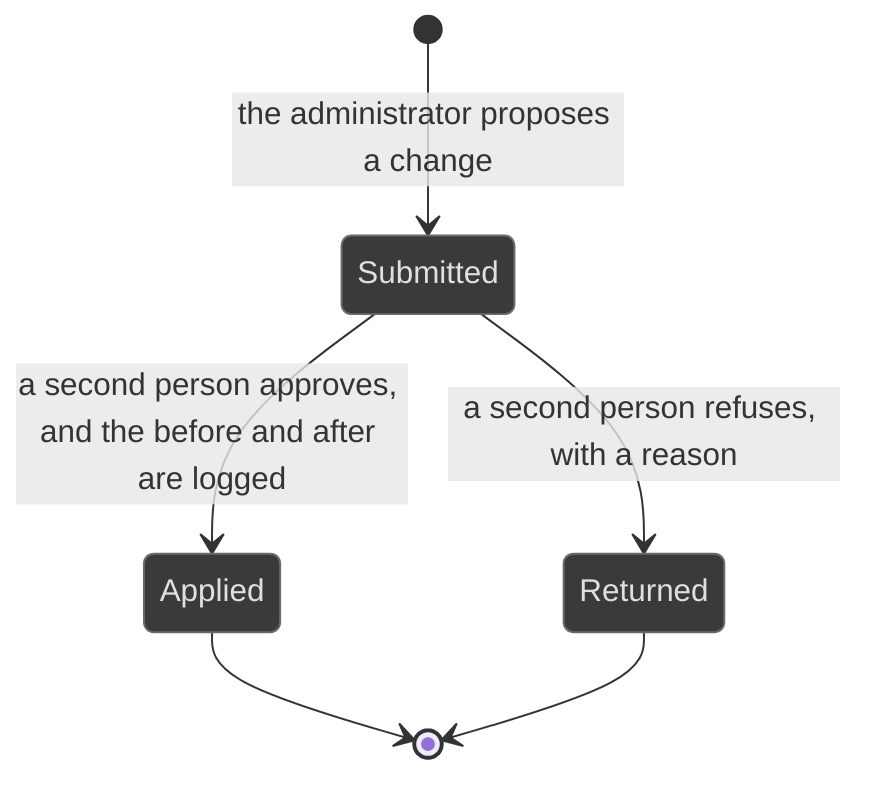
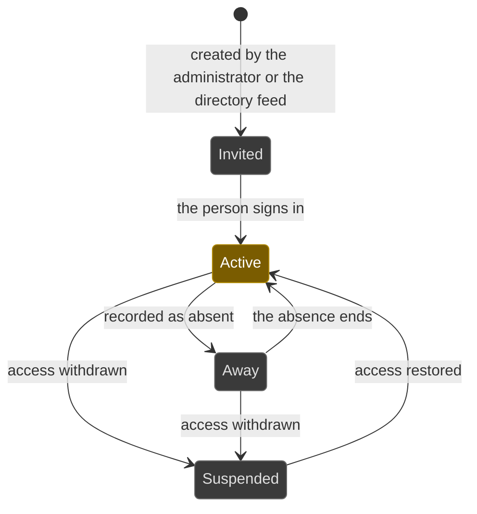

# Workflows: administration

Generated by Prototype to Product Kit v2.1 · 2026-08-27
Last updated: 2026-08-27

**Module** [[M-16]] · **Index** [[workflows]] · **Matrix** [[traceability]]

**Where this is built** [[SLICE-43]], [[SLICE-44]], [[SLICE-45]]

**Screens it drives** SCR-070 to SCR-079, in [[screen-inventory#1. Screens]]

**Entities it moves** listed on [[M-16]], defined in [[data-model#1. Entities]]

**Rules that span entities** [[workflows#3. Explicitly illegal moves that span entities]] ·
**derived states** [[workflows#2. Derived states, displayed and never stored]] ·
**chasing** [[workflows#5. Time-driven behaviour]]

---

## Configuration change

**What this entity is for.** A configuration change is any alteration to how the
platform behaves: a threshold, a maker-checker rule, a department head, a
retention policy, a connected system, a person's role. It exists because a
platform that manages compliance must govern its own configuration, since the
fastest way to make a red number go green is to change what red means
(FRD §5.30).

### States

| ID | Label shown to user | Meaning | Terminal |
|---|---|---|---|
| CFG-S1 | Submitted | The administrator has proposed the change | no |
| CFG-S2 | Applied | A second person approved it and it took effect | yes |
| CFG-S3 | Returned | A second person refused it, with a reason | yes |

### Transitions

| ID | From | To | Trigger | Who may | Must be true first | State change | Side effects | Audit | API write | In prototype |
|---|---|---|---|---|---|---|---|---|---|---|
| CFG-T1 | n/a | Submitted | The administrator changes a configuration item | Administrator | The item is on the configurable list of §14.1 | A pending change carrying the before and after values | The checker gains a queue item. Nothing has taken effect | `config.submit` with before and after | `POST /config/changes` | NOT PRESENT |
| CFG-T2 | Submitted | Applied | The checker approves | A second Administrator, or the role the maker-checker rule names, and never the submitter | The change is Submitted | The configuration takes effect | The change is written to the audit log with the before value, the after value, the actor and the timestamp | `config.change` with before and after | `POST /config/changes/:id/approve` | NOT PRESENT |
| CFG-T3 | Submitted | Returned | The checker refuses | A second Administrator, and never the submitter | A reason is supplied | Nothing takes effect | The submitter is told why | `config.return` with the reason | `POST /config/changes/:id/return` | NOT PRESENT |

### What is configurable

Each of these changes is maker-checked and logged. FRD §14.1.

| ID | Area | What is configurable |
|---|---|---|
| CFG-C01 | Organization | Profile, entity details, operating time zone, financial calendar |
| CFG-C02 | People and roles | Users, their roles, departments, line of defence, status |
| CFG-C03 | Department heads | Who heads each of the eight departments, and therefore who escalation resolves to |
| CFG-C04 | Frameworks | Which control frameworks and libraries are enabled, and the mapping between them |
| CFG-C05 | Regulators and clocks | Which regulators apply, each reporting window, what triggers it, the clock-start rule per regulator, and the escalation owner per regulator |
| CFG-C06 | Maker-checker rules | Which change kinds require approval, who may approve each, and whether a line-of-defence constraint applies |
| CFG-C07 | Authority matrix | The action-to-authority assignments of §4.10, held as data |
| CFG-C08 | The reminder ladder | The reminder and escalation intervals and their targets, per object type |
| CFG-C09 | Expiry windows | The warning windows for exceptions, risk acceptances and assurance reports, and the exception renewal-escalation thresholds |
| CFG-C10 | Risk model | The scoring scale, the domains, the appetite statements and tolerance bands per domain, and the residual thresholds behind severity |
| CFG-C11 | Indicators | Definitions, thresholds, direction, refresh cadence, source feed |
| CFG-C12 | Third-party model | Diligence cadence per criticality, the tier thresholds and the driver weights |
| CFG-C13 | Campaigns | Cycle definitions, scope rules, cadence, question sets |
| CFG-C14 | Connected systems | Which connectors are enabled, their credentials, field mapping and sync cadence |
| CFG-C15 | Retention and privacy | Retention rules per data store, masking rules, residency settings |
| CFG-C16 | Notifications | Per-person and per-event preferences, digest cadence, channels |
| CFG-C17 | Sector packs | Which pack is enabled, its sections, committees and report templates |
| CFG-C18 | Pack composition | Which sections each audience takes, and the basis text |

### Explicitly illegal moves

| ID | The move | Why refused |
|---|---|---|
| CFG-I1 | Applying your own configuration change | A platform that manages compliance cannot have an unaudited back door. `BR-AUT-08` |
| CFG-I2 | Editing, clearing or shortening the audit log below its retention floor, as anyone including the administrator | The log's value is precisely that it outlives the convenience of the people it records. `BR-AUD-02`, `BR-DAT-05` |
| CFG-I3 | Switching separation of duties off | The intervals and the approver sets are configurable; the rule that a maker may not approve their own work is not. §14.2 |
| CFG-I4 | Typing a value over a derived one | An administrator may change a threshold; they may not type a band, a tier or a stage. §14.2 |
| CFG-I5 | Making evidence optional on a duty | The requirement that a duty has proof is structural. `BR-EVD-01`, §14.2 |
| CFG-I6 | Configuring case confidentiality or recusal | Neither is an administrative setting. §14.2 |
| CFG-I7 | Treating the administrator's breadth of visibility as breadth of authority | The administrator configures; they do not approve filings or accept risks. `BR-AUT-09` |
| CFG-I8 | Changing a department head with no trail | An escalation path that can be edited without a trace is not an escalation path. §4.13 |

### Diagram

---

## Person

**What this entity is for.** A person is a named individual with a job title, a
department, a line of defence and one or more roles. Ownership is held by a
person, escalation resolves to a person, and the audit trail names a person
(FRD §4.3).

### States

| ID | Label shown to user | Meaning | Terminal |
|---|---|---|---|
| PER-S1 | Invited | Created, not yet signed in | no |
| PER-S2 | Active | Working | no |
| PER-S3 | Away | Absent. Their queue is covered by a delegate, or it blocks | no |
| PER-S4 | Suspended | Access withdrawn, records kept | no |

### Transitions

| ID | From | To | Trigger | Who may | Must be true first | State change | Side effects | Audit | API write | In prototype |
|---|---|---|---|---|---|---|---|---|---|---|
| PER-T1 | n/a | Invited | The administrator creates a person, or the directory feed creates one | Administrator, or the directory connector | A name, a job title, a department and a line of defence are supplied | Person created | Ownership and escalation can now resolve to them | `config.change` naming the person | `POST /people` | SIMULATED |
| PER-T2 | Invited | Active | The person signs in for the first time | System | Authentication succeeded | `status` | They appear in owner and checker pickers | `person.activate` | internal | NOT PRESENT |
| PER-T3 | Active | Away | The person is recorded as absent | Administrator | A period is supplied | `status` | Without delegation their queue blocks, which is the gap FRD G-16 names. With delegation a time-boxed stand-in inherits their queue items and maker rights, and never their approval rights | `config.change` | `POST /people/:id/away` | NOT PRESENT |
| PER-T4 | Away | Active | The absence ends | Administrator, or the schedule | n/a | `status` | The delegation ends and the trail shows who acted under it | `config.change` | `POST /people/:id/return` | NOT PRESENT |
| PER-T5 | Active or Away | Suspended | Access is withdrawn | Administrator | The change is maker-checked | `status`; sessions revoked | Their owned records stay owned and are surfaced for reassignment. Deleting never orphans provenance | `config.change` | `POST /people/:id/suspend` | NOT PRESENT |
| PER-T6 | any | any | A role is granted or removed | Administrator | The change is maker-checked | A person-role row added or removed | Their navigation and their queue change to the union of their roles at the altitude they select | `config.change` naming the role | `POST /people/:id/roles` | SIMULATED, and the prototype's switcher replaces the role rather than taking the union |
| PER-T7 | any | any | The person moves department | Administrator, or the directory feed | The change is maker-checked | `department` | Every record they own moves with them, because a record's department derives from its owner | `config.change` with before and after | `PATCH /people/:id` | NOT PRESENT |

### Explicitly illegal moves

| ID | The move | Why refused |
|---|---|---|
| PER-I1 | Storing a department on any record other than a person | A stored department drifts from the org chart the moment someone moves team. `BR-SCP-01` |
| PER-I2 | Letting a delegate inherit approval rights | The rights separation of duties reserves cannot be delegated. §4.13, §21.13 |
| PER-I3 | Deleting a person who owns records | `BR-LNK-10` |
| PER-I4 | Letting a persona switch confer access a person does not have | `BR-SCP-05` |

### Diagram

