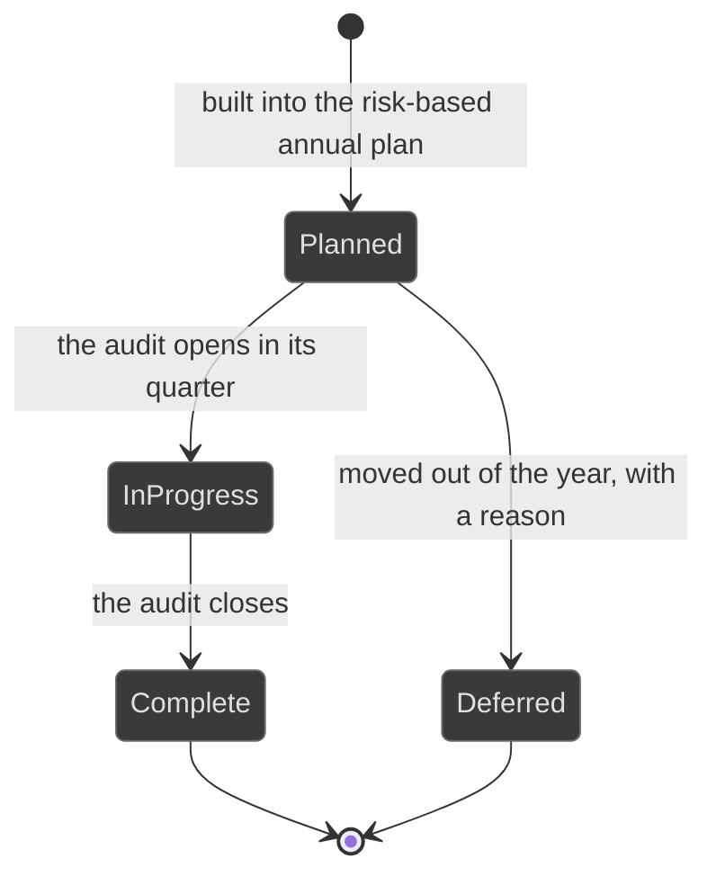
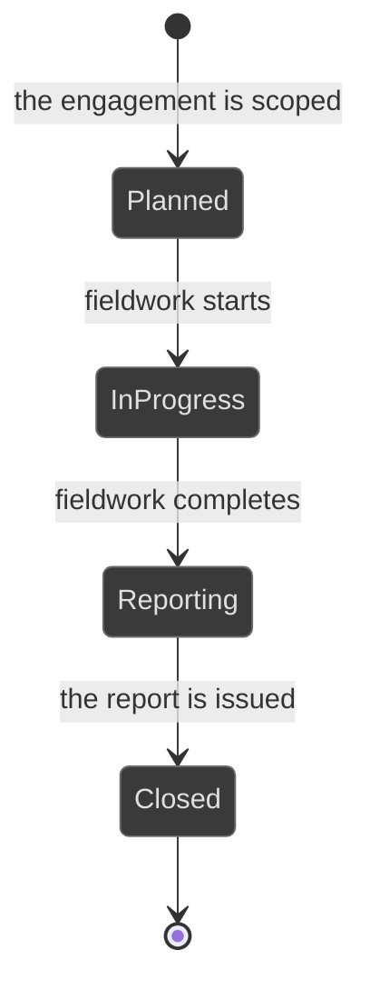
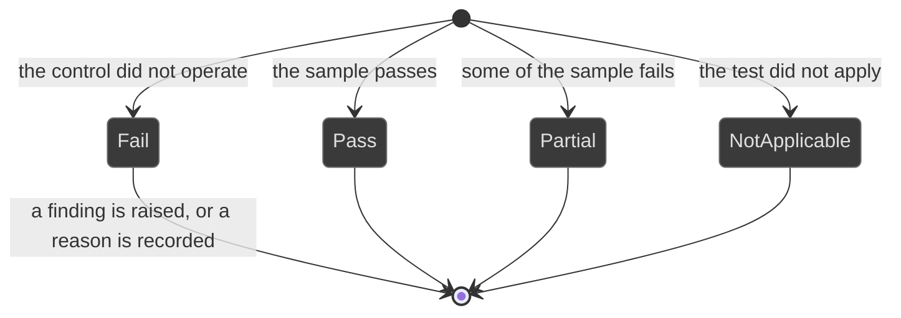
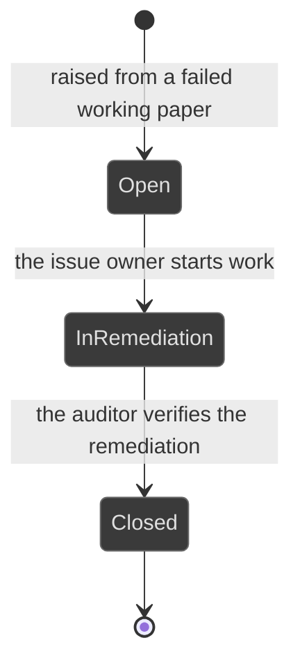

# Workflows: assurance

Generated by Prototype to Product Kit v2.1 · 2026-08-27
Last updated: 2026-08-27

**Module** [[M-09]] · **Index** [[workflows]] · **Matrix** [[traceability]]

**Where this is built** [[SLICE-29]], [[SLICE-30]]

**Screens it drives** SCR-062 to SCR-065, in [[screen-inventory#1. Screens]]

**Entities it moves** listed on [[M-09]], defined in [[data-model#1. Entities]]

**Rules that span entities** [[workflows#3. Explicitly illegal moves that span entities]] ·
**derived states** [[workflows#2. Derived states, displayed and never stored]] ·
**chasing** [[workflows#5. Time-driven behaviour]]

---

## Audit plan entry

**What this entity is for.** A plan entry is one line of the risk-based annual
plan: an auditable area, the quarter it is scheduled for, the auditor, and the
risks that justify its priority. It exists so the committee reads coverage
rather than intentions (FRD §5.21).

| ID | Label shown to user | Meaning | Terminal |
|---|---|---|---|
| APE-S1 | Planned | Scheduled, not started | no |
| APE-S2 | In progress | Its audit is open | no |
| APE-S3 | Complete | Its audit is closed | yes |
| APE-S4 | Deferred | Moved out of the year, with a recorded reason | yes |

| ID | From | To | Trigger | Who may | Must be true first | State change | Side effects | Audit | API write | In prototype |
|---|---|---|---|---|---|---|---|---|---|---|
| APE-T1 | n/a | Planned | The Head of Internal Audit builds the plan | Auditor | The linked risks are named, so the priority is grounded in the register | Entry created | Plan-versus-actual delivery becomes computable | `auditPlan.create` | `POST /audit-plan` | SIMULATED |
| APE-T2 | Planned | In progress | The audit is opened | Auditor | The scheduled quarter has started | `state`, `linkedAuditId` | Delivery moves | `audit.open` | `POST /audits` | SIMULATED |
| APE-T3 | In progress | Complete | The audit closes | Auditor | The audit is Closed | `state` | Delivery moves | `audit.close` | `POST /audits/:id/close` | SIMULATED |
| APE-T4 | Planned | Deferred | The entry is moved out of the year | Auditor | A reason is supplied | `state`, `deferredReason` | The committee sees the deferral, not a silent absence | `auditPlan.defer` with the reason | `POST /audit-plan/:id/defer` | NOT PRESENT |

| ID | Illegal move | Why refused |
|---|---|---|
| APE-I1 | Computing delivery over the full-year total | Delivery is complete entries over entries due to date. `BR-DRV-11`, §10.1 |
| APE-I2 | Deferring with no reason | `BR-LFC-09` |
| APE-I3 | Storing the priority | It follows from the residuals of the linked risks. `BR-DRV` |

---

## Audit

**What this entity is for.** An audit is one assurance engagement: a scope, a
period, an auditor, and the working papers and findings it produces. It exists so
the third line can test any link in the connected chain independently and leave
a trail that survives external scrutiny (FRD §5.21).

| ID | Label shown to user | Meaning | Terminal |
|---|---|---|---|
| AUD-S1 | Planned | Scoped, not started | no |
| AUD-S2 | In progress | Fieldwork under way | no |
| AUD-S3 | Reporting | Fieldwork done, the report is being written | no |
| AUD-S4 | Closed | Reported, and every finding is closed or handed to remediation | yes |

| ID | From | To | Trigger | Who may | Must be true first | State change | Side effects | Audit | API write | In prototype |
|---|---|---|---|---|---|---|---|---|---|---|
| AUD-T1 | n/a | Planned | The Head of Internal Audit opens the engagement | Auditor | A type, an auditor, a period and a scope are supplied | Audit created | The plan entry moves | `audit.open` | `POST /audits` | SIMULATED |
| AUD-T2 | Planned | In progress | Fieldwork starts | Auditor | n/a | `state` | The auditor can pull a control's evidence from the connected model rather than requesting it by email | `audit.start` | `POST /audits/:id/start` | SIMULATED |
| AUD-T3 | In progress | Reporting | Fieldwork completes | Auditor | At least one working paper exists | `state` | Unescalated failures are surfaced explicitly | `audit.report` | `POST /audits/:id/report` | SIMULATED |
| AUD-T4 | Reporting | Closed | The report is issued | Auditor | Every failed paper has either a finding or a recorded reason it produced none | `state` | Plan delivery moves; the Audit Committee pack picks it up | `audit.close` | `POST /audits/:id/close` | SIMULATED |

| ID | Illegal move | Why refused |
|---|---|---|
| AUD-I1 | Closing with a failed paper that produced neither a finding nor a recorded reason | A test that failed and was quietly dropped is the most damaging thing an internal audit function can leave behind. §5.21 |
| AUD-I2 | Requesting evidence by email rather than pulling it from the model | The whole point of the connected model. §5.21 step 3 |

---

## Working paper

**What this entity is for.** A working paper records one test performed during
fieldwork: what was tested, over what population, on what sample, by whom, with
what evidence, and what the tester concluded. A finding is raised from a failed
paper, so a finding always has a test behind it (FRD §5.21 step 4).

A paper is a fact, not a process. Its result is its state.

| ID | Label shown to user | Meaning | Terminal |
|---|---|---|---|
| WPR-S1 | Pass | The control operated across the sample | yes |
| WPR-S2 | Partial | Some of the sample failed | yes |
| WPR-S3 | Fail | The control did not operate. A finding is raised from it | yes |
| WPR-S4 | Not applicable | The test did not apply | yes |

| ID | Trigger | Who may | Must be true first | State change | Side effects | Audit | API write | In prototype |
|---|---|---|---|---|---|---|---|---|
| WPR-T1 | The auditor records a paper | Auditor | An objective, a procedure, a population, a sample and a conclusion are supplied | Paper created with its result | The paper can be cited in the report | `workingPaper.record` | `POST /audits/:id/papers` | SIMULATED |
| WPR-T2 | The auditor raises a finding from a failed paper | Auditor | The result is Fail and no finding exists yet | `findingId` set; a finding created carrying the paper's reference | The paper stops reading as an unescalated failure | `finding.raise` naming the paper | `POST /papers/:id/finding` | SIMULATED |
| WPR-T3 | The auditor records why a failed paper produced no finding | Auditor | The result is Fail and a basis is supplied | A recorded basis | The paper is no longer surfaced as unescalated | `workingPaper.noFinding` with the basis | `POST /papers/:id/no-finding` | NOT PRESENT |

| ID | Illegal move | Why refused |
|---|---|---|
| WPR-I1 | Raising a finding with no paper behind it | A finding always has a test behind it. §5.21 step 5 |
| WPR-I2 | Raising more than one finding from a paper | One finding per paper. §7.2 |
| WPR-I3 | Testing a control you own, where the customer has configured a line-of-defence constraint | `BR-AUT-10`, and see DECISION NEEDED [[decisions#DN-003 Is "not the same person" enough, or must the checker sit in a different line\|DN-003]] |
| WPR-I4 | Leaving a failed paper with no finding and no recorded reason | §5.21 |

---

## Audit finding

**What this entity is for.** A finding is the conclusion drawn from a failed
test, with exactly one remediation issue behind it. It exists so that a weakness
found by the third line is tracked in the same register as every other weakness,
and cannot close on the owner's say-so (FRD §5.21, §5.22).

| ID | Label shown to user | Meaning | Terminal |
|---|---|---|---|
| FND-S1 | Open | Raised, not yet owned as remediation | no |
| FND-S2 | In remediation | Its issue is being worked | no |
| FND-S3 | Closed | Remediation verified by the auditor | yes |

| ID | From | To | Trigger | Who may | Must be true first | State change | Side effects | Audit | API write | In prototype |
|---|---|---|---|---|---|---|---|---|---|---|
| FND-T1 | n/a | Open | The auditor raises it from a failed paper | Auditor | The paper's result is Fail | Finding created carrying the paper's reference | One remediation issue is spawned with an owner and a due date | `finding.raise`, then `issue.raise` | `POST /papers/:id/finding` | SIMULATED |
| FND-T2 | Open | In remediation | The issue owner starts work | The issue owner | The issue exists | `state` | The finding's ageing keeps running. Age is from the raise date, not from the start of work | `issue.progress` | `PATCH /issues/:id` | SIMULATED |
| FND-T3 | In remediation | Closed | The auditor verifies the remediation | Auditor | The issue is Resolved and the auditor has re-tested | `state`, `verifiedById`, `verifiedAt` | Open findings and the ageing bands move; the Audit Committee pack picks it up | `finding.close` naming the verifier | `POST /findings/:id/close` | SIMULATED, and the prototype closes the finding when the issue resolves |
| FND-T4 | any | any | The finding repeats an earlier closed one on the same control | System | An earlier closed finding covers the control | `isRepeat` | Repetition is the signal that remediation was cosmetic, and it is surfaced as such | `finding.repeat` | internal | NOT PRESENT |

| ID | Illegal move | Why refused |
|---|---|---|
| FND-I1 | Closing on the owner's assertion | Self-certified remediation is how repeat findings are born. `BR-LFC-07` |
| FND-I2 | Closing when the issue resolves, without an auditor's verification | The prototype does exactly this, and it is the rule the FRD names. `BR-LFC-07` |
| FND-I3 | Reporting a mean finding age | A mean of open ages improves when young items close. Ageing bands, plus the oldest open finding. §10.1, D-06 |
| FND-I4 | Raising a finding with no issue behind it | Every open finding has exactly one remediation issue. §7.2 |

