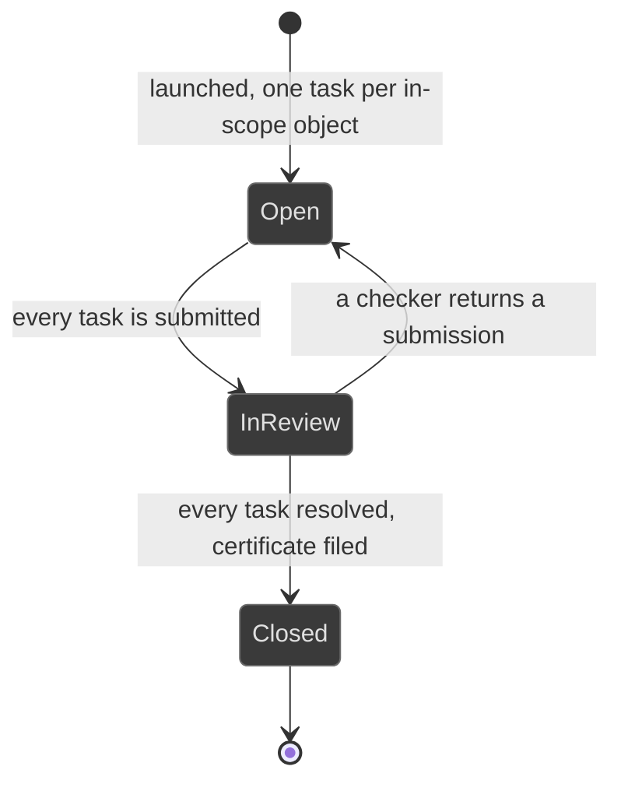

# Workflows: campaign

Generated by Prototype to Product Kit v2.1 · 2026-08-27
Last updated: 2026-08-27

**Module** [[M-11]] · **Index** [[workflows]] · **Matrix** [[traceability]]

**Where this is built** [[SLICE-35]], [[SLICE-36]], [[SLICE-37]]

**Screens it drives** SCR-030 to SCR-034, in [[screen-inventory#1. Screens]]

**Entities it moves** listed on [[M-11]], defined in [[data-model#1. Entities]]

**Rules that span entities** [[workflows#3. Explicitly illegal moves that span entities]] ·
**derived states** [[workflows#2. Derived states, displayed and never stored]] ·
**chasing** [[workflows#5. Time-driven behaviour]]

---

## Campaign

**What this entity is for.** A campaign is a fanned-out periodic cycle that
creates one task per in-scope object, routes each submission to a checker, writes
the agreed result back to the register it assessed, and files a completion
certificate. One container, three payloads: assessment, attestation and
third-party diligence (FRD §5.16, §5.17, §5.20).

The design contract is blunt: a cycle that collects opinions and files them is
theatre. This one moves the register.

### States

| ID | Label shown to user | Meaning | Terminal |
|---|---|---|---|
| CMP-S1 | Open | Launched, tasks are out | no |
| CMP-S2 | In review | Every task is submitted, checkers are working | no |
| CMP-S3 | Closed | Every task is resolved and the certificate is filed | yes |

### Transitions

| ID | From | To | Trigger | Who may | Must be true first | State change | Side effects | Audit | API write | In prototype |
|---|---|---|---|---|---|---|---|---|---|---|
| CMP-T1 | n/a | Open | The owner launches the cycle | Risk Manager, Compliance Manager | A type, a scope, a due date and an assignee per object are supplied | Campaign created; one Task per in-scope object, with the type's completion policy | Tasks fan into each owner's queue; the ladder chases against the campaign due date | `campaign.launch` naming the type, the scope and the count | `POST /campaigns` | SIMULATED |
| CMP-T2 | Open | Open | An assignee submits their response | The assignee | The response passes the completeness check for its type | Task moves to Submitted; a response record is written | The checker gains a queue item. A diligence response is pre-filled from the register, so the reviewer contradicts facts rather than inventing them | `campaign.submit` naming the task | `POST /campaigns/:id/tasks/:taskId/submit` | SIMULATED |
| CMP-T3 | Open | Open | The checker returns a submission with a note | The nominated checker, never the assignee | A note is supplied | Task moves to Returned | The assignee reworks it. The second line's job is to disagree where the evidence does not support the score | `campaign.return` with the note | `POST /campaigns/:id/tasks/:taskId/return` | SIMULATED |
| CMP-T4 | Open | Open | The checker approves a submission | The nominated checker, never the assignee | The task is Submitted | Task moves to Done | The write-back fires: an assessment writes the new score onto the risk with a timeline entry; a diligence response writes the re-rated criticality and the refreshed diligence date onto the arrangement; an attestation records the acknowledged version | `campaign.review` naming the task and what was written back | `POST /campaigns/:id/tasks/:taskId/approve` | SIMULATED |
| CMP-T5 | Open | Open | A cannot-comply declaration is approved | The nominated checker | The declaration kind is `CannotComply` | An exception is raised against the control or duty the policy mandates | A person who says they cannot follow a policy has raised a control gap, and the platform treats it as one | `exception.raise` naming the campaign task | internal, on `campaign.review` | SIMULATED |
| CMP-T6 | Open | In review | Every task is submitted | System | No task is Open, In progress or Returned | `state` | The campaign screen shows the review workload | `campaign.inReview` | internal | NOT PRESENT |
| CMP-T7 | In review | Closed | The owner closes the cycle | Risk Manager, Compliance Manager | Every task is Done or Cancelled | `state`, `closedOn`; a completion certificate filed as evidence | The certificate discharges the assessment duty, where the campaign names one | `campaign.close` naming the certificate | `POST /campaigns/:id/close` | SIMULATED, and the prototype allows closure while tasks are unstarted |
| CMP-T8 | Open | Open | An assignee proposes retiring a risk as no longer relevant | The assignee | The type is Assessment | `stillRelevant` false on the response | A first-class outcome, routed to the same challenge as any other proposal | `campaign.submit` | same as CMP-T2 | SIMULATED |

### Explicitly illegal moves

| ID | The move | Why refused |
|---|---|---|
| CMP-I1 | Approving your own campaign response | `BR-AUT-05` |
| CMP-I2 | Closing while tasks are outstanding | The cycle is the sum of its tasks. §5.16 step 6 |
| CMP-I3 | Storing progress or the overdue count | Both are derived from the tasks. `BR-DRV-10` |
| CMP-I4 | Storing an assessment result on the risk alongside the campaign record | The assessment history is the campaign record, read back. There is one copy of the truth. §5.16 |
| CMP-I5 | Recording an assessment with a re-score and no control opinion | A re-score with no control opinion is what makes an assessment an opinion poll. §5.16 step 3 |
| CMP-I6 | Recording an attestation without the version acknowledged | `BR-LFC-06` |
| CMP-I7 | Leaving a cannot-comply declaration inside the campaign response | It routes into the exception register as a real, time-boxed, approved deviation with an owner. §5.17 |
| CMP-I8 | Submitting a diligence response with required gaps unanswered | The completeness check blocks submission. §5.20 step 4 |
| CMP-I9 | Building a fourth campaign type as a parallel machine | A new cycle type is a payload behind the one registry. §14.3 |

### Diagram

### Per-type write-back

| Type | Completion policy on its tasks | What approval writes back | FRD |
|---|---|---|---|
| Assessment | `makerChecker` | Likelihood, impact and treatment onto the risk, with a timeline entry recording what changed | §5.16 step 5 |
| Attestation | `acknowledge` | The acknowledged version onto the response, from which the attestation rate is computed against the policy's current version | §5.17 step 4 |
| Diligence | `makerChecker` | The re-rated criticality and the refreshed diligence date onto the arrangement, which moves the derived tier | §5.20 step 6 |
