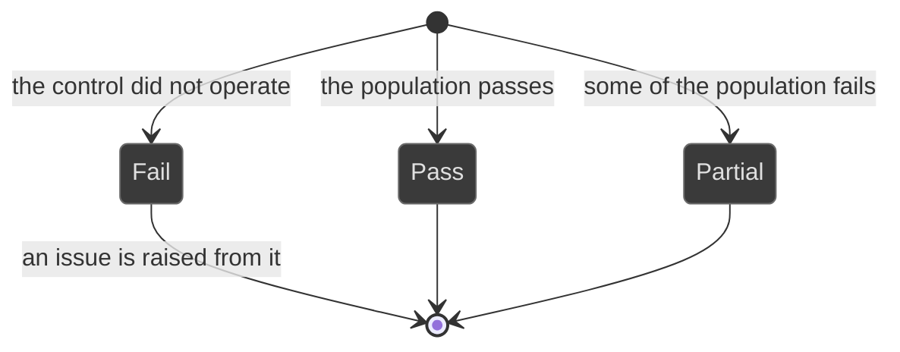
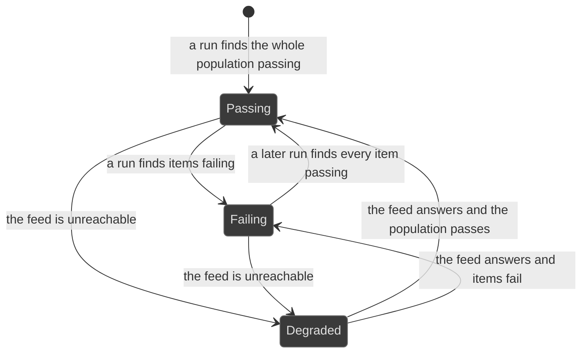

# Workflows: control

Generated by Prototype to Product Kit v2.1 · 2026-08-27
Last updated: 2026-08-27

**Module** [[M-04]] · **Index** [[workflows]] · **Matrix** [[traceability]]

**Where this is built** [[SLICE-12]], [[SLICE-13]], [[SLICE-14]], [[SLICE-15]]

**Screens it drives** SCR-020 to SCR-027, in [[screen-inventory#1. Screens]]

**Entities it moves** listed on [[M-04]], defined in [[data-model#1. Entities]]

**Rules that span entities** [[workflows#3. Explicitly illegal moves that span entities]] ·
**derived states** [[workflows#2. Derived states, displayed and never stored]] ·
**chasing** [[workflows#5. Time-driven behaviour]]

A control itself has no lifecycle. It stands, and what moves is its test result
and, where it is monitored, its rule status. Both are below.

---

## Control test

**What this entity is for.** A test is the record of one occasion on which
somebody checked that a control actually works, by a stated method against a
defined population. It exists because a control that is never tested is an
assertion, and the test history is what an auditor asks for first (FRD §5.8).

### States

A test is a fact, not a process. Its result is its state.

| ID | Label shown to user | Meaning | Terminal |
|---|---|---|---|
| TST-S1 | Pass | The control operated as designed across the population tested | yes |
| TST-S2 | Partial | Some of the population failed. Not a pass, and not a failure | yes |
| TST-S3 | Fail | The control did not operate. A remediation issue is raised from it | yes |

### Transitions

| ID | From | To | Trigger | Who may | Must be true first | State change | Side effects | Audit | API write | In prototype |
|---|---|---|---|---|---|---|---|---|---|---|
| TST-T1 | n/a | Pass | A tester records a clean result | Control Owner, Auditor, Executive | A method and a note are supplied | Test created; the control's derived result becomes Pass | The evidence ledger gains a row; the pass rate moves; the risks the control mitigates reflect the change in assurance | `control.retest` naming method, population and result | `POST /controls/:id/tests` | SIMULATED, session only |
| TST-T2 | n/a | Partial | A tester records a partial result | Control Owner, Auditor, Executive | Same | Test created | The control sits in its own band on the register and the drill. It is outside the pass-rate numerator and it does not clear an open issue | `control.retest` | same | SIMULATED |
| TST-T3 | n/a | Fail | A tester records a failure | Control Owner, Auditor, Executive | Same | Test created | A remediation issue is raised against the control automatically. Nobody has to remember | `control.retest`, then `issue.raise` naming the test | same | SIMULATED, the prototype records the result and raises no issue |
| TST-T4 | n/a | any | An out-of-cycle re-test is directed after an incident, a finding or a regulatory change | Control Owner, Auditor, Executive | The prompting record is named | Test created carrying the prompt | The prompting record shows the re-test | `control.retest` naming the prompt | same | SIMULATED |

### Explicitly illegal moves

| ID | The move | Why refused |
|---|---|---|
| TST-I1 | Counting a Partial in the pass-rate numerator | A partial is not a pass. §10.1 |
| TST-I2 | Counting an untested control as passing | Unknown is not green. It is counted separately as tests lapsed or never run. §10.1 |
| TST-I3 | Recording a Fail without an issue | A fail with no issue is a process breach. `BR-LFC-11` |
| TST-I4 | Editing a recorded test | The history is the point. A correction is a new test with a note |
| TST-I5 | Testing a control you own, where the customer has configured a line-of-defence constraint | `BR-AUT-10`, and see DECISION NEEDED [[decisions#DN-003 Is "not the same person" enough, or must the checker sit in a different line\|DN-003]] |

### Diagram

---

## Monitoring rule

**What this entity is for.** A monitoring rule is a control that tests itself,
on a schedule, against a live population from a bound feed, and escalates on its
own when it fails. It is what makes the platform continuous rather than periodic
(FRD §5.9).

### States

| ID | Label shown to user | Meaning | Terminal |
|---|---|---|---|
| MON-S1 | Passing | The whole population passed on the latest run | no |
| MON-S2 | Failing | Items failed on the latest run | no |
| MON-S3 | Degraded | The bound feed was unreachable. The rule cannot see its population | no |

All three are derived from the latest run. None is stored.

### Transitions

| ID | From | To | Trigger | Who may | Must be true first | State change | Side effects | Audit | API write | In prototype |
|---|---|---|---|---|---|---|---|---|---|---|
| MON-T1 | any | Passing | A run finds every item passing | System | The feed answered | A run recorded with its counts | The run is captured as evidence automatically, linked to the control and its framework references. The control's result becomes Pass | `monitoring.run` with the system as actor | internal, on schedule | SIMULATED, one seeded run per rule |
| MON-T2 | any | Failing | A run finds items failing | System | The feed answered | A run recorded, with one failing-item row per item | The run is captured as evidence; the control's result becomes Fail; one remediation issue is raised naming the failing items; where the failure has already produced a real event, the issue is linked to the incident | `monitoring.run`, then `issue.raise` | internal, on schedule | SIMULATED, the cascade is seeded rather than produced |
| MON-T3 | any | Degraded | A run cannot reach the feed | System | n/a | A run recorded with `feedReachable = false` | The rule reads Degraded, never Passing. The integrations view shows the stale sync. Degraded counts as not passing in the monitored-controls measure | `monitoring.degraded` | internal, on schedule | NOT PRESENT |
| MON-T4 | Failing | Failing | The owner records a failing item as a false positive | Control Owner | A basis is supplied | The item is excluded from the population by a configuration change | The configuration change is itself governed and logged | `config.change` naming the exclusion and its basis | `POST /monitoring/items/:id/exclude` | NOT PRESENT |
| MON-T5 | Failing | Failing | The owner raises a time-boxed exception with a compensating control | Control Owner, Compliance Manager, Compliance Analyst, Risk Manager | n/a | An exception against the control | The ordinary ladder stops and the expiry ladder starts | `exception.raise` | `POST /exceptions` | SIMULATED |

### Explicitly illegal moves

| ID | The move | Why refused |
|---|---|---|
| MON-I1 | Reporting Passing when the feed was unreachable | A rule that cannot see its population must never report success. `BR-DRV-09` |
| MON-I2 | Excluding a failing item without a recorded basis | Moving the goalposts is the easiest way to make a red number disappear. `BR-LFC-09`, §5.30 |
| MON-I3 | Raising a second issue for a failure already tracked | One failure, one issue. §5.9 |
| MON-I4 | Storing the rule status | It is derived from the latest run. `BR-DRV-09` |

### Diagram

---

## Evidence ledger, per control per period

Not a state machine. The ledger is derived: for each period inside the control's
cadence, the evidence linked to that control with a `periodCovered` in that
period, and the test result recorded in it. A period with neither reads as a gap,
and a gap is what an auditor looks for. FRD §8.2, proto `lib/cycles.ts`
`controlLedger`.
