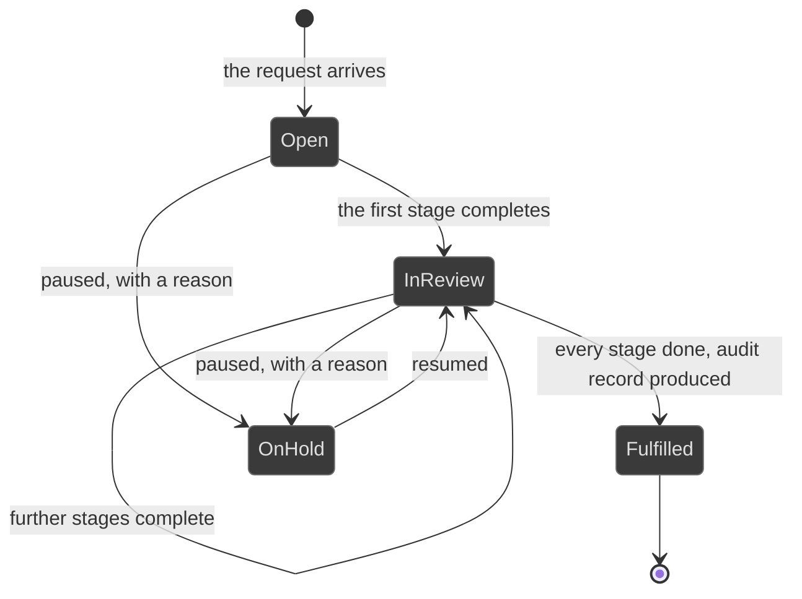

# Workflows: data governance

Generated by Prototype to Product Kit v2.1 · 2026-08-27
Last updated: 2026-08-27

**Module** [[M-15]] · **Index** [[workflows]] · **Matrix** [[traceability]]

**Where this is built** [[SLICE-38]], [[SLICE-39]]

**Screens it drives** SCR-060, SCR-061, in [[screen-inventory#1. Screens]]

**Entities it moves** listed on [[M-15]], defined in [[data-model#1. Entities]]

**Rules that span entities** [[workflows#3. Explicitly illegal moves that span entities]] ·
**derived states** [[workflows#2. Derived states, displayed and never stored]] ·
**chasing** [[workflows#5. Time-driven behaviour]]

---

## Data-subject request

**What this entity is for.** A request is a data principal asking for their data
to be given, corrected or erased, worked as a fixed sequence of stages with an
audit record at the end. It exists because two legal duties collide here: the
principal asks for erasure and the firm is required to retain some of it, and the
platform's job is to make the resolution explicit and auditable rather than a
judgment call somebody made in an inbox (FRD §5.25).

### The stages

Each stage is a Task with the `simple` completion policy, so the one work-item
engine, the one ladder and the one audit trail serve them.

**Erasure, five stages.**

| Stage | Who acts | What they do |
|---|---|---|
| 1 Locate | Compliance Analyst | Find every store holding the principal's data, using the data inventory |
| 2 Check retention | Compliance Analyst | Identify which records are under a statutory retention rule and cannot be erased |
| 3 Erase and record | Compliance Analyst | Erase what may be erased, and record what may not with the rule that requires it |
| 4 Log | Compliance Analyst | Log the action against each affected store |
| 5 Produce the audit record | DPO | Produce the record given to the principal and held for the regulator |

**Access, correction and portability, three stages.**

| Stage | Who acts | What they do |
|---|---|---|
| 1 Locate | Compliance Analyst | Find every store holding the principal's data |
| 2 Verify | Compliance Analyst | Verify the principal's identity |
| 3 Fulfil and log | Compliance Analyst | Fulfil the request and log it |

### States

| ID | Label shown to user | Meaning | Terminal |
|---|---|---|---|
| DSR-S1 | Open | Received, no stage complete | no |
| DSR-S2 | In review | At least one stage complete, not all | no |
| DSR-S3 | On hold | Paused, with a recorded reason | no |
| DSR-S4 | Fulfilled | Every stage complete and the audit record produced | yes |

### Transitions

| ID | From | To | Trigger | Who may | Must be true first | State change | Side effects | Audit | API write | In prototype |
|---|---|---|---|---|---|---|---|---|---|---|
| DSR-T1 | n/a | Open | A request arrives, usually through the privacy tooling | System, or DPO by hand | The principal's reference and the request type are supplied | Request created; the stage tasks created | The statutory response window starts and is chased. The principal's identifier is displayed masked | `dsar.receive` | `POST /data-requests` | SIMULATED |
| DSR-T2 | Open | In review | A stage task completes | Compliance Manager, Compliance Analyst | The prior stage is Done | The stage task moves to Done | The completed-stage count moves. It is derived from the tasks, never a stored counter | `task.complete` naming the stage | `POST /tasks/:id/complete` | SIMULATED, as a stored step counter |
| DSR-T3 | In review | In review | Stage 2 finds records under a statutory retention rule | Compliance Analyst | The retention rule is named | `partialRefusalBasis`, citing the rule | The partial refusal with its statutory basis is the deliverable, not a failure. This is the normal outcome for erasure at a regulated firm | `dsar.retentionConflict` naming the rule | `POST /data-requests/:id/retention-conflict` | SIMULATED |
| DSR-T4 | In review | Fulfilled | The last stage completes | DPO | Every stage task is Done and the audit record is attached as evidence | `state` | The consent ledger and the inventory reflect the outcome. The data-protection duty's cycle is discharged | `dsar.fulfil` naming the audit record | `POST /data-requests/:id/fulfil` | SIMULATED |
| DSR-T5 | Open or In review | On hold | The request is paused | DPO | A reason is supplied | `state` | The statutory window keeps running. A pause is not a stop | `dsar.hold` with the reason | `POST /data-requests/:id/hold` | SIMULATED |
| DSR-T6 | any | any | The request reveals a breach | DPO, Compliance Manager | n/a | An incident created with the data-protection clock started at the time of discovery | It routes into the incident machinery, and the divergence from any earlier detection time is recorded | `incident.raise` naming the request | `POST /incidents` | NOT PRESENT |
| DSR-T7 | any | any | The statutory window is missed | System | `dueDate` has passed and the state is not Fulfilled | none stored | The request is flagged as breached and escalates. A missed privacy deadline is itself a reportable matter | `dsar.breached` | internal | NOT PRESENT |

### Explicitly illegal moves

| ID | The move | Why refused |
|---|---|---|
| DSR-I1 | Erasing data a statutory retention rule requires be kept | The refusal, with the rule cited, is the deliverable. `BR-DAT-03` |
| DSR-I2 | Rendering the principal's identifier unmasked | Unmasking is a governed, logged action. `BR-DAT-01` |
| DSR-I3 | Completing a stage out of order | The sequence is the audit record |
| DSR-I4 | Storing the completed-stage count | It is derived from the stage tasks. `BR-DRV` |
| DSR-I5 | Fulfilling with no audit record | The audit record is what the principal is given and what the regulator reads. §5.25 step 5 |
| DSR-I6 | Treating a partial refusal as a failure | It is the normal outcome at a regulated firm. §5.25 alternate path |

### Diagram

---

## Data asset and consent

Neither carries a lifecycle. The inventory records what the firm holds, where, of
what kind, how long it is kept and with what consent, and the consent position is
derived from the consent records for that asset. Both exist so an erasure request
can be worked against a real inventory rather than somebody's memory
(FRD §8.2, §5.25 step 1).

| ID | Trigger | Who may | State change | Audit | In prototype |
|---|---|---|---|---|---|
| DAS-T1 | An asset is registered or amended | Administrator, DPO | The inventory row changes | `config.change` with before and after | SIMULATED |
| DAS-T2 | A retention rule is changed | Administrator | The rule changes, maker-checked | `config.change` | NOT PRESENT |
| DAS-T3 | A consent is captured or withdrawn | System, from the privacy tooling | A consent record | `consent.record` | NOT PRESENT |

| ID | Illegal move | Why refused |
|---|---|---|
| DAS-I1 | Shortening the audit log's retention below its floor, as anyone including the administrator | `BR-DAT-05` |
| DAS-I2 | Storing the consent position as a single status per asset | It is derived from the consent records. `BR-DRV` |
