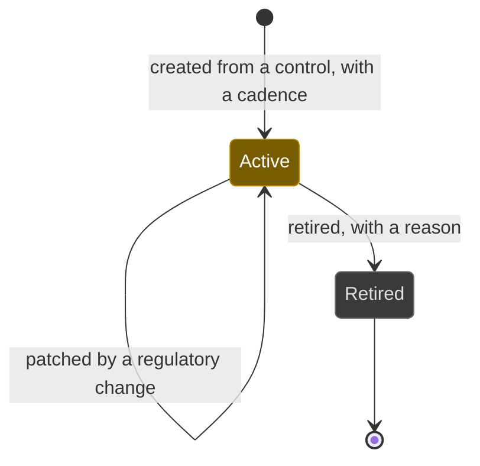
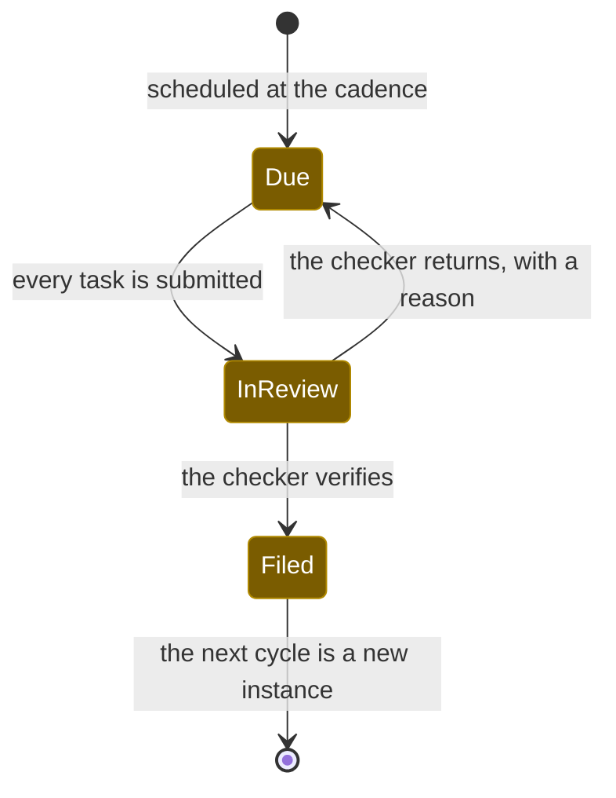
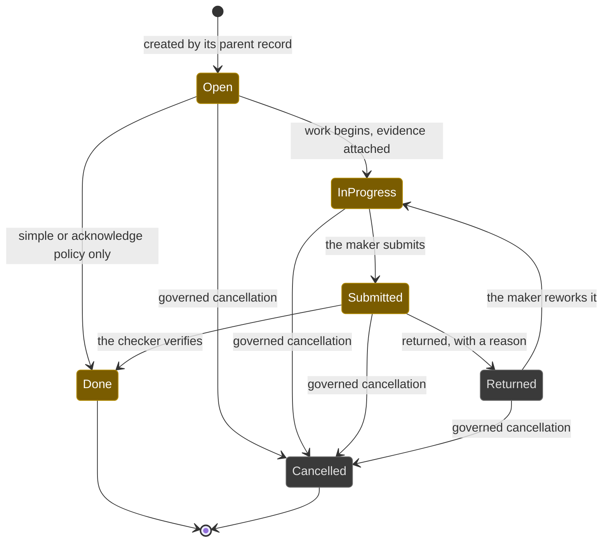

# Workflows: duty

Generated by Prototype to Product Kit v2.1 · 2026-08-27
Last updated: 2026-08-27

**Module** [[M-03]] · **Index** [[workflows]] · **Matrix** [[traceability]]

**Where this is built** [[SLICE-16]], [[SLICE-17]], [[SLICE-18]], [[SLICE-19]], [[SLICE-20]]

**Screens it drives** SCR-043 to SCR-050, in [[screen-inventory#1. Screens]]

**Entities it moves** listed on [[M-03]], defined in [[data-model#1. Entities]]

**Rules that span entities** [[workflows#3. Explicitly illegal moves that span entities]] ·
**derived states** [[workflows#2. Derived states, displayed and never stored]] ·
**chasing** [[workflows#5. Time-driven behaviour]]

---

## Obligation, the standing duty

**What this entity is for.** An obligation is a duty the firm must perform,
whether the law imposed it or the firm set it for itself, carrying a cadence, an
owner, a nominated checker and provenance back to a clause or a policy. It holds
no due date, because a standing duty does not have one; its cycles do (FRD §5.4,
§7.1).

### States

| ID | Label shown to user | Meaning | Terminal |
|---|---|---|---|
| OBL-S1 | Active | The duty stands and generates cycles | no |
| OBL-S2 | Retired | The duty no longer stands. History is kept, live denominators drop it | yes |

### Transitions

| ID | From | To | Trigger | Who may | Must be true first | State change | Side effects | Audit | API write | In prototype |
|---|---|---|---|---|---|---|---|---|---|---|
| OBL-T1 | n/a | Active | A person creates the duty a control discharges | Compliance Manager, Compliance Analyst | A control, a cadence, an owner and a period with a due date are supplied | Obligation created; the first cycle created at Due; one task created | The duty appears in the register, on the calendar and in the owner's queue | `obligation.submit` naming the control, the cadence and the period | `POST /controls/:id/obligations` | LIVE |
| OBL-T2 | n/a | Active | A regulatory change creates a genuinely new duty | Compliance Manager in Compliance and Company Secretarial | The provision is promoted first | Same | The duty carries provenance to the new clause and a link to the change | `obligation.submit` naming the change | `POST /controls/:id/obligations` | NOT PRESENT |
| OBL-T3 | Active | Active | A regulatory change patches the duty in place | Compliance Manager, Compliance Analyst | The change is acknowledged | `frequency`, `evidenceRequirement`, `title` as applicable | Future cycles inherit the change; historic cycles keep the cadence they were performed under | `obligation.patch` with before and after values | `PATCH /obligations/:id` | SIMULATED |
| OBL-T4 | Active | Retired | A person retires the duty, with a reason | Compliance Manager, Executive | No cycle is open | `state`, `retiredAt`, `retiredReason` | The duty leaves live denominators and keeps its history. Retirements in the period are shown on the duty-coverage drill, so a rise produced by shrinking the denominator is visible as exactly that | `obligation.retire` with the reason | `POST /obligations/:id/retire` | NOT PRESENT |

### Explicitly illegal moves

| ID | The move | Why refused |
|---|---|---|
| OBL-I1 | Editing a duty so it means something new, rather than promoting the new clause | It destroys the provenance of what the duty used to mean. FRD §5.3 step 6 |
| OBL-I2 | Retiring a duty with an open cycle | The open cycle would vanish from the register while still being owed |
| OBL-I3 | Retiring a duty with no reason | `BR-LFC-09` |
| OBL-I4 | Giving a duty a due date | The duty has a cadence; the cycle has the date |

### Diagram

---

## Obligation cycle

**What this entity is for.** A cycle is one period's performance of a standing
duty, carrying the due date, the tasks and the on-time record. It exists so a
firm never re-creates a duty it performs every month, and can always show which
periods were met (FRD §5.4, §5.5).

### States

| ID | Label shown to user | Meaning | Terminal |
|---|---|---|---|
| CYC-S1 | Due | Owed, not yet submitted | no |
| CYC-S2 | In review | Submitted, waiting on the nominated checker | no |
| CYC-S3 | Filed | Verified and complete for this period | yes |

`Overdue` is not a state. A cycle whose due date has passed and whose state is
not Filed reads as overdue everywhere, and the flow continues.

### Transitions

| ID | From | To | Trigger | Who may | Must be true first | State change | Side effects | Audit | API write | In prototype |
|---|---|---|---|---|---|---|---|---|---|---|
| CYC-T1 | n/a | Due | The duty is created, or the prior cycle is filed | System | The duty is Active and its frequency is periodic | Cycle created at the cadence from the later of the prior due date and today; tasks created with cleared evidence and maker-checker reset | The cycle appears on the one calendar and in the owner's queue; the ladder starts | `cycle.schedule` naming the duty and the period | internal, on `task.verify` | SIMULATED, `nextInstance()` runs in memory |
| CYC-T2 | Due | In review | Every task on the cycle is submitted | System | Each task passed its own completion gate | `state` | The nominated checker gains a queue item | `cycle.inReview` | internal, on `task.submit` | LIVE |
| CYC-T3 | In review | Filed | The checker verifies the last task | Compliance Manager, Executive, Auditor, and never the submitter | Every task is Done | `state`, `filedAt` | Evidence reads Verified; the on-time record is written; the next cycle is scheduled; the queue item clears; the overdue count and the on-time rate move | `task.verify` naming actor and cycle | `POST /tasks/:id/verify` | LIVE, except the next-cycle scheduling |
| CYC-T4 | In review | Due | The checker returns a task with a reason | Compliance Manager, Executive, Auditor, and never the submitter | A reason is supplied | `state`; the task returns to InProgress | The maker gains a queue item carrying the reason; the ladder resumes | `task.return` with the reason | `POST /tasks/:id/return` | SIMULATED |
| CYC-T5 | Due | Due | An exception is approved against the duty | Compliance Manager, Risk Manager, Executive | The exception is Active | none on the cycle | The ordinary ladder stops running against this cycle and the exception's expiry ladder starts | `exception.approve` | `POST /exceptions/:id/approve` | SIMULATED |

### Explicitly illegal moves

| ID | The move | Why refused |
|---|---|---|
| CYC-I1 | Filing a cycle whose tasks are not all Done | The cycle is the sum of its tasks |
| CYC-I2 | Closing a missed cycle by generating the next one | Otherwise a firm outruns its own failures. `BR-SCH-05` |
| CYC-I3 | Auto-scheduling an event-based, continuous or daily duty | Its next occurrence is not a function of the calendar, so generating one would be a fiction. `BR-SCH-03` |
| CYC-I4 | Storing Overdue as a state | It is stale the moment the clock ticks or the deadline is amended. `BR-DRV-17` |
| CYC-I5 | Applying a grace band to on-time | One definition of on time, used by every metric. `BR-SCH-04` |

### Diagram

---

## Task, the one work item

**What this entity is for.** A task is one unit of work with a maker, a checker,
a deadline and a completion policy. It is one engine used by obligation cycles,
issue remediation, campaign responses, data-subject request stages and
attestations, so the platform has one definition of done and one ladder chasing
it (FRD §5.4, §5.7, §7.3).

### Completion policies

| Policy | What Done requires | Label shown for Done |
|---|---|---|
| `simple` | Nothing beyond the act | Done |
| `acknowledge` | The acknowledgement act itself | Acknowledged |
| `evidence` | At least one attached evidence item | Verified |
| `makerChecker` | Approval by the nominated checker, who is not the maker | Approved |

### States

| ID | Label shown to user | Meaning | Terminal |
|---|---|---|---|
| TSK-S1 | Open | Assigned, not started | no |
| TSK-S2 | In progress | Work has begun, evidence may be attached | no |
| TSK-S3 | Submitted | Handed to the checker | no |
| TSK-S4 | Returned | Sent back with a reason | no |
| TSK-S5 | Done | Complete, under whichever gate the policy sets | yes |
| TSK-S6 | Cancelled | Withdrawn by a governed act | yes |

### Transitions

| ID | From | To | Trigger | Who may | Must be true first | State change | Side effects | Audit | API write | In prototype |
|---|---|---|---|---|---|---|---|---|---|---|
| TSK-T1 | n/a | Open | The parent record creates it | System | A parent cycle, campaign, issue or request exists | Task created with a policy, an assignee, a nominated checker and a due date | The assignee gains a queue item; the ladder starts against the task's own due date | `task.create` | internal | LIVE |
| TSK-T2 | Open | In progress | The maker attaches evidence, or records progress | Compliance Manager, Compliance Analyst, Control Owner | The actor is the assignee | `state`; an evidence record at Submitted, linked to the task | The vault gains the item with its capture method and everything it links to | `task.attachEvidence` naming the evidence | `POST /tasks/:id/evidence` | LIVE |
| TSK-T3 | Open | Done | The assignee performs a `simple` or `acknowledge` task | The assignee | The policy is `simple` or `acknowledge` | `state`, `completedAt` | The queue item clears | `task.complete` | `POST /tasks/:id/complete` | SIMULATED |
| TSK-T4 | In progress | Submitted | The maker submits | Compliance Manager, Compliance Analyst, Control Owner | Under `evidence`, at least one evidence item is attached | `state`, `submittedAt`; the parent cycle moves to In review | The checker gains a queue item | `task.submit` naming the evidence count | `POST /tasks/:id/submit` | LIVE, and the refusal with no evidence is LIVE |
| TSK-T5 | Submitted | Done | The checker verifies and approves | Compliance Manager, Executive, Auditor, and never the maker | The task is Submitted | `state`, `completedAt`; attached evidence moves to Verified; the parent cycle moves to Filed | Both queue items clear; the metrics move | `task.verify` naming actor and cycle | `POST /tasks/:id/verify` | LIVE, and the separation refusal is LIVE |
| TSK-T6 | Submitted | Returned | The checker returns with a reason | Compliance Manager, Executive, Auditor, and never the maker | A reason is supplied | `state`, `returnReason` | The maker gains a queue item carrying the reason; the ladder resumes | `task.return` with the reason | `POST /tasks/:id/return` | SIMULATED |
| TSK-T7 | Returned | In progress | The maker picks it back up | The assignee | n/a | `state` | The return reason stays part of the record | `task.rework` | `POST /tasks/:id/rework` | SIMULATED |
| TSK-T8 | Open, In progress, Submitted, Returned | Cancelled | A governed cancellation | Compliance Manager, Executive | A reason is supplied | `state` | The parent record is told; the queue item clears | `task.cancel` with the reason | `POST /tasks/:id/cancel` | NOT PRESENT |

### Explicitly illegal moves

| ID | The move | Why refused |
|---|---|---|
| TSK-I1 | Submitting an `evidence` task with nothing attached | A duty may not be marked complete with nowhere for its proof to live. `BR-EVD-01` |
| TSK-I2 | Verifying a task you submitted | `BR-AUT-05`. The single most important control in the platform |
| TSK-I3 | Verifying a task that is not Submitted | The state machine is not advisory. `BR-LFC-01` |
| TSK-I4 | Returning a task with no reason | A rejection without a reason cannot be acted on or reviewed. `BR-LFC-10` |
| TSK-I5 | Choosing the checker at the moment of approval | The checker is nominated at creation, so the trail shows who was supposed to check. `BR-AUT-04` |
| TSK-I6 | Chasing a multi-step duty at the duty level only | A three-party payroll chain has three accountable people, and chasing only the first is chasing nobody. `BR-ESC-06` |

### Diagram

