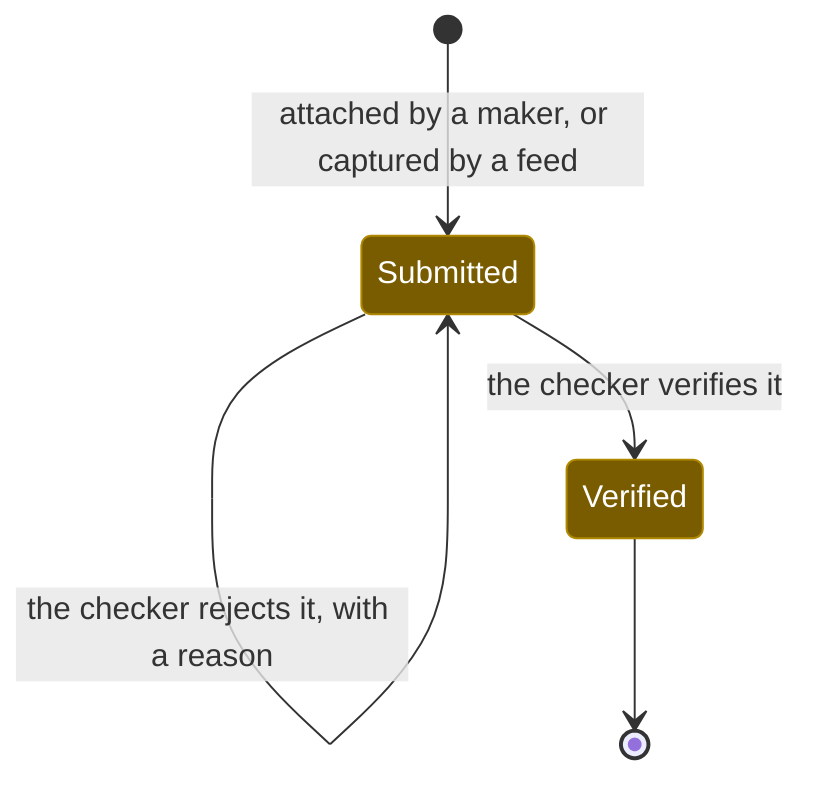

# Workflows: evidence

Generated by Prototype to Product Kit v2.1 · 2026-08-27
Last updated: 2026-08-27

**Module** [[M-05]] · **Index** [[workflows]] · **Matrix** [[traceability]]

**Where this is built** [[SLICE-03]], [[SLICE-21]]

**Screens it drives** SCR-068, SCR-069, SCR-100, SCR-101, in [[screen-inventory#1. Screens]]

**Entities it moves** listed on [[M-05]], defined in [[data-model#1. Entities]]

**Rules that span entities** [[workflows#3. Explicitly illegal moves that span entities]] ·
**derived states** [[workflows#2. Derived states, displayed and never stored]] ·
**chasing** [[workflows#5. Time-driven behaviour]]

---

## Evidence

**What this entity is for.** Evidence is the real artifact that proves a control
operated or a duty was done: a filing acknowledgement, a treasury challan, a
committee minute, a configuration export, a log extract. It exists to make
proof a byproduct of doing the work rather than a separate act of documentation,
because the single most painful real finding is a control that operated and was
never documented (FRD §5.6).

### States

| ID | Label shown to user | Meaning | Terminal |
|---|---|---|---|
| EVD-S1 | Submitted | Captured and linked. Somebody says this happened | no |
| EVD-S2 | Verified | Somebody independent checked it is the right artifact, for the right period, showing the right thing | yes |

### Transitions

| ID | From | To | Trigger | Who may | Must be true first | State change | Side effects | Audit | API write | In prototype |
|---|---|---|---|---|---|---|---|---|---|---|
| EVD-T1 | n/a | Submitted | A maker attaches an artifact to a task | Compliance Manager, Compliance Analyst, Control Owner | The task exists and the actor is its assignee | Evidence created with `capturedById`, `capturedAt`, `kind` and, once file handling is real, the document hash | Linked to the task, and through it to the obligation, the control and the framework references those satisfy. The vault gains the item. The task moves to In progress | `task.attachEvidence` naming the evidence and its kind | `POST /tasks/:id/evidence` | LIVE, without a payload |
| EVD-T2 | n/a | Submitted | A monitoring run captures itself | System | The run completed | Evidence created with `capturedBySystem` and no `capturedById` | Linked to the control and its framework references. The control's evidence count moves | `monitoring.run` with the system as actor | internal | SIMULATED |
| EVD-T3 | n/a | Submitted | A person attaches an artifact on someone else's behalf | Compliance Manager, Compliance Analyst, Control Owner | The person it is for is named | Evidence created with both `capturedById` and `capturedOnBehalfOfId` | The trail names both people. Attribution is what makes an artifact defensible | `task.attachEvidence` naming both | same endpoint | NOT PRESENT |
| EVD-T4 | Submitted | Verified | A checker verifies the artifact | Compliance Manager, Auditor, Control Owner, and never the person who attached it | The artifact is linked to a task or a control | `state`, `verifiedAt`, `verifiedById`, `verificationNote` | The task may now complete; the duty's cycle becomes provable | `evidence.verify` naming actor and note | `POST /evidence/:id/verify` | LIVE, as a side effect of `task.verify`, with no note |
| EVD-T5 | Submitted | Submitted | The checker rejects the artifact | Compliance Manager, Auditor, Control Owner, and never the person who attached it | A reason is supplied | Evidence stays Submitted; the task returns to its maker with the reason | The maker is told what was wrong | `evidence.reject` with the reason | `POST /evidence/:id/reject` | NOT PRESENT |

### Explicitly illegal moves

| ID | The move | Why refused |
|---|---|---|
| EVD-I1 | Verifying evidence you attached | An artifact nobody else checked is a claim, not proof. `BR-EVD-02` |
| EVD-I2 | Counting auto-captured evidence toward a duty without a verification act | The feed proves the system ran; a person attests that it proves the duty. `BR-EVD-03` |
| EVD-I3 | Submitting generated text as evidence | An auditor tests the artifact, not the system's assertion about it. `BR-AI-04`, `BR-EVD-07` |
| EVD-I4 | Deleting evidence a task, control, obligation or pack cites | `BR-LNK-10` |
| EVD-I5 | Attaching an artifact with no link to a task or a control | Evidence that proves nothing is not evidence. `BR-EVD-04` |
| EVD-I6 | Showing the maker no guidance before they attach | Most bad evidence is not dishonest; it is someone guessing what was wanted. `BR-EVD-06` |

### What the prototype only simulates

| ID | What | What must become real |
|---|---|---|
| EVD-SIM-1 | Evidence records carry no payload. The upload drawer previews a file and raises a toast | Real file upload with virus scanning, type and size limits, content-addressed storage, integrity hashing, retention enforcement and legal hold. FRD G-13, G-14 |
| EVD-SIM-2 | Verification is a single button with no note and no period check | A structured verification recording what was checked: the right artifact, the right period, the right thing. FRD §5.6 step 4 |
| EVD-SIM-3 | Guidance on what good proof looks like exists in `lib/evidenceGuidance.ts` and is rendered only on the evidence detail screen, after the fact | The guidance belongs on the task screen, before the maker attaches anything. `BR-EVD-06` |
| EVD-SIM-4 | Roughly seventy per cent of seeded evidence is marked auto-captured, and no feed captured any of it | Real connectors, with inbound data attributed to the feed that produced it. FRD §12.2 |

### Diagram

