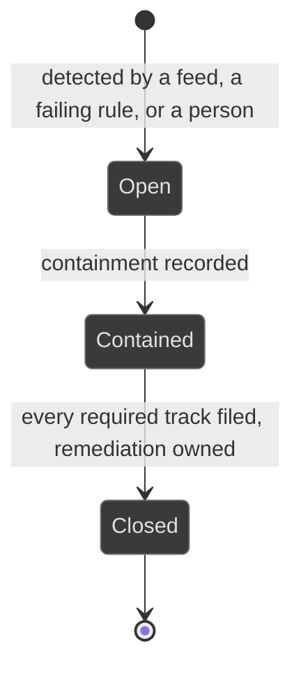
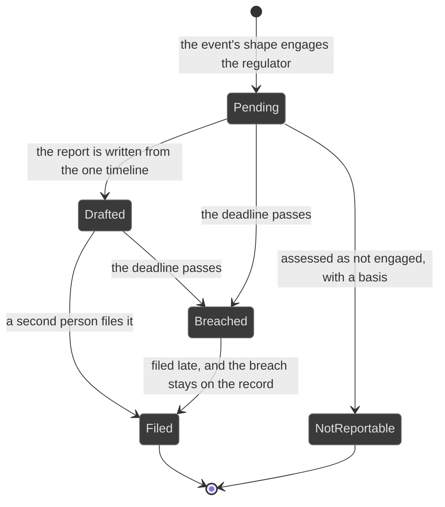

# Workflows: incident

Generated by Prototype to Product Kit v2.1 · 2026-08-27
Last updated: 2026-08-27

**Module** [[M-08]] · **Index** [[workflows]] · **Matrix** [[traceability]]

**Where this is built** [[SLICE-31]], [[SLICE-32]]

**Screens it drives** SCR-037, SCR-038, SCR-097 to SCR-099, in [[screen-inventory#1. Screens]]

**Entities it moves** listed on [[M-08]], defined in [[data-model#1. Entities]]

**Rules that span entities** [[workflows#3. Explicitly illegal moves that span entities]] ·
**derived states** [[workflows#2. Derived states, displayed and never stored]] ·
**chasing** [[workflows#5. Time-driven behaviour]]

---

## Incident

**What this entity is for.** An incident is a realised event that needs a
response and, often, notification to more than one regulator on more than one
clock. It exists so a firm responds once and satisfies several legal duties
without gathering proof three times, because three gatherings produce three
slightly different stories, which is worse than being late (FRD §5.10).

### States

| ID | Label shown to user | Meaning | Terminal |
|---|---|---|---|
| INC-S1 | Open | Detected, response under way | no |
| INC-S2 | Contained | The event is stopped, work continues | no |
| INC-S3 | Closed | Every required track is filed and remediation is owned | yes |

### Transitions

| ID | From | To | Trigger | Who may | Must be true first | State change | Side effects | Audit | API write | In prototype |
|---|---|---|---|---|---|---|---|---|---|---|
| INC-T1 | n/a | Open | A feed raises the incident | System | The feed answered with a detection time, a source and the affected assets | Incident created with `detectedAt` | Classified automatically against the sector taxonomy; the tracks its shape engages are created, each with its clock started at detection | `incident.raise` with the feed as actor | internal, on the feed | SIMULATED |
| INC-T2 | n/a | Open | A failing monitoring rule raises it | System | The rule's failure has produced a real event | Incident created, linked to the failing control | The issue from the rule is linked to the incident | `incident.raise` naming the rule | internal | SIMULATED |
| INC-T3 | n/a | Open | A person raises it by hand | Control Owner, Compliance Manager | A detection time is supplied | Incident created | Same as INC-T1 | `incident.raise` | `POST /incidents` | NOT PRESENT |
| INC-T4 | Open | Open | A responder records a timeline entry | Control Owner, Compliance Manager, and the DPO where personal data is involved | n/a | A timeline event, attributed and timestamped | One unified timeline serves every track | `incident.timeline` | `POST /incidents/:id/timeline` | SIMULATED |
| INC-T5 | Open | Open | Evidence is captured once | Control Owner, Compliance Manager | n/a | Evidence linked to the incident | Available to every track. The same artifacts back all three filings | `task.attachEvidence` | `POST /incidents/:id/evidence` | SIMULATED |
| INC-T6 | Open | Open | Personal-data involvement is discovered after the fact | Control Owner, Compliance Manager, DPO | n/a | `personalDataInvolved`, `personalDataDiscoveredAt`; a data-protection track created with `clockStartBasis = discovery` | The divergence from the detection time is recorded explicitly. This is the most legally sensitive clock-start rule in the platform | `incident.dataDiscovered` recording both times | `POST /incidents/:id/data-discovered` | NOT PRESENT |
| INC-T7 | Open | Contained | The responder records containment | Control Owner | The timeline carries a containment entry | `state`, `containedAt` | The cockpit's open-incident count moves | `incident.contain` | `POST /incidents/:id/contain` | NOT PRESENT |
| INC-T8 | Open or Contained | Open or Contained | The incident is linked to the control that failed and the risk it realised | Control Owner, Risk Manager | Both exist | Cross-links created | The control shows the incident; the realised risk is evidence that the residual was understated | `incident.link` | `POST /incidents/:id/links` | SIMULATED |
| INC-T9 | Open or Contained | Open or Contained | A loss is recognised | Control Owner, Compliance Manager | A category and a gross amount are supplied | Loss event created | Net is derived from gross minus recovery, floored at zero, and cannot be keyed | `loss.book` naming the category | `POST /incidents/:id/loss` | SIMULATED |
| INC-T10 | Contained | Closed | The Executive closes it | Executive | Every required track is Filed and remediation is owned | `state`, `closedAt`, `closureNote` | The nearest-clock strip drops it; the cockpit counts move | `incident.close` | `POST /incidents/:id/close` | NOT PRESENT |
| INC-T11 | Open or Contained | n/a | The incident turns out to be a fraud | Compliance Manager, Auditor, Risk Manager, Control Owner | n/a | A fraud case created, carrying the incident's regulator tracks | The incident links to the case | `fraud.open` naming the incident | `POST /incidents/:id/convert` | NOT PRESENT |

### Explicitly illegal moves

| ID | The move | Why refused |
|---|---|---|
| INC-I1 | Closing while a required track is unfiled | Closing the record does not discharge the duty. `BR-LFC-05` |
| INC-I2 | Starting a clock at record creation rather than detection | The regulator's clock does not wait for the firm's process. `BR-SCH-06` |
| INC-I3 | Clearing a breached clock by closing the record | A missed regulatory deadline is itself a reportable failure. `BR-SCH-08` |
| INC-I4 | Gathering proof separately per regulator | Three gatherings produce three slightly different stories. `BR-EVD-04` |
| INC-I5 | Storing the net loss | `BR-DRV-04` |
| INC-I6 | Recording a recovery greater than the gross loss | A recovery may not turn a loss into a gain. §5.11 |
| INC-I7 | Closing a track as not reportable with no recorded assessment | An inspector will ask to see it. `BR-LFC-09` |

### Diagram

---

## Regulator track

**What this entity is for.** A track is one regulator's reporting duty arising
from one incident or one case, with its own window, its own clock and its own
output format. Its shape is determined by the shape of the event, not by whoever
remembers (FRD §5.10, §5.23).

### States

| ID | Label shown to user | Meaning | Terminal |
|---|---|---|---|
| TRK-S1 | Pending | Engaged, nothing drafted | no |
| TRK-S2 | Drafted | The report is written and previewed | no |
| TRK-S3 | Filed | Submitted, with an acknowledgement captured as evidence | yes |
| TRK-S4 | Breached | The deadline passed and the track is not filed. Sticky | no |
| TRK-S5 | Not reportable | Assessed as not engaged, with a recorded basis | yes |

### Transitions

| ID | From | To | Trigger | Who may | Must be true first | State change | Side effects | Audit | API write | In prototype |
|---|---|---|---|---|---|---|---|---|---|---|
| TRK-T1 | n/a | Pending | The parent's shape engages the regulator | System | The incident or case carries the triggering attribute | Track created with `windowHours`, `clockStartedAt` and `requiredBasis` | The clock appears in the vital-signs strip and on the record | `track.engage` naming the basis | internal | SIMULATED, tracks are seeded |
| TRK-T2 | Pending | Drafted | The responder drafts the report from the one timeline and the one evidence set | Control Owner, Compliance Manager | The timeline carries the facts | `state`, `draftedAt` | The drawer previews the output in that regulator's format | `track.draft` | `POST /tracks/:id/draft` | SIMULATED |
| TRK-T3 | Drafted | Filed | A second person files it | Control Owner, Executive for an incident; Compliance Manager, Control Owner, Executive for a case; never the drafter | The draft exists | `state`, `filedAt`, `filedById` | The acknowledgement is captured as evidence; the incident may now close once every required track is filed | `incident.fileTrack` naming actor and track | `POST /tracks/:id/file` | SIMULATED |
| TRK-T4 | Pending or Drafted | Breached | The deadline passes | System | `deadline` has passed | none stored; the derived state moves | The track stays visible as breached, for good. The executive is notified | `track.breach` with the system as actor | internal | SIMULATED, the derived state exists and nothing notifies |
| TRK-T5 | Pending | Not reportable | The assessment concludes the regulator is not engaged | Compliance Manager | A basis is supplied | `notReportableBasis` | We decided it was not reportable is a decision an inspector will ask to see | `track.notReportable` with the basis | `POST /tracks/:id/not-reportable` | NOT PRESENT |

### Explicitly illegal moves

| ID | The move | Why refused |
|---|---|---|
| TRK-I1 | Filing a track you drafted | `BR-AUT-06`. Filing to a regulator on someone else's work is a sign-off |
| TRK-I2 | Un-breaching a track | Breach is sticky. `BR-SCH-08` |
| TRK-I3 | Filing with no acknowledgement captured | The acknowledgement is the evidence the duty was discharged. G-12 |
| TRK-I4 | Deciding the engaged tracks by hand | The shape of the event decides, not whoever remembers. §5.10 step 3 |

### Diagram

---

## Loss event

**What this entity is for.** A loss event is the financial consequence of an
incident or a confirmed fraud, categorised on the standard operational-risk
taxonomy. One loss book, so both sources book on the same categories and the
result is comparable with the industry (FRD §5.11).

A loss event has no lifecycle. It accumulates.

| ID | Trigger | Who may | Must be true first | State change | Side effects | Audit | API write | In prototype |
|---|---|---|---|---|---|---|---|---|
| LOS-T1 | The responder categorises the loss | Control Owner, Investigator | The parent is confirmed to carry a loss | Loss event created with a category from the standard seven | The Risk Committee pack's loss section moves | `loss.book` | `POST /incidents/:id/loss` | SIMULATED |
| LOS-T2 | The responder records the gross loss | Control Owner, Investigator | The category is set | `grossLoss` | The operational risk domain's evidence base moves | `loss.gross` with before and after | same | SIMULATED |
| LOS-T3 | A recovery lands | Control Owner, Investigator, Finance | An accounting reference is supplied | `recovery`, `accountingRef` | Net is derived. The fraud module's recovery-rate measure moves | `loss.recovery` | `POST /incidents/:id/loss/recovery` | SIMULATED |

| ID | Illegal move | Why refused |
|---|---|---|
| LOS-I1 | Keying the net loss | Gross minus recovery, floored at zero. The list, the detail and any roll-up cannot disagree. `BR-DRV-04` |
| LOS-I2 | Recording a recovery greater than the gross | A recovery may not become a gain. §5.11 |
| LOS-I3 | Booking a fraud loss into a separate book | One loss engine, one taxonomy. `BR-LNK-07` |
