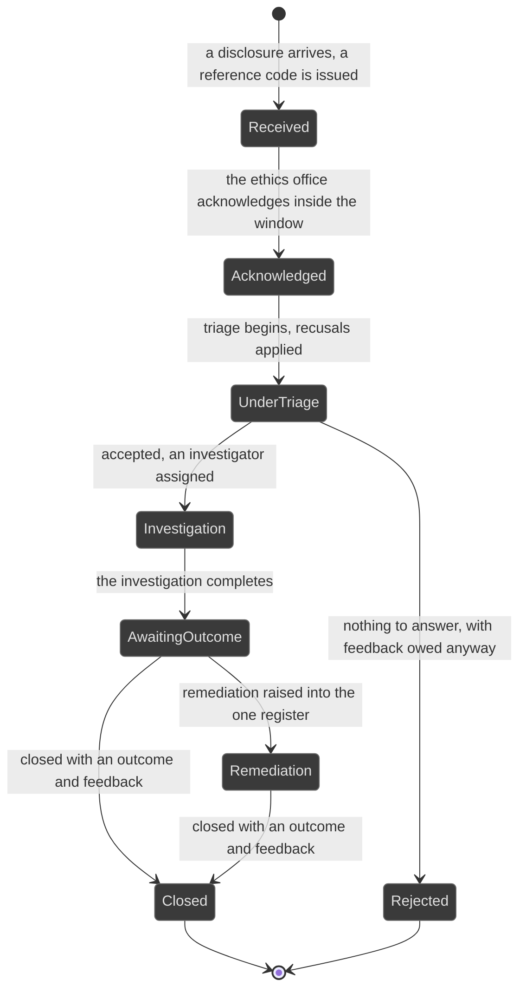
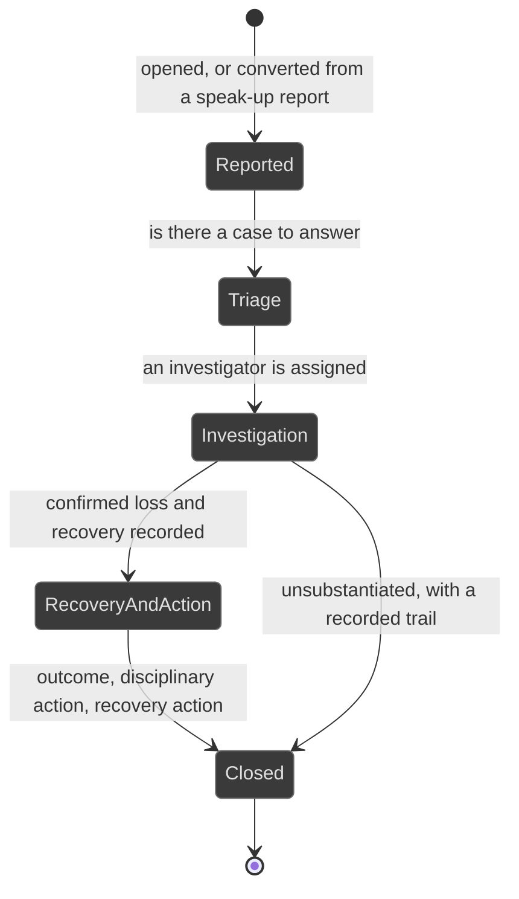

# Workflows: investigations

Generated by Prototype to Product Kit v2.1 · 2026-08-27
Last updated: 2026-08-27

**Module** [[M-14]] · **Index** [[workflows]] · **Matrix** [[traceability]]

**Where this is built** [[SLICE-40]], [[SLICE-41]], [[SLICE-42]]

**Screens it drives** SCR-039 to SCR-042, in [[screen-inventory#1. Screens]]

**Entities it moves** listed on [[M-14]], defined in [[data-model#1. Entities]]

**Rules that span entities** [[workflows#3. Explicitly illegal moves that span entities]] ·
**derived states** [[workflows#2. Derived states, displayed and never stored]] ·
**chasing** [[workflows#5. Time-driven behaviour]]

Two intakes, deliberately not one. A speak-up intake exists to protect a person;
a fraud intake exists to process data. They meet only at the platform level: both
push their outcome into the risk register, both raise remediation through the one
issues register, and both evidence themselves in the one vault.

---

## Speak-up report

**What this entity is for.** A speak-up report is a disclosure made through the
statutory vigil mechanism, held under a reference code rather than a name. Every
design decision in this workflow follows from one fact: this module exists to
protect a person (FRD §5.24, §4.12).

### States

| ID | Label shown to user | Meaning | Terminal |
|---|---|---|---|
| WBR-S1 | Received | Landed, reference code issued | no |
| WBR-S2 | Acknowledged | The reporter has been told it landed and is being looked at | no |
| WBR-S3 | Under triage | Being assessed for whether there is a case to answer | no |
| WBR-S4 | Investigation | Assigned to an investigator | no |
| WBR-S5 | Awaiting outcome | The investigation is complete, the outcome is being settled | no |
| WBR-S6 | Remediation | Remediation is running through the one issues register | no |
| WBR-S7 | Closed | Closed with an outcome and substantive feedback | yes |
| WBR-S8 | Rejected | Triage found nothing to answer, and the reporter still received feedback | yes |

### Transitions

| ID | From | To | Trigger | Who may | Must be true first | State change | Side effects | Audit | API write | In prototype |
|---|---|---|---|---|---|---|---|---|---|---|
| WBR-T1 | n/a | Received | A report arrives through a channel | Anyone, including anonymously | Nothing. The channel accepts | Report created; a reference code issued; metadata stripped at intake | Where the reporter identified themselves, a sealed custody note is stored naming who could unseal it, never the identity. Recusals are computed and written. The report is counted for every viewer and opens only for people on its access list | `speakup.receive` recording the act and never the content | `POST /speak-up` | SIMULATED |
| WBR-T2 | Received | Acknowledged | The ethics office acknowledges inside the window | The ethics office, by person | The actor is on the access list and is not recused | `state`, `acknowledgedOn` | The acknowledgement clock is met. The chasing target is the ethics office, never the reporter | `speakup.acknowledge` | `POST /speak-up/:id/acknowledge` | SIMULATED |
| WBR-T3 | Acknowledged | Under triage | Triage begins | Compliance Manager, by person on the access list | Case access, and no recusal | `state`, `triagedById`, `triagedOn` | Recusals are applied. A recused person cannot open it and it never reaches their queue | `speakup.triage` | `POST /speak-up/:id/triage` | SIMULATED |
| WBR-T4 | Under triage | Investigation | Triage accepts and assigns an investigator | Compliance Manager, by person on the access list | An investigator is named and is not recused | `state`, `investigatorId`, `assignedOn` | The investigator gains case access and a queue item | `speakup.assign` | same endpoint | SIMULATED |
| WBR-T5 | Under triage | Rejected | Triage finds nothing to answer | Compliance Manager, by person on the access list | A basis is supplied | `state`, `outcome`, `closureNote` | The reporter still receives substantive feedback. A channel that goes silent is a channel nobody uses twice | `speakup.reject` with the basis | same endpoint | SIMULATED |
| WBR-T6 | Investigation | Investigation | The investigator messages the reporter through the reference code | The assigned investigator | Case access | A message appended | The investigator never learns who the reporter is | `speakup.message` recording the act only | `POST /speak-up/:id/messages` | SIMULATED |
| WBR-T7 | Investigation | Awaiting outcome | The investigation completes | The assigned investigator | Case access | `state` | The approver gains a queue item | `speakup.investigationComplete` | `POST /speak-up/:id/complete` | SIMULATED |
| WBR-T8 | Awaiting outcome | Remediation | Remediation is raised | Compliance Manager, Auditor, by person | Case access | An issue in the one register, carrying the act and never the allegation | The case shows its issue | `issue.raise` naming the case | `POST /issues` | SIMULATED |
| WBR-T9 | Remediation or Awaiting outcome | Closed | A second person closes it | Compliance Manager, Auditor, by person, and never the investigator | An outcome and substantive feedback are both recorded | `state`, `outcome`, `closedOn`, `closureNote` | The reporter receives feedback whether or not the allegation stood up. A substantiated outcome pushes into the risk register | `speakup.close` recording the act only | `POST /speak-up/:id/close` | SIMULATED, and the prototype grants closure to the Audit Committee Chair, which the FRD removes |
| WBR-T10 | Investigation or Awaiting outcome | n/a | The report is really a fraud matter | Compliance Manager, by person | Case access | A fraud case created carrying the reference code and nothing else | The conversion must not become the leak | `speakup.convert` naming both ids | `POST /speak-up/:id/convert` | SIMULATED |
| WBR-T11 | any | any | A retaliation watch is reviewed | The ethics office, by person | A watch is open | `retaliationReviewedOn` | The next review falls ninety days out, and is chased until the watch is closed | `speakup.retaliationReview` | `POST /speak-up/:id/retaliation-review` | SIMULATED, with no ninety-day cadence |
| WBR-T12 | any | any | An identity is unsealed | Compliance Manager or Audit Committee Chair, by person, and never alone | A reason is supplied and the actor is on the unsealable list | `unsealedOn`, `unsealedById`, `unsealReason` | The unsealing is itself logged, as a governed separated-duty act | `speakup.unseal` recording the act and the reason, never the identity | `POST /speak-up/:id/unseal` | SIMULATED |

### Explicitly illegal moves

| ID | The move | Why refused |
|---|---|---|
| WBR-I1 | Opening a case you are not on the access list for, whatever your role | Access is decided by person, so a persona switch never opens a sealed case. `BR-SCP-05` |
| WBR-I2 | Opening a case you are recused from, even while on the access list | Recusal beats clearance. `BR-SCP-06` |
| WBR-I3 | Hiding the existence of a sealed case from someone who may not open it | A sealed case is counted, not hidden. Otherwise open-report counts could be understated to the committee that must oversee them. `BR-SCP-08` |
| WBR-I4 | Sending a case-restricted queue item or notification to someone not cleared | The queue must not become the leak the case page prevents. `BR-SCP-09` |
| WBR-I5 | Storing the reporter's identity in any field | You cannot leak what you do not hold. `BR-DAT-02` |
| WBR-I6 | Writing the allegation into the audit log | The trail records the act, never the content. `BR-AUD-05` |
| WBR-I7 | Closing with no outcome, or with no substantive feedback | `BR-LFC-12` |
| WBR-I8 | Closing a case you investigated | `BR-AUT-06` |
| WBR-I9 | Carrying anything but the reference code into a converted fraud case | `BR-LNK-09` |
| WBR-I10 | Offering the Executive persona the speak-up module at all | The CRO may be the subject of a report, and a channel whose subject can read it is not a channel. §4.9 |
| WBR-I11 | Closing as an Audit Committee Chair | The chair reviews; they do not operate the platform. Access to read is not authority to dispose. §4.10 v2.1 ruling |
| WBR-I12 | Naming a person in `allegationAgainst` at intake | A role or a team at intake. A name enters only once an allegation is substantiated |

### Diagram

---

## Fraud case

**What this entity is for.** A fraud case is an investigation into suspected
fraud, carrying the regulatory duties its shape engages. Fraud needs its own
module because its intake, its investigation discipline and its regulatory duties
differ from an operational incident's. What it must not have is its own private
copy of the shared machinery (FRD §5.23).

### States

| ID | Label shown to user | Meaning | Terminal |
|---|---|---|---|
| FRD-S1 | Reported | Opened, tracks determined | no |
| FRD-S2 | Triage | Is there a case to answer, and who investigates | no |
| FRD-S3 | Investigation | Under investigation against a target date | no |
| FRD-S4 | Recovery and action | Loss confirmed, recovery and remediation under way | no |
| FRD-S5 | Closed | Closed with an outcome, a disciplinary action and a recovery action | yes |

### Transitions

| ID | From | To | Trigger | Who may | Must be true first | State change | Side effects | Audit | API write | In prototype |
|---|---|---|---|---|---|---|---|---|---|---|
| FRD-T1 | n/a | Reported | Someone opens the case | Compliance Manager, Auditor, Risk Manager, Control Owner | A scheme, a detection method, an estimated loss and a subject scope are supplied | Case created | The regulatory tracks the case's shape engages are created: a subscriber-impacting event engages the sector regulator inside forty-eight hours and then the quarterly return; a cyber-enabled fraud engages the six-hour cyber direction; personal data involvement engages the breach intimation; a loss above the board's criminal-referral threshold engages a police referral; a loss above the audit-committee threshold is reportable to the statutory auditor and the committee | `fraud.open` naming the scheme and the detection | `POST /fraud` | SIMULATED |
| FRD-T2 | n/a | Reported | A speak-up report converts | Compliance Manager, by person on the access list | The source case exists | Case created carrying the reference code and nothing else | `BR-LNK-09` | `speakup.convert` | `POST /speak-up/:id/convert` | SIMULATED |
| FRD-T3 | Reported | Triage | Triage begins | The investigator, by person on the access list | Case access, and no recusal | `state` | Recusals are applied. The subject being senior is exactly when this matters | `fraud.triage` | `POST /fraud/:id/triage` | SIMULATED |
| FRD-T4 | Triage | Investigation | An investigator is assigned | Auditor, Compliance Manager, Control Owner, by person | Case access | `state`, `investigatorId` | A target date is derived: forty-five days for a critical case, ninety otherwise, chased on the ladder | `fraud.investigate` | `POST /fraud/:id/investigate` | SIMULATED |
| FRD-T5 | Investigation | Investigation | A regulator track is filed | Compliance Manager, Control Owner, Executive, and never the drafter | The track is Drafted | Track moves to Filed | The acknowledgement is captured as evidence | `fraud.fileTrack` naming the regulator | `POST /tracks/:id/file` | SIMULATED |
| FRD-T6 | Investigation | Recovery and action | The confirmed loss and any recovery are recorded | The investigator | A confirmed amount is supplied, and any recovery does not exceed the gross | `state`; a loss event booked on the standard categories | Net is derived. A confirmed fraud lands in the same loss engine as an operational incident, not a parallel one | `loss.book`, `loss.recovery` | `POST /fraud/:id/loss` | SIMULATED |
| FRD-T7 | Recovery and action | Recovery and action | Remediation is raised | The investigator | Case access | An issue in the one register | The case shows its issue | `issue.raise` naming the case | `POST /issues` | SIMULATED |
| FRD-T8 | Recovery and action | Recovery and action | The outcome is pushed into the risk register | The investigator, Risk Manager | A risk is named or created | A link to the risk | A case that changes nothing is noise. `BR-LNK-08` | `fraud.linkRisk` | `POST /fraud/:id/risks` | SIMULATED |
| FRD-T9 | Recovery and action | Closed | A second person closes it | Compliance Manager, Risk Manager, Executive, and never the investigator | An outcome, a disciplinary action and a recovery action are recorded | `state`, `outcome`, `closedOn`, `closureNote` | The Audit Committee pack picks it up | `fraud.close` naming the outcome | `POST /fraud/:id/close` | SIMULATED, and the prototype grants closure to the Audit Committee Chair, which the FRD removes |
| FRD-T10 | any | Closed | The case is unsubstantiated | Compliance Manager, Risk Manager, Executive, and never the investigator | An outcome and a trail are recorded | Same | An unsubstantiated case that leaves no record is a case that will be re-investigated from scratch. A control observation is recorded where relevant | `fraud.close` with the outcome | same endpoint | SIMULATED |

### Explicitly illegal moves

| ID | The move | Why refused |
|---|---|---|
| FRD-I1 | Closing a case you investigated | `BR-AUT-06` |
| FRD-I2 | Filing a track you drafted | `BR-AUT-06` |
| FRD-I3 | Opening a case you are recused from | Recusal is computed, not left to good manners. `BR-SCP-06`, `BR-SCP-07` |
| FRD-I4 | Naming a subject before an allegation is substantiated | Subjects are held by reference. §5.23 |
| FRD-I5 | Booking a fraud loss outside the one loss engine | `BR-LNK-07` |
| FRD-I6 | Choosing the engaged regulatory tracks by hand | The shape of the case decides, not whoever remembers. §5.23 |
| FRD-I7 | Closing an unsubstantiated case with no record | It will be re-investigated from scratch. §5.23 alternate path |
| FRD-I8 | Closing as an Audit Committee Chair | §4.10 v2.1 ruling |

### Diagram

