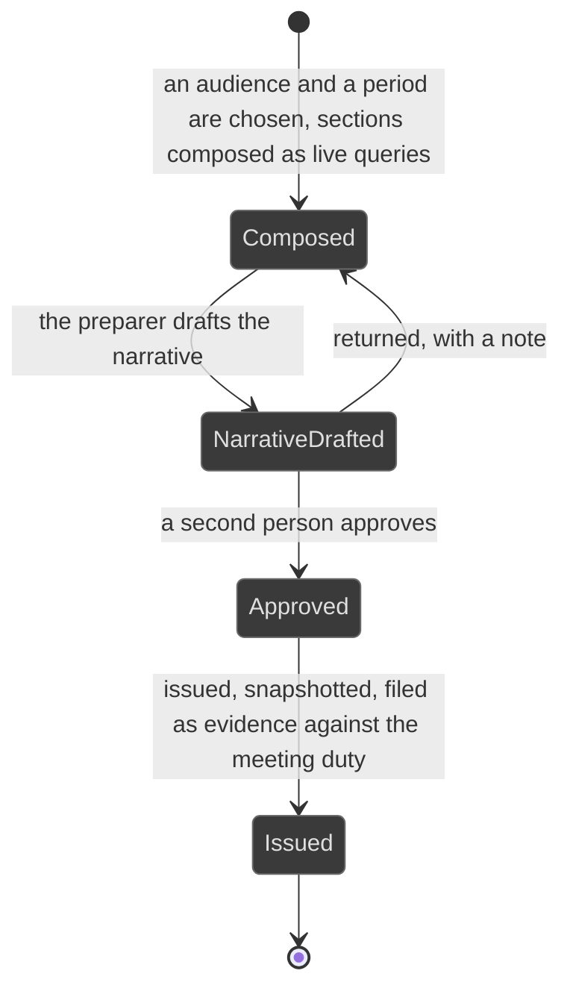

# Workflows: pack

Generated by Prototype to Product Kit v2.1 · 2026-08-27
Last updated: 2026-08-27

**Module** [[M-18]] · **Index** [[workflows]] · **Matrix** [[traceability]]

**Where this is built** [[SLICE-46]], [[SLICE-47]], [[SLICE-48]]

**Screens it drives** SCR-059, SCR-090, SCR-091, SCR-102, in [[screen-inventory#1. Screens]]

**Entities it moves** listed on [[M-18]], defined in [[data-model#1. Entities]]

**Rules that span entities** [[workflows#3. Explicitly illegal moves that span entities]] ·
**derived states** [[workflows#2. Derived states, displayed and never stored]] ·
**chasing** [[workflows#5. Time-driven behaviour]]

---

## Pack

**What this entity is for.** A pack is a committee or board report composed from
live queries over the register, produced under a named basis, with its narrative
approved by a second person before issue. It exists to turn committee preparation
from a project into a view, and it is the closing argument of the product
(FRD §5.26).

Three things make a pack governance-grade rather than a print-out, and all three
are requirements: it names the authority the meeting is held under, its narrative
is maker-checked before issue exactly like a filing, and issuing it discharges a
duty rather than sitting beside one.

### States

| ID | Label shown to user | Meaning | Terminal |
|---|---|---|---|
| PCK-S1 | Composed | The audience, the period and the sections are chosen | no |
| PCK-S2 | Narrative drafted | The preparer has written the narrative | no |
| PCK-S3 | Approved | A second person has approved the narrative | no |
| PCK-S4 | Issued | Published to the committee, snapshotted, and filed as evidence | yes |

### Transitions

| ID | From | To | Trigger | Who may | Must be true first | State change | Side effects | Audit | API write | In prototype |
|---|---|---|---|---|---|---|---|---|---|---|
| PCK-T1 | n/a | Composed | The preparer chooses an audience and a period | Compliance Manager, Risk Manager, Auditor, Executive | The audience is one of board, audit committee, risk committee or management | Pack created; one section row per section that audience takes | Each section is a live query over the register, never a stored table. A section whose module is not built is absent, not empty | `pack.compose` naming the audience and the period | `POST /packs` | SIMULATED |
| PCK-T2 | Composed | Composed | The system names the basis | System | The audience is set | `basis`, `basisIsBestPractice` | Where the basis is best practice rather than a binding duty, the pack says so. Overclaiming a statutory basis is a compliance failure in a compliance product | `pack.basis` | internal | SIMULATED |
| PCK-T3 | Composed | Narrative drafted | The preparer drafts the narrative | The preparer | The sections are composed | `narrative` | The approver gains a queue item | `pack.draft` | `POST /packs/:id/narrative` | SIMULATED |
| PCK-T4 | Narrative drafted | Approved | A second person approves the narrative | Compliance Manager, Risk Manager, Executive, Auditor, and never the preparer | The narrative exists | `approvedById`, `approvedOn` | The pack may now be issued | `pack.approve` | `POST /packs/:id/approve` | SIMULATED |
| PCK-T5 | Narrative drafted | Composed | The approver returns the narrative with a note | Compliance Manager, Risk Manager, Executive, Auditor, and never the preparer | A note is supplied | `returnReason` | The preparer reworks it | `pack.return` with the note | `POST /packs/:id/return` | SIMULATED |
| PCK-T6 | Approved | Issued | The preparer issues the pack | The preparer | The narrative is approved | `issuedOn`; the numbers as at issue are snapshotted | The issued pack is filed as evidence against the committee-meeting obligation's task, so producing the pack discharges the duty to hold and minute the meeting. The live view moves on; the committee's record is fixed | `pack.issue` naming the evidence | `POST /packs/:id/issue` | SIMULATED |

### Explicitly illegal moves

| ID | The move | Why refused |
|---|---|---|
| PCK-I1 | Approving a narrative you drafted | `BR-AUT-06` |
| PCK-I2 | Printing an empty section heading | A pack that prints an empty heading is worse than one that prints less: it reads as nothing to report when it means we cannot see. §5.26 |
| PCK-I3 | Storing a section's content as a table | Each section is a live query. §10.3 |
| PCK-I4 | Issuing without filing the pack as evidence | Issuing must discharge a duty rather than sit beside one. §5.26 step 7 |
| PCK-I5 | Claiming a statutory basis where the basis is best practice | §10.3 |
| PCK-I6 | Letting the board and management read different numbers | Both read the same live data. §10.3 |
| PCK-I7 | Showing a synthesised series on a board surface | `BR-DRV-18`. Until enough real history exists, a window reads since go-live, n months |

### Diagram

### The four audiences and their bases

| Audience | Committee | Basis it is produced under | What issuing discharges |
|---|---|---|---|
| Board | n/a | The board's reporting duty under the companies legislation | The board meeting and its minutes |
| Audit Committee | Audit | The audit-committee provision of the companies legislation. The quarterly cadence follows listed-company best practice, which this firm is not bound by and carries deliberately | The audit committee meeting |
| Risk Management Committee | Risk | The sector regulator's information and cyber-security guidelines, and the enterprise-risk board-reporting pattern | The risk committee meeting |
| Management | n/a | Internal management review, explicitly not a statutory return | n/a |
