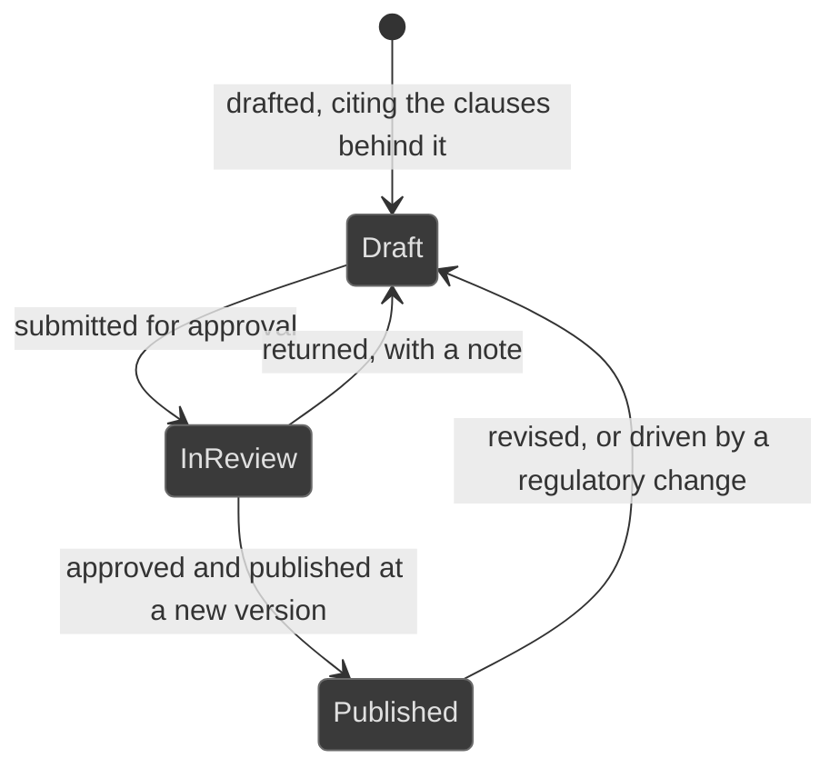

# Workflows: policy

Generated by Prototype to Product Kit v2.1 · 2026-08-27
Last updated: 2026-08-27

**Module** [[M-10]] · **Index** [[workflows]] · **Matrix** [[traceability]]

**Where this is built** [[SLICE-22]]

**Screens it drives** SCR-035, SCR-036, in [[screen-inventory#1. Screens]]

**Entities it moves** listed on [[M-10]], defined in [[data-model#1. Entities]]

**Rules that span entities** [[workflows#3. Explicitly illegal moves that span entities]] ·
**derived states** [[workflows#2. Derived states, displayed and never stored]] ·
**chasing** [[workflows#5. Time-driven behaviour]]

---

## Policy

**What this entity is for.** A policy is an internal instrument the firm binds
itself to, and it is where internal obligations come from. It exists because a
policy that is out of date silently invalidates every duty derived from it
(FRD §5.18).

### States

| ID | Label shown to user | Meaning | Terminal |
|---|---|---|---|
| POL-S1 | Draft | Being written or revised | no |
| POL-S2 | In review | Submitted for approval | no |
| POL-S3 | Published | Approved and in force, at a stated version | no |

A policy is never terminal. It is revised, republished, or its review date
passes and it reads as overdue for review.

### Transitions

| ID | From | To | Trigger | Who may | Must be true first | State change | Side effects | Audit | API write | In prototype |
|---|---|---|---|---|---|---|---|---|---|---|
| POL-T1 | n/a | Draft | The owner drafts a new policy | Compliance Manager, Control Owner, Risk Manager | A title, a category, an owner and the clauses behind it are supplied | Policy and a draft version created | The clauses it derives from gain a forward link | `policy.draft` | `POST /policies` | NOT PRESENT |
| POL-T2 | Published | Draft | The owner revises it | The policy owner | n/a | A new draft version created; the published version stays in force | Duties derived from the policy keep running against the version in force | `policy.revise` | `POST /policies/:id/revise` | NOT PRESENT |
| POL-T3 | Draft | In review | The owner submits it | The policy owner | The draft version cites at least one clause | `state` on the version | The approver gains a queue item | `policy.submit` | `POST /policies/:id/submit` | SIMULATED |
| POL-T4 | In review | Published | The approver approves and publishes | Compliance Manager, Executive, and never the submitter | The submission exists | `state`, `publishedOn`, `approvedById`; the version label increments | The policy is mapped to the controls that operationalise it; the next review is scheduled; an attestation campaign opens for the new version | `policy.publish` naming the version | `POST /policies/:id/publish` | SIMULATED |
| POL-T5 | In review | Draft | The approver returns it with a note | Compliance Manager, Executive, and never the submitter | A note is supplied | `state` on the version | The owner gains a queue item carrying the note | `policy.return` with the note | `POST /policies/:id/return` | NOT PRESENT |
| POL-T6 | Published | Published | The review date passes with no revision | System | `nextReview` has passed | none stored | The policy reads as overdue for review and escalates. Duties derived from it remain live, because the duty does not lapse because the policy did, and the gap is visible on the cockpit and in the pack | `policy.reviewOverdue` | internal | NOT PRESENT |
| POL-T7 | Published | Draft | A regulatory change drives a revision | Compliance Manager | The change is acknowledged | A new draft version, linked to the change | The change's impact set records the policy as patched | `policy.revise` naming the change | `POST /policies/:id/revise` | SIMULATED |

### Explicitly illegal moves

| ID | The move | Why refused |
|---|---|---|
| POL-I1 | Approving a policy you submitted | `BR-AUT-05` |
| POL-I2 | Carrying prior acknowledgements forward to a new version | An attestation is against a version. Publishing v3.5 does not carry forward the staff who acknowledged v3.4. `BR-LFC-06` |
| POL-I3 | Reporting an attestation rate against anything but the current version | 94 per cent attested against a superseded version is the failure this exists to prevent. `BR-DRV-13` |
| POL-I4 | Publishing without recording the approval chain | The chain is what makes the version defensible |
| POL-I5 | Retiring the duties derived from a policy whose review lapsed | The duty does not lapse because the policy did. §5.18 alternate path |
| POL-I6 | Using the word coverage for the attestation rate | Coverage is reserved for the compound label Duty coverage. §10.1 |

### Diagram

