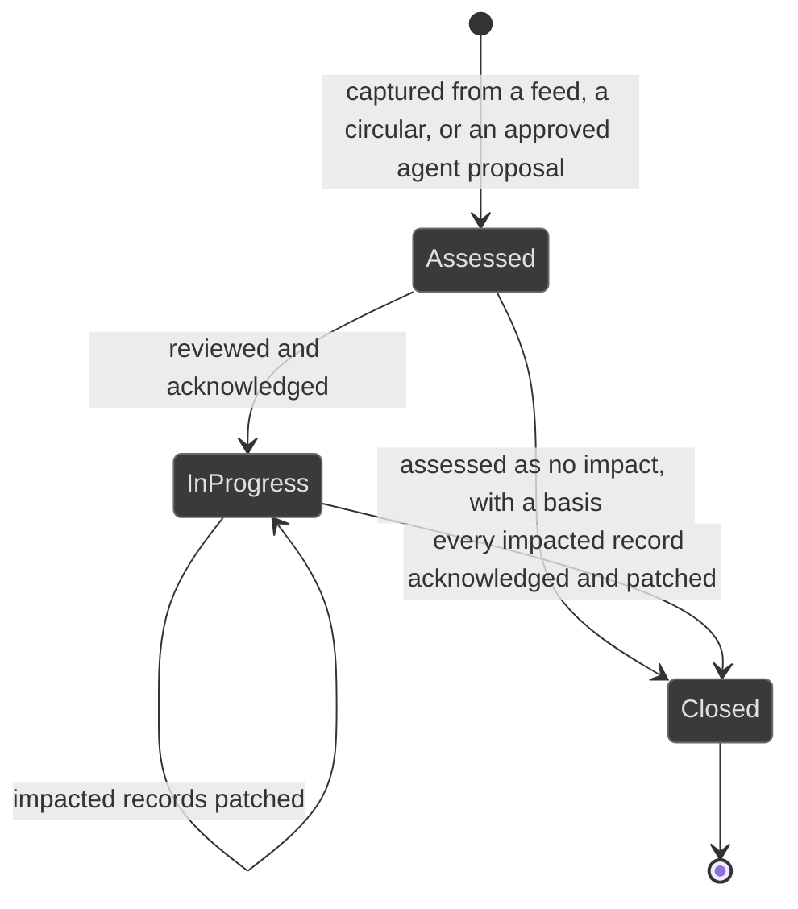
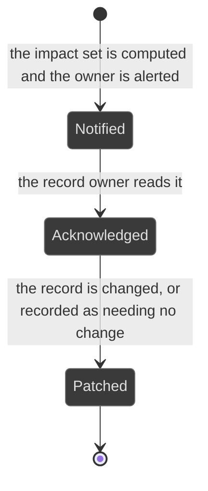

# Workflows: regulatory change

Generated by Prototype to Product Kit v2.1 · 2026-08-27
Last updated: 2026-08-27

**Module** [[M-13]] · **Index** [[workflows]] · **Matrix** [[traceability]]

**Where this is built** [[SLICE-33]]

**Screens it drives** SCR-051, SCR-052, in [[screen-inventory#1. Screens]]

**Entities it moves** listed on [[M-13]], defined in [[data-model#1. Entities]]

**Rules that span entities** [[workflows#3. Explicitly illegal moves that span entities]] ·
**derived states** [[workflows#2. Derived states, displayed and never stored]] ·
**chasing** [[workflows#5. Time-driven behaviour]]

---

## Regulatory change

**What this entity is for.** A regulatory change is an incoming change to the law
or to a regulator's expectations, with its computed impact across the firm's own
records. It exists because a change that reaches the right person in a week is
manageable and a change discovered during an inspection is not (FRD §5.3).

### States

| ID | Label shown to user | Meaning | Terminal |
|---|---|---|---|
| RCM-S1 | Assessed | Captured, impact computed, owners alerted, no acknowledgement yet | no |
| RCM-S2 | In progress | Acknowledged, impacted records being patched | no |
| RCM-S3 | Closed | Every impacted record is acknowledged and patched, or no impact was recorded | yes |

### Transitions

| ID | From | To | Trigger | Who may | Must be true first | State change | Side effects | Audit | API write | In prototype |
|---|---|---|---|---|---|---|---|---|---|---|
| RCM-T1 | n/a | Assessed | A change arrives from a regulatory-intelligence feed or a regulator circular | System | The change carries its source, its publication date and a summary | Change created with provenance | The provenance counter behind the firm's claim to be current increments | `regChange.capture` with the feed as actor | internal, on the feed | SIMULATED |
| RCM-T2 | n/a | Assessed | The source-scanning agent proposes it | System | The run recorded its inputs, its evidence and its outputs | A proposal, and nothing changed | A person approves the proposal, which then performs the ordinary capture | `agent.run`, then `regChange.capture` naming the run | `POST /agent-runs/:id/apply` | SIMULATED |
| RCM-T3 | Assessed | Assessed | The system computes the impact set | System | The change exists | One impact row per touched obligation, control and policy | The owner of every impacted record is alerted automatically. Nobody pressed send | `regChange.impact` naming the count | internal | SIMULATED |
| RCM-T4 | Assessed | In progress | A person reviews the impact and acknowledges the change | Compliance Manager, Compliance Analyst, Risk Manager | The impact set exists | `state`, `acknowledgedById`, `acknowledgedAt` | The change enters the working register | `regChange.acknowledge` | `POST /reg-changes/:id/acknowledge` | SIMULATED |
| RCM-T5 | In progress | In progress | A person patches an impacted record | The record's own authority: Compliance Manager for a duty, Control Owner for a control, the policy owner for a policy | The impact row is acknowledged | `patchedAt`, `patchNote` on the impact row; the target record changes | The target gains a link to the change that drove it | `obligation.patch`, `control.patch` or `policy.revise`, each with before and after | per record | SIMULATED |
| RCM-T6 | In progress | In progress | The change creates a genuinely new duty rather than amending one | Compliance Manager in Compliance and Company Secretarial | The instrument is registered and the provision is extracted | The provision enters the pipeline at Awaiting decision | The new duty carries its own provenance. Editing an existing duty to mean something new would destroy the provenance of what it used to mean | `provision.promote` naming the change | `POST /provisions/:id/promote` | NOT PRESENT |
| RCM-T7 | In progress | Closed | Every impacted record is acknowledged and patched | Compliance Manager, Compliance Analyst | No impact row is unacknowledged | `state`, `closedAt` | The change leaves the working register | `regChange.close` | `POST /reg-changes/:id/close` | SIMULATED |
| RCM-T8 | Assessed | Closed | The assessment is that nothing is affected | Compliance Manager, Compliance Analyst | A basis is supplied | `state`, `noImpactBasis`, `closedAt` | No impact is a decision that must be visible, not an absence | `regChange.noImpact` with the basis | `POST /reg-changes/:id/no-impact` | NOT PRESENT |

### Explicitly illegal moves

| ID | The move | Why refused |
|---|---|---|
| RCM-I1 | Closing while an impacted record is unacknowledged | Otherwise closed means we stopped looking. `BR-LFC-08` |
| RCM-I2 | Recording no impact with no basis | `BR-LFC-09` |
| RCM-I3 | Editing an existing duty to mean something new | It destroys the provenance of what the duty used to mean. §5.3 step 6 |
| RCM-I4 | Pausing an escalation ladder because a regulatory change landed on the duty | A regulatory change is not a reason for a deadline to stop counting. §5.3 alternate path |
| RCM-I5 | Alerting owners by hand | The alert is automatic, and its automatic nature is the requirement. §5.3 step 3 |

### Diagram

---

## Change impact

**What this entity is for.** An impact row is the platform's assertion that one
named obligation, control or policy is touched by one change, together with the
record of who acknowledged it and what was done. It is what makes the closure
gate checkable (FRD §5.3 step 2, `BR-LFC-08`).

| ID | Label shown to user | Meaning | Terminal |
|---|---|---|---|
| IMP-S1 | Notified | The owner has been told | no |
| IMP-S2 | Acknowledged | The owner has read it | no |
| IMP-S3 | Patched | The record has been changed, or recorded as needing no change | yes |

| ID | From | To | Trigger | Who may | Must be true first | State change | Side effects | Audit | API write | In prototype |
|---|---|---|---|---|---|---|---|---|---|---|
| IMP-T1 | n/a | Notified | The impact set is computed | System | The change exists | Row created, `notifiedOwnerAt` set | The owner gains a queue item | `regChange.impact` | internal | SIMULATED |
| IMP-T2 | Notified | Acknowledged | The record owner acknowledges | The record owner | n/a | `acknowledgedById`, `acknowledgedAt` | The change may progress toward closure | `regChange.acknowledgeImpact` | `POST /reg-changes/:id/impacts/:impactId/ack` | NOT PRESENT |
| IMP-T3 | Acknowledged | Patched | The owner patches the record, or records that no change is needed | The record owner | A patch note is supplied either way | `patchedAt`, `patchNote` | The target record links back to the change | per record | per record | SIMULATED |

| ID | Illegal move | Why refused |
|---|---|---|
| IMP-I1 | Marking an impact patched with no note | `BR-LFC-09` |
| IMP-I2 | Acknowledging on someone else's behalf | The row records who was told and who read it |

### Diagram

