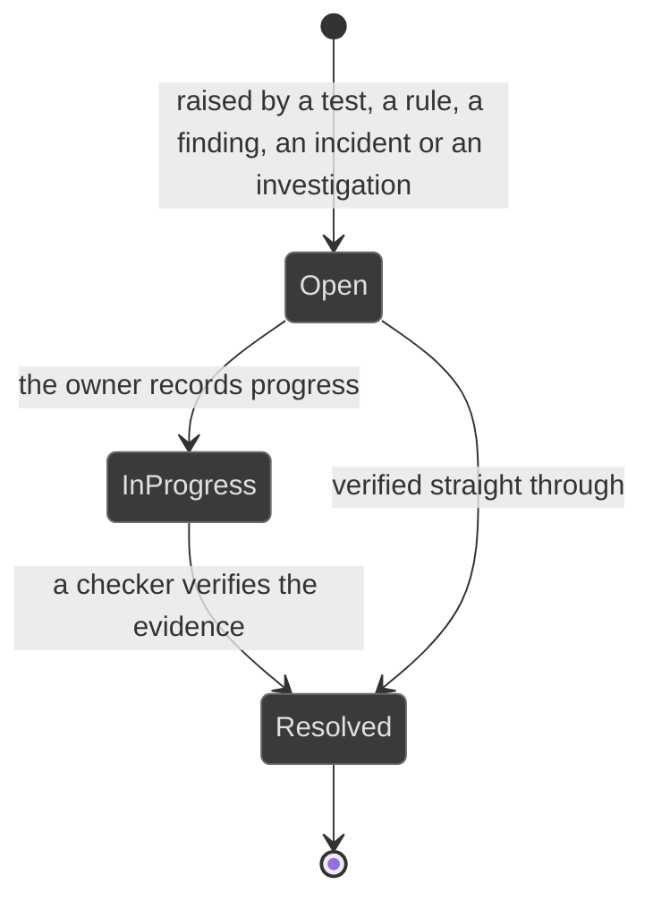
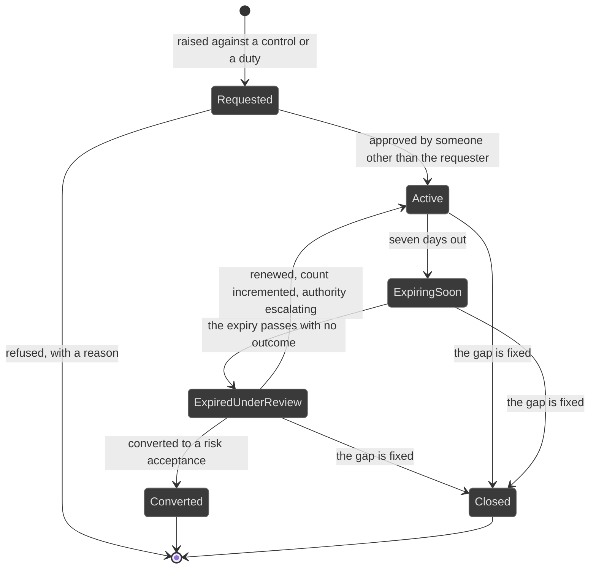

# Workflows: remediation

Generated by Prototype to Product Kit v2.1 · 2026-08-27
Last updated: 2026-08-27

**Module** [[M-07]] · **Index** [[workflows]] · **Matrix** [[traceability]]

**Where this is built** [[SLICE-23]], [[SLICE-24]]

**Screens it drives** SCR-066, SCR-067, in [[screen-inventory#1. Screens]]

**Entities it moves** listed on [[M-07]], defined in [[data-model#1. Entities]]

**Rules that span entities** [[workflows#3. Explicitly illegal moves that span entities]] ·
**derived states** [[workflows#2. Derived states, displayed and never stored]] ·
**chasing** [[workflows#5. Time-driven behaviour]]

Two entities, one register. The Issues and Remediation screen is a union view
over both, so the Audit Committee has one place to look and nothing is invisible.
They are not fused, because an issue is a weakness being fixed and an exception
is a deviation being governed, and those are different lifecycles.

---

## Issue

**What this entity is for.** An issue is a tracked weakness needing remediation,
from whatever produced it: a failed control test, a failing monitoring rule, an
audit finding, an incident action, or an investigation outcome. It exists so
that findings do not get lost between modules (FRD §5.22).

### States

| ID | Label shown to user | Meaning | Terminal |
|---|---|---|---|
| ISS-S1 | Open | Raised, owned, dated, not started | no |
| ISS-S2 | In progress | Work has begun | no |
| ISS-S3 | Resolved | Verified closed by someone with resolve authority | yes |

### Transitions

| ID | From | To | Trigger | Who may | Must be true first | State change | Side effects | Audit | API write | In prototype |
|---|---|---|---|---|---|---|---|---|---|---|
| ISS-T1 | n/a | Open | A control test fails | System | The test result is Fail | Issue created with source `ControlFailure`, the control as its reference, a severity, an owner and a due date | The control shows the issue on its own page; the ladder starts | `issue.raise` naming the test | internal, on `control.retest` | NOT PRESENT |
| ISS-T2 | n/a | Open | A monitoring rule fails | System | A run recorded failing items | Issue created naming the failing items | Where the failure has produced a real event, the issue is linked to the incident | `issue.raise` naming the run | internal, on the run | SIMULATED, the link is seeded |
| ISS-T3 | n/a | Open | An audit finding is raised | System | The finding exists | Issue created with source `AuditFinding`, one per finding | The finding shows its issue; closing the issue feeds the finding's closure | `issue.raise` naming the finding | internal, on `finding.raise` | SIMULATED |
| ISS-T4 | n/a | Open | An incident produces a remedial action | Control Owner, Compliance Manager | The incident exists | Issue created with source `Incident` | The incident shows the issue | `issue.raise` naming the incident | `POST /issues` | SIMULATED |
| ISS-T5 | n/a | Open | An investigation concludes | Compliance Manager, Auditor, Risk Manager, Control Owner | The case exists and the actor may open it | Issue created with source `Investigation`. The issue carries the act, never the allegation | The case shows the issue | `issue.raise` naming the case, with no content | `POST /issues` | SIMULATED |
| ISS-T6 | Open | In progress | The owner records progress | The issue owner | n/a | `state` | The queue item stays | `issue.progress` | `PATCH /issues/:id` | SIMULATED |
| ISS-T7 | In progress | Resolved | A checker verifies and resolves | Control Owner, Auditor, Compliance Manager | Evidence that the weakness is closed is attached | `state`, `resolvedAt`, `resolvedById`, `resolutionNote` | Where the issue backs an audit finding, the finding may now be closed by the auditor; the metrics move | `issue.resolve` with the note | `POST /issues/:id/resolve` | SIMULATED |
| ISS-T8 | Open or In progress | Resolved | Several issues are actioned together where one remediation closes them | Control Owner, Auditor, Compliance Manager | Each has evidence | Each moves independently | Each records its own resolution | `issue.resolve` per issue | `POST /issues/bulk/resolve` | SIMULATED, bulk status change only |

### Explicitly illegal moves

| ID | The move | Why refused |
|---|---|---|
| ISS-I1 | Resolving an issue with no evidence that the weakness is closed | The proof is the point |
| ISS-I2 | Storing the age | Ageing is the number the Audit Committee asks for, and it cannot be a field somebody forgot to update. `BR-DRV-12` |
| ISS-I3 | Reporting a mean of open issue ages | A mean of open ages improves when young items close and flatters stalling. Ageing bands, the oldest item, and the share closed within SLA. §10.1, D-06 |
| ISS-I4 | Holding an exception as an issue with a deviation record attached | Two different lifecycles fused into one. §5.14 v2.1 |
| ISS-I5 | Keeping a module-private remediation list | `BR-LNK-06` |

### Diagram

---

## Exception

**What this entity is for.** An exception is a known, time-boxed, approved and
compensated deviation from a named control or a named duty. It is how the firm
says: we know, here is why, here is what we are doing instead, and here is when
it ends. The same deviation undocumented is a finding (FRD §5.14).

### States

| ID | Label shown to user | Meaning | Terminal |
|---|---|---|---|
| EXC-S1 | Requested | Raised, waiting on an approver | no |
| EXC-S2 | Active | Approved, inside its expiry | no |
| EXC-S3 | Expiring soon | Inside the seven-day window before expiry | no |
| EXC-S4 | Expired, under review | Past expiry with no outcome recorded. An open exposure, escalating | no |
| EXC-S5 | Converted | Ended by becoming a time-bound risk acceptance | yes |
| EXC-S6 | Closed | Ended because the gap was fixed or the deviation ended | yes |

`Expiring soon` and `Expired` are derived from the expiry date and the warning
window. Neither is stored.

### Transitions

| ID | From | To | Trigger | Who may | Must be true first | State change | Side effects | Audit | API write | In prototype |
|---|---|---|---|---|---|---|---|---|---|---|
| EXC-T1 | n/a | Requested | The owner raises a deviation against a control or a duty | Control Owner, Compliance Manager, Compliance Analyst, Risk Manager | A subject, a reason, a requested expiry and a severity are supplied. A compensating control is supplied where one exists | Exception created, optionally citing the issue that prompted it | The approver gains a queue item; the subject shows the exception on its own page | `exception.raise` naming the subject | `POST /exceptions` | SIMULATED, and modelled as an issue |
| EXC-T2 | n/a | Requested | A deviation is known in advance, before anything has failed | Control Owner, Compliance Manager, Compliance Analyst, Risk Manager | No issue exists, and that is correct | Exception created with no `issueId` | A proactive exception is a first-class path, not an issue in disguise | `exception.raise` | `POST /exceptions` | NOT PRESENT |
| EXC-T3 | n/a | Requested | An attestation declares that the person cannot comply | System, on campaign task submission | The declaration kind is `CannotComply` | Exception created against the control or duty the policy mandates | The declaration is treated as the control gap it is, not as a comment in a text box | `exception.raise` naming the campaign task | internal, on `campaign.submit` | SIMULATED |
| EXC-T4 | Requested | Active | The approver approves | Compliance Manager, Risk Manager, Executive, and never the requester | The request is complete | `approvedById`, `approvedOn` | The subject stops escalating on the ordinary ladder; the expiry ladder starts against `expiresOn` | `exception.approve` | `POST /exceptions/:id/approve` | SIMULATED |
| EXC-T5 | Requested | Requested | The approver refuses | Compliance Manager, Risk Manager, Executive, and never the requester | A reason is supplied | `refusedOn`, `refusalReason` | The requester is told why; the ordinary ladder keeps running | `exception.refuse` with the reason | `POST /exceptions/:id/refuse` | NOT PRESENT |
| EXC-T6 | Active | Expiring soon | Seven days before expiry | System | n/a | none stored | The owner and the approver are both chased | `reminder.fire` | internal | SIMULATED |
| EXC-T7 | Expiring soon | Expired, under review | The expiry passes with no outcome | System | n/a | none stored | The exception reads as the open exposure in the union register and escalates on the standard ladder, reaching the executive rung at seven days. No issue is created | `exception.expired` | internal | NOT PRESENT |
| EXC-T8 | Active, Expiring soon or Expired | Closed | The owner closes it because the gap is fixed or the deviation ended | Control Owner, Compliance Manager, Auditor | A closure note is supplied | `closedOn`, `closureNote` | The subject returns to the ordinary ladder | `exception.close` | `POST /exceptions/:id/close` | SIMULATED |
| EXC-T9 | Expired | Active | The approver renews with a new expiry | Compliance Manager, Risk Manager or Executive for the first renewal; **Executive only** from the second; never the requester | A new expiry is supplied | `renewalCount` increments, `expiresOn` moves | Past the second renewal the exception is reported by name in the Audit Committee pack | `exception.renew` naming the count and the approver | `POST /exceptions/:id/renew` | SIMULATED, with no authority escalation |
| EXC-T10 | Expired | Converted | The approver converts it to a risk acceptance | Compliance Manager, Risk Manager, Executive, and never the requester | The subject maps to a risk | A risk acceptance is created; the exception closes with that outcome | The exposure moves onto the risk, where it expires again | `exception.convert` naming both records | `POST /exceptions/:id/convert` | NOT PRESENT |
| EXC-T11 | Active | Active | The linked issue closes while the exception is live | System | The issue resolves | none | The exception does not auto-close. The deviation was approved to an expiry. The link records that the prompting weakness is gone | `issue.resolve` | internal | NOT PRESENT |

### Explicitly illegal moves

| ID | The move | Why refused |
|---|---|---|
| EXC-I1 | Approving your own exception, or renewing your own | Renewing a deviation is the same decision as granting it. `BR-AUT-05`, `BR-AUT-06` |
| EXC-I2 | Creating an exception with no expiry | An exception always expires. §5.14 |
| EXC-I3 | Auto-creating an issue when an exception expires | It would split one exposure across two lifecycles and let the exception read as merely expired while a clone carries the heat. `BR-LFC-13` |
| EXC-I4 | Letting an undecided expiry go quiet | Lapse is not an outcome. There is no state in which an undecided expiry stops being loud. `BR-LFC-13` |
| EXC-I5 | Taking a second renewal without the Executive | An exception renewed repeatedly is a permanent decision the firm has not admitted to. `BR-AUT-11` |
| EXC-I6 | Creating an exception with no named subject | The deviation is always from something nameable. §7.2 |
| EXC-I7 | Forcing a proactive exception to invent an issue | A planned migration that will suspend a control for a fortnight has no weakness behind it. §5.14 |
| EXC-I8 | Storing the expiry state | `BR-DRV-08` |

### Diagram

