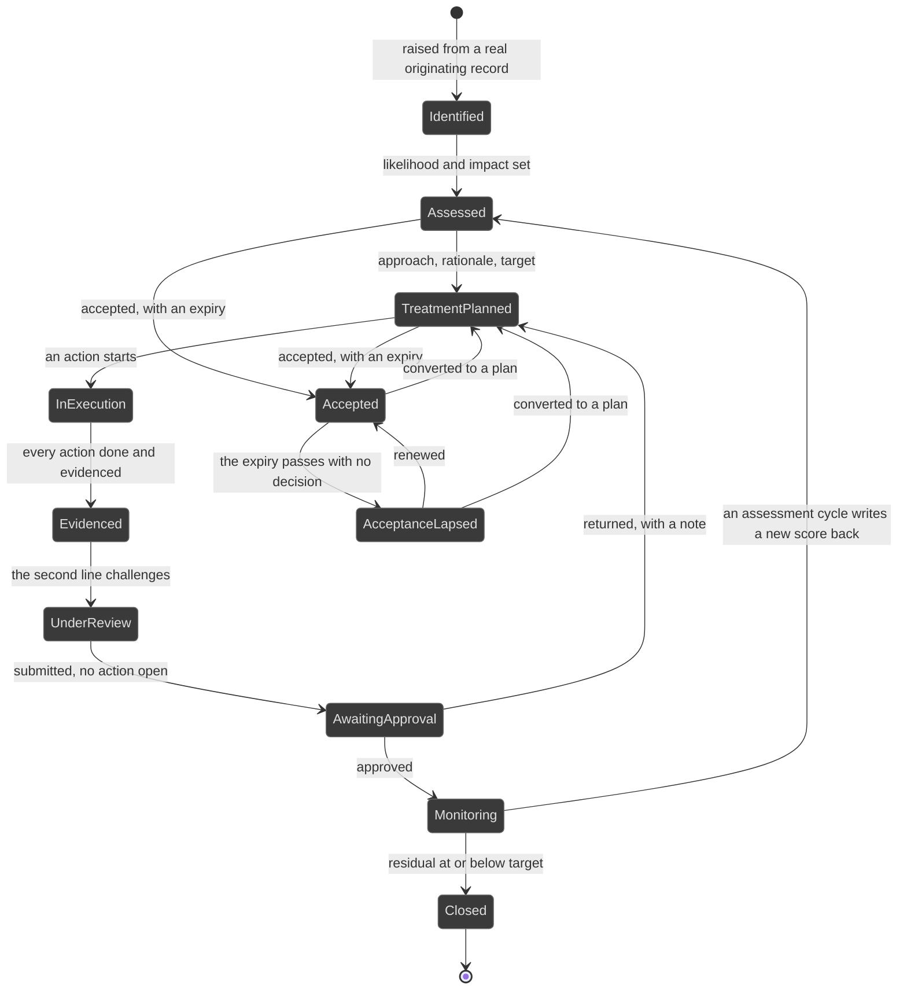
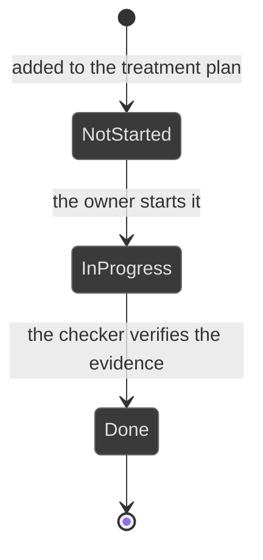
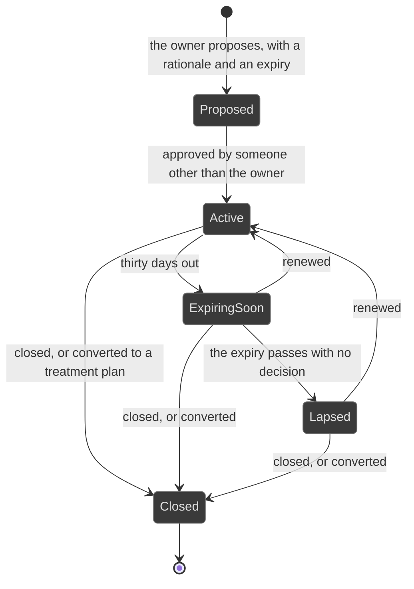
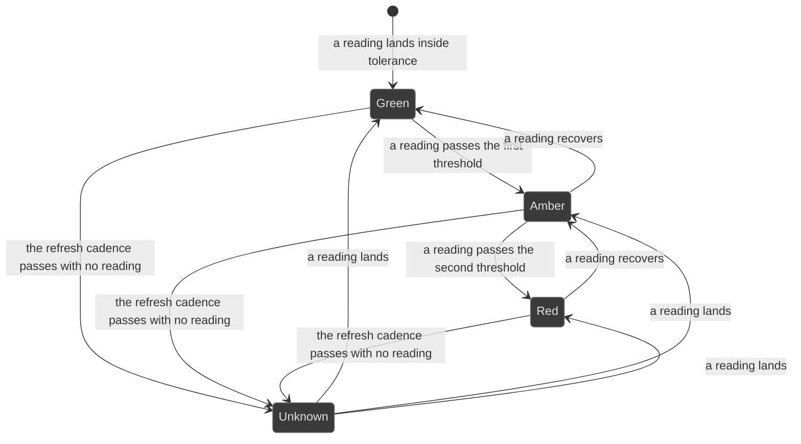

# Workflows: risk

Generated by Prototype to Product Kit v2.1 · 2026-08-27
Last updated: 2026-08-27

**Module** [[M-06]] · **Index** [[workflows]] · **Matrix** [[traceability]]

**Where this is built** [[SLICE-25]], [[SLICE-26]], [[SLICE-27]], [[SLICE-28]]

**Screens it drives** SCR-011 to SCR-019, in [[screen-inventory#1. Screens]]

**Entities it moves** listed on [[M-06]], defined in [[data-model#1. Entities]]

**Rules that span entities** [[workflows#3. Explicitly illegal moves that span entities]] ·
**derived states** [[workflows#2. Derived states, displayed and never stored]] ·
**chasing** [[workflows#5. Time-driven behaviour]]

---

## Risk

**What this entity is for.** A risk is something that could stop the firm meeting
its objectives, rated by how likely it is and how bad it would be, with the
badness grounded in the actual sourced penalty. It exists so the register is a
thing that moves rather than a list of nouns: identified from somewhere real,
assessed, treated by named actions with owners and dates, evidenced, challenged,
approved and then monitored (FRD §5.12).

### States

Every one of these is derived from the risk's own lifecycle record, so the
register and the detail page cannot disagree.

| ID | Label shown to user | Meaning | Terminal |
|---|---|---|---|
| RSK-S1 | Identified | Raised, with its originating record recorded | no |
| RSK-S2 | Assessed | Likelihood and impact set, residual computed | no |
| RSK-S3 | Treatment planned | An approach, a rationale, a target residual and a target date exist | no |
| RSK-S4 | In execution | At least one remediation action has started | no |
| RSK-S5 | Evidenced | Every action is done and evidenced | no |
| RSK-S6 | Under review | The second line is challenging the plan and its execution | no |
| RSK-S7 | Awaiting approval | Submitted for approval, with no action open | no |
| RSK-S8 | Monitoring | Approved, and watched | no |
| RSK-S9 | Closed | Residual at or below target, and mitigated | yes |
| RSK-S10 | Accepted | Carried deliberately, until a stated expiry | no |
| RSK-S11 | Acceptance lapsed | The acceptance expired with no decision. An open exposure, escalating | no |

### Transitions

| ID | From | To | Trigger | Who may | Must be true first | State change | Side effects | Audit | API write | In prototype |
|---|---|---|---|---|---|---|---|---|---|---|
| RSK-T1 | n/a | Identified | Someone raises the risk | Risk Manager, Control Owner, Compliance Manager, Auditor | The originating record is named: an assessment, a finding, an incident, a regulatory change, a control failure, or a manual entry | Risk created with its identification block | It appears on the register and the heat map | `risk.identify` naming the source record | `POST /risks` | SIMULATED |
| RSK-T2 | Identified | Assessed | The owner sets likelihood and impact | The owner | Both are 1 to 5 | `likelihood`, `impact`; inherent and residual follow | The heat map position moves; the domain aggregate moves | `risk.assess` with before and after | `PATCH /risks/:id/assessment` | SIMULATED |
| RSK-T3 | Assessed | Treatment planned | The owner writes the treatment | The owner | An approach, a rationale, a target residual and a target date are supplied | Treatment created | The register shows the target beside the current residual | `risk.treatmentPlan` | `POST /risks/:id/treatment` | SIMULATED |
| RSK-T4 | Treatment planned | In execution | The owner progresses an action | Risk Manager, Control Owner, Compliance Manager | At least one action exists with an owner, a due date and a residual contribution | The action's task moves to In progress | The ladder chases each action on its own due date; the projected residual appears beside the current one | `risk.action.advance` naming the action | `POST /risks/:id/actions/:actionId/advance` | SIMULATED |
| RSK-T5 | In execution | Evidenced | The last action is done and evidenced | The action owner | Every action is Done and carries at least one verified evidence item | none stored; the derived stage moves | The evidence tab fills | `task.verify` on the last action | `POST /tasks/:id/verify` | SIMULATED |
| RSK-T6 | Evidenced | Under review | The second line reviews the plan and its execution | Risk Manager, Compliance Manager, Auditor | The risk is Evidenced | A review recorded with an outcome | The reviewer's queue item clears | `risk.review` with the outcome and the note | `POST /risks/:id/review` | SIMULATED |
| RSK-T7 | Under review | Awaiting approval | The owner submits the plan | Risk Manager, Control Owner, Compliance Manager | No remediation action is open | Approval record moves to Submitted | The approver gains a queue item | `risk.submit` | `POST /risks/:id/submit` | SIMULATED |
| RSK-T8 | Awaiting approval | Monitoring | The approver approves | Risk Manager, Executive, and never the maker | The risk is Awaiting approval | Approval record moves to Approved | The register shows Monitoring; the appetite aggregate reflects it | `risk.approve` | `POST /risks/:id/approve` | SIMULATED |
| RSK-T9 | Awaiting approval | Treatment planned | The approver returns it with a note | Risk Manager, Executive, and never the maker | A note is supplied | Approval record moves to Returned | The owner gains a queue item carrying the note; execution resumes | `risk.return` with the note | `POST /risks/:id/return` | SIMULATED |
| RSK-T10 | Monitoring | Closed | The residual sits at or below target and the risk is mitigated | Risk Manager, Executive | `residual` is at or below `targetResidual` | Closure recorded | The register drops it from live exposure and keeps its history | `risk.close` with the basis | `POST /risks/:id/close` | NOT PRESENT |
| RSK-T11 | Assessed or Treatment planned | Accepted | The approver accepts the exposure | Executive, Risk Manager, and never the owner | A rationale and an expiry are supplied | Acceptance created | The acceptance's expiry is chased from thirty days out; the appetite view counts it as exposure once it lapses | `risk.accept` naming rationale and expiry | `POST /risks/:id/accept` | SIMULATED |
| RSK-T12 | Accepted | Acceptance lapsed | The expiry passes with no decision | System | `expiresOn` has passed and no renewal, closure or conversion was recorded | none stored; the derived stage moves | The risk reads as an open, unmanaged exposure on the register and in the committee pack, and it escalates | `risk.acceptanceLapsed` with the system as actor | internal, on schedule | NOT PRESENT |
| RSK-T13 | Accepted or Acceptance lapsed | Accepted | The approver renews | Executive, Risk Manager, and never the owner | A new expiry is supplied | `renewalCount` increments, `expiresOn` moves | The Risk Committee pack lists acceptances and their expiries | `risk.acceptRenew` | `POST /risks/:id/accept/renew` | NOT PRESENT |
| RSK-T14 | Accepted or Acceptance lapsed | Treatment planned | The acceptance is converted to a treatment plan | Risk Manager, Executive | A treatment is supplied | Acceptance closed, treatment created | The register shows the risk back in the workflow | `risk.acceptConvert` | `POST /risks/:id/accept/convert` | NOT PRESENT |
| RSK-T15 | Monitoring | Assessed | An assessment campaign approval writes a new score back | System, on campaign task approval | The campaign task is Approved | `likelihood`, `impact`, treatment; a timeline entry recording the change | The heat map, the domain aggregate and the exposure trend all move | `campaign.writeBack` naming the campaign task | internal, on `campaign.review` | SIMULATED |
| RSK-T16 | any | any | A monitored indicator on the risk breaches | System | A reading lands outside the green band | none | The register badges the risk with the worst band across its indicators | `kri.breach` | internal, on reading | SIMULATED |
| RSK-T17 | any | any | An incident realises the risk | System | The incident links to the risk | none | The realised risk is evidence that the residual was understated | `incident.linkRisk` | `POST /incidents/:id/risks` | SIMULATED |

### Explicitly illegal moves

| ID | The move | Why refused |
|---|---|---|
| RSK-I1 | Reaching Awaiting approval while a remediation action is open | The execution layer is the gate. Otherwise a plan is approved on the strength of its intentions. `BR-LFC-03` |
| RSK-I2 | Accepting your own exposure | Accepting a risk is precisely the decision that needs a second pair of eyes. `BR-AUT-07` |
| RSK-I3 | Creating an acceptance with no expiry | Governance by expiry only works if there is an expiry. §5.13 |
| RSK-I4 | Reading a lapsed acceptance as accepted | It is an open, unmanaged exposure. `BR-LFC-04` |
| RSK-I5 | Storing the workflow stage | The register and the detail page must read the same function. `BR-DRV-01` |
| RSK-I6 | Storing the residual, the projected residual or the domain aggregate | `BR-DRV-05`, `BR-DRV-14`. See DECISION NEEDED [[decisions#DN-009 How is one risk's residual score worked out\|DN-009]] for the residual formula itself |
| RSK-I7 | Creating a lapsed acceptance as an Exception record | The risk itself is the visible exposure. A lapsed acceptance creates no exception. §5.13 v2.1 naming note |
| RSK-I8 | Raising a risk with no originating record | A risk is always traceable to where it came from. §5.12 step 1 |

### Diagram

---

## Remediation action

**What this entity is for.** An action is one dated, owned step in a treatment
plan, carrying the residual reduction it will bank when it lands. It is the
execution layer that gates approval, so a plan cannot be approved on intentions
(FRD §5.12 steps 4 to 6).

An action is performed as a Task, so maker and checker, evidence and the ladder
are the same machinery, not a second copy of it. Its state is a projection of
the task's.

| ID | Label shown to user | Meaning | Terminal |
|---|---|---|---|
| ACT-S1 | Not started | The task is Open | no |
| ACT-S2 | In progress | The task is In progress, Submitted or Returned | no |
| ACT-S3 | Done | The task is Done | yes |

| ID | From | To | Trigger | Who may | Must be true first | State change | Side effects | Audit | API write | In prototype |
|---|---|---|---|---|---|---|---|---|---|---|
| ACT-T1 | n/a | Not started | The owner adds an action to the plan | Risk Manager, Control Owner, Compliance Manager | An owner, a due date and a residual contribution are supplied | Action and its task created | The action owner gains a queue item; the ladder starts | `risk.action.create` | `POST /risks/:id/actions` | SIMULATED |
| ACT-T2 | Not started | In progress | The owner starts it | The action owner | n/a | Task moves to In progress | The projected residual reflects the work still to land | `risk.action.advance` | `POST /risks/:id/actions/:actionId/advance` | SIMULATED |
| ACT-T3 | In progress | Done | The checker verifies the evidence | The nominated checker, never the owner | Evidence is attached and verified | Task moves to Done | The residual contribution banks; the risk's derived stage may move to Evidenced | `task.verify` | `POST /tasks/:id/verify` | SIMULATED |
| ACT-T4 | Not started or In progress | In progress | A milestone is marked done | The action owner | The milestone exists | `doneAt` on the milestone | Milestone progress is visible on the action | `risk.action.milestone` | `POST /risks/:id/actions/:actionId/milestones/:m` | SIMULATED |
| ACT-T5 | Not started or In progress | In progress | The action is blocked | The action owner | A reason is supplied | An issue is raised against the action | The blockage is tracked in the one remediation register, not as a private state | `issue.raise` naming the action | `POST /issues` | SIMULATED, the prototype has a Blocked status with no issue behind it |

| ID | Illegal move | Why refused |
|---|---|---|
| ACT-I1 | Marking an action Done with no verified evidence | The plan is judged on what landed, not on what was intended. §5.12 step 6 |
| ACT-I2 | Banking a residual contribution before the action is Done | The projected residual exists precisely so a plan that is behind cannot present itself as done. `BR-DRV-14` |
| ACT-I3 | Holding a Blocked state with no issue behind it | A private to-do list per module is how work gets lost. `BR-LNK-06` |

---

## Risk acceptance

**What this entity is for.** An acceptance is the recorded decision to carry a
risk rather than treat it, always time bound. It exists because carrying a risk
is legitimate and carrying it silently and forever is not (FRD §5.13).

| ID | Label shown to user | Meaning | Terminal |
|---|---|---|---|
| ACC-S1 | Proposed | The owner has asked | no |
| ACC-S2 | Active | Approved, and inside its expiry | no |
| ACC-S3 | Expiring soon | Inside the thirty-day window before expiry | no |
| ACC-S4 | Lapsed | Past expiry with no decision | no |
| ACC-S5 | Closed | Ended deliberately, or converted to a treatment plan | yes |

| ID | From | To | Trigger | Who may | Must be true first | State change | Side effects | Audit | API write | In prototype |
|---|---|---|---|---|---|---|---|---|---|---|
| ACC-T1 | n/a | Proposed | The owner proposes acceptance | The risk owner | A rationale and an expiry are supplied | Acceptance created | The approver gains a queue item | `risk.acceptPropose` | `POST /risks/:id/accept` | SIMULATED |
| ACC-T2 | Proposed | Active | The approver accepts | Executive, Risk Manager, and never the owner | The proposal exists | `acceptedById`, `acceptedOn` | The risk reads Accepted; the expiry ladder starts thirty days out | `risk.accept` | `POST /risks/:id/accept/approve` | SIMULATED |
| ACC-T3 | Active | Expiring soon | Thirty days before expiry | System | n/a | none stored | The owner and the approver are both chased | `reminder.fire` | internal | SIMULATED |
| ACC-T4 | Expiring soon | Lapsed | The expiry passes with no decision | System | n/a | none stored | The risk reads Acceptance lapsed and escalates. The appetite view counts it as exposure, not as a decision | `risk.acceptanceLapsed` | internal | NOT PRESENT |
| ACC-T5 | Active, Expiring soon or Lapsed | Active | The approver renews | Executive, Risk Manager, and never the owner | A new expiry is supplied | `renewalCount` increments | The Risk Committee pack lists the renewal | `risk.acceptRenew` | `POST /risks/:id/accept/renew` | NOT PRESENT |
| ACC-T6 | Active, Expiring soon or Lapsed | Closed | The acceptance is closed or converted | Executive, Risk Manager | A basis is supplied | `closedOn` | Where converted, a treatment plan is created | `risk.acceptClose` | `POST /risks/:id/accept/close` | NOT PRESENT |

| ID | Illegal move | Why refused |
|---|---|---|
| ACC-I1 | Approving your own acceptance | `BR-AUT-07` |
| ACC-I2 | Storing the expiry state | It is derived from the expiry date and the window. `BR-DRV-08` |
| ACC-I3 | Letting a lapsed acceptance stop escalating | Governance by expiry only works if expiry bites. `BR-LFC-04` |

---

## Key risk indicator

**What this entity is for.** An indicator is a measured number with thresholds
and a direction, attached to a risk, that moves before the risk materialises. Its
whole value depends on the band being honest, which is why the band is derived
and can never be typed (FRD §5.15).

The indicator has no lifecycle. Its band is derived from its latest reading, its
thresholds and its direction.

| ID | Band | Meaning |
|---|---|---|
| KRI-B1 | Green | Inside tolerance. For a higher-is-worse indicator green is a ceiling; for a lower-is-worse indicator green is a floor |
| KRI-B2 | Amber | Past the first threshold |
| KRI-B3 | Red | Past the second threshold |
| KRI-B4 | Unknown | Not refreshed inside its cadence. Counted as unknown, never as green |

| ID | Trigger | Who may | Must be true first | State change | Side effects | Audit | API write | In prototype |
|---|---|---|---|---|---|---|---|---|
| KRI-T1 | A reading is recorded by a person | The indicator owner | A period and a value are supplied | Reading appended | The band is recomputed; the risk's worst band rolls up | `kri.reading` | `POST /kris/:id/readings` | SIMULATED |
| KRI-T2 | A reading arrives from a feed | System | The feed answered | Reading appended with `capturedBySystem` | Same | `kri.reading` with the system as actor | internal | NOT PRESENT |
| KRI-T3 | The band is not green | System | A reading landed outside green | none | The owner gains a queue item; the ladder chases against the refresh date; the register badges the risk | `kri.breach` | internal | SIMULATED |
| KRI-T4 | The refresh cadence passes with no reading | System | n/a | none | The indicator reads stale and is chased. A stale green is not a green | `kri.stale` | internal | NOT PRESENT |
| KRI-T5 | A threshold is changed | Administrator | The change is maker-checked | The threshold moves | The band recomputes. Moving the goalposts is the easiest way to make a red indicator disappear, so the change is governed and logged | `config.change` with before and after | `PATCH /kris/:id/thresholds` | NOT PRESENT |

| ID | Illegal move | Why refused |
|---|---|---|
| KRI-I1 | Storing the band | An indicator must never read green while its number sits in the red zone. `BR-DRV-02` |
| KRI-I2 | Averaging the bands across a risk's indicators | One amber among greens must not be averaged away. The worst band rolls up. `BR-DRV-16` |
| KRI-I3 | Counting a stale indicator as green | §5.15 alternate path |
| KRI-I4 | Changing a threshold outside the governed configuration path | §5.30 |

