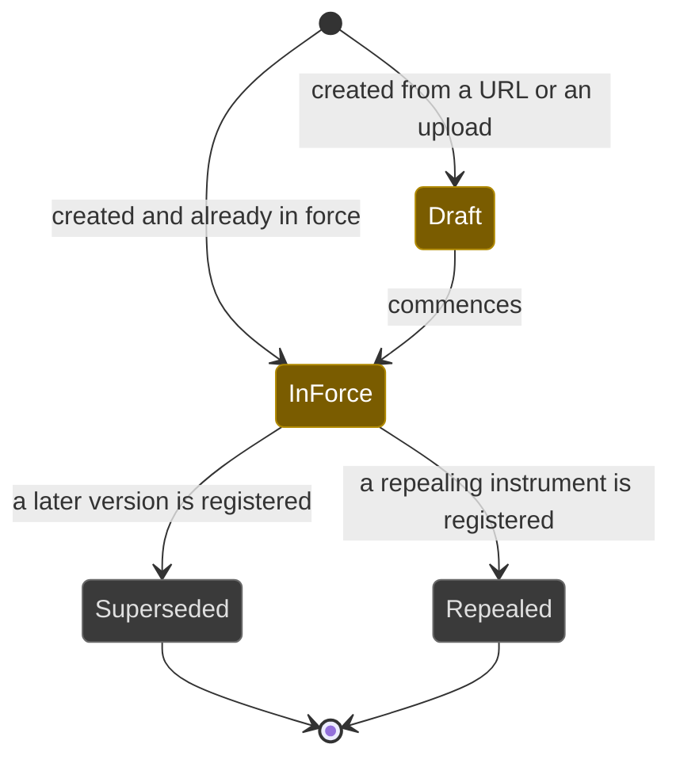
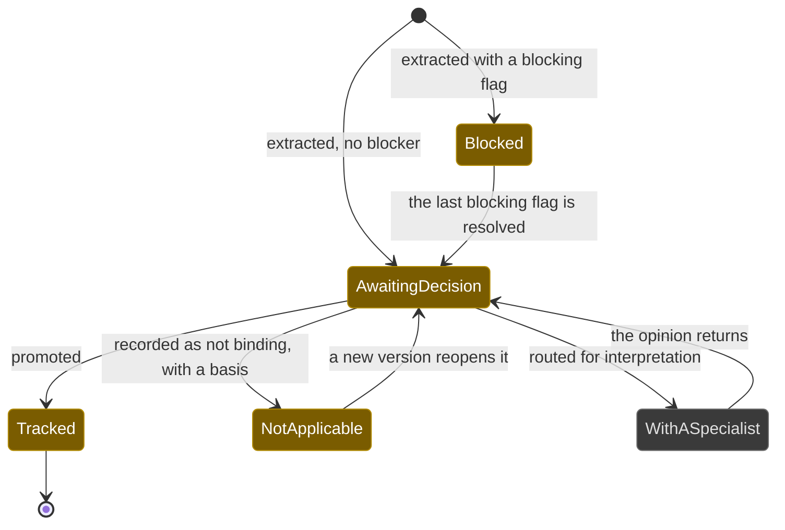
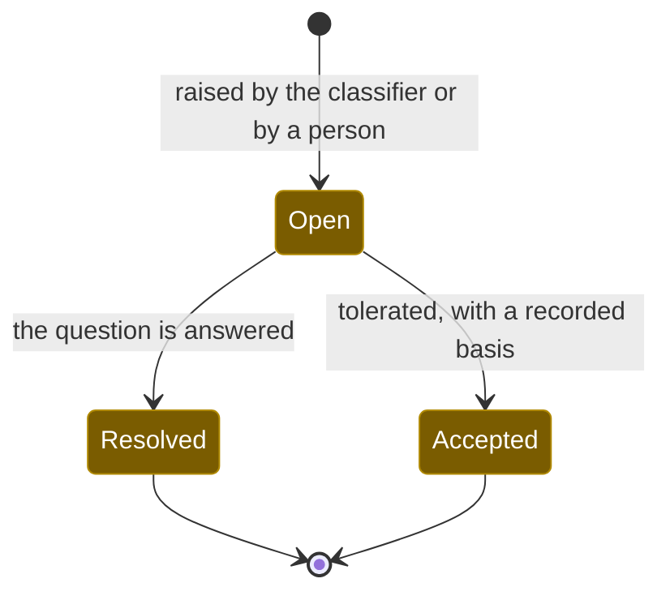
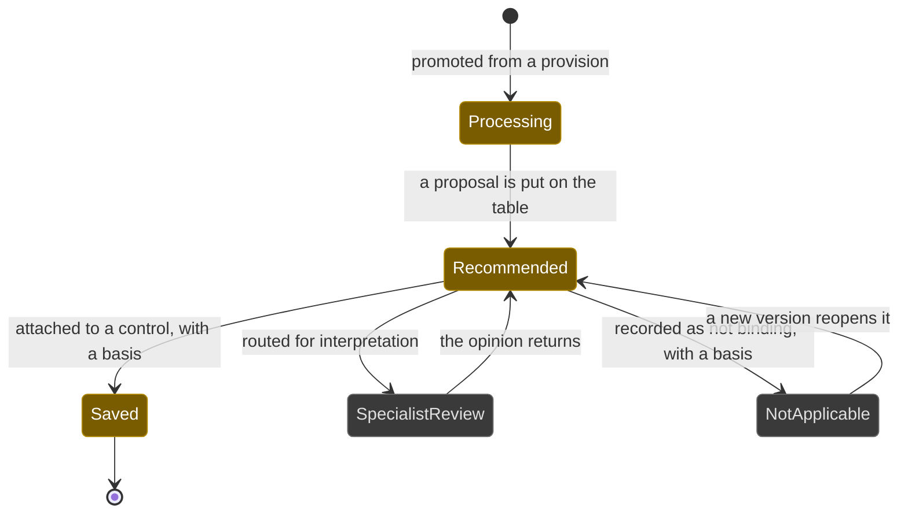

# Workflows: source

Generated by Prototype to Product Kit v2.1 · 2026-08-27
Last updated: 2026-08-27

**Module** [[M-02]] · **Index** [[workflows]] · **Matrix** [[traceability]]

**Where this is built** [[SLICE-06]], [[SLICE-07]], [[SLICE-08]], [[SLICE-09]], [[SLICE-10]], [[SLICE-11]]

**Screens it drives** SCR-053 to SCR-058, SCR-086, SCR-103, in [[screen-inventory#1. Screens]]

**Entities it moves** listed on [[M-02]], defined in [[data-model#1. Entities]]

**Rules that span entities** [[workflows#3. Explicitly illegal moves that span entities]] ·
**derived states** [[workflows#2. Derived states, displayed and never stored]] ·
**chasing** [[workflows#5. Time-driven behaviour]]

---

## Source instrument

**What this entity is for.** An instrument is the legal artifact a firm is bound
by: an act, a set of rules, a regulation, a circular, a notification, a
direction or a standard. It exists so that every duty in the platform can be
traced back to the exact words that created it (FRD §5.1, §5.2).

### States

| ID | Label shown to user | Meaning | Terminal |
|---|---|---|---|
| INS-S1 | In force | Binding now | no |
| INS-S2 | Draft | Issued for consultation, not yet binding | no |
| INS-S3 | Superseded | Replaced by a later version, and kept readable | yes |
| INS-S4 | Repealed | No longer law | yes |

### Transitions

| ID | From | To | Trigger | Who may | Must be true first | State change | Side effects | Audit | API write | In prototype |
|---|---|---|---|---|---|---|---|---|---|---|
| INS-T1 | n/a | Draft or In force | A person supplies a name and URL, or uploads a document | Compliance Manager in Compliance and Company Secretarial | The document is retrievable or uploaded, and the entry method is recorded | Instrument created | Document stored by content hash; extraction starts; the assigned departments gain visibility | `instrument.create` naming actor, entry method and source | `POST /instruments` | LIVE via `pnpm ingest` |
| INS-T2 | Draft | In force | The instrument's effective date passes, or a person confirms commencement | Compliance Manager in Compliance and Company Secretarial | `effectiveFrom` is set | `status` | Its provisions become decidable | `instrument.commence` | `POST /instruments/:id/commence` | NOT PRESENT |
| INS-T3 | In force | Superseded | A later version is registered against it | Compliance Manager in Compliance and Company Secretarial | The superseding instrument exists | `status`, and an instrument relation of kind `supersedes` | The supersession banner appears on both; prior clause decisions stay bound to the prior version and are never carried forward | `instrument.supersede` naming both ids | `POST /instruments/:id/supersede` | SIMULATED, the fields exist and no action sets them |
| INS-T4 | In force | Repealed | A repealing instrument is registered | Compliance Manager in Compliance and Company Secretarial | The repealing instrument exists | `status` | Duties deriving from it are surfaced for review, never auto-retired | `instrument.repeal` | `POST /instruments/:id/repeal` | NOT PRESENT |
| INS-T5 | any | any | Re-extraction detects the source text has changed under a promoted clause | System | A stored `textHash` no longer matches | `textDriftedAt` on each affected clause | The decision stands and its basis is flagged for re-reading | `clause.textDrift` | internal, on re-ingest | LIVE, the columns and the check exist |

### Explicitly illegal moves

| ID | The move | Why refused |
|---|---|---|
| INS-I1 | Carrying a superseded version's clause decisions forward to the new version | A decision made about different words is not a decision about these words. `BR-LFC-02` |
| INS-I2 | Deleting an instrument that a clause, control or duty cites | Provenance survives. `BR-LNK-10` |
| INS-I3 | Creating an instrument from outside Compliance and Company Secretarial | Deciding that a body of law binds the firm is that function's accountability. `BR-AUT-02` |

### Diagram

---

## Source provision

**What this entity is for.** A provision is every numbered thing the extractor
found in an instrument, held faithfully, whether or not it binds the firm. It
exists so the tracked register stays clean: a statute is mostly machinery, and
only the duties are promoted (FRD §5.1, §5.2, `BR-AI-03`).

### States

Provisions carry no stored state. The position is derived from three timestamps,
so a provision cannot be in two decided states at once.

| ID | Label shown to user | Meaning | Terminal |
|---|---|---|---|
| PRV-S1 | Awaiting decision | Classified, no decision recorded | no |
| PRV-S2 | Blocked | Carries at least one unresolved blocking flag, so it cannot be promoted | no |
| PRV-S3 | With a specialist | Routed for external legal interpretation | no |
| PRV-S4 | Tracked | Promoted into a clause | yes for this version |
| PRV-S5 | Not applicable | Recorded as not binding the firm, with a basis | no, it reopens on a new version |

### Transitions

| ID | From | To | Trigger | Who may | Must be true first | State change | Side effects | Audit | API write | In prototype |
|---|---|---|---|---|---|---|---|---|---|---|
| PRV-T1 | n/a | Awaiting decision or Blocked | Extraction and classification complete | System | The instrument's text layer produced segments | `classification`, `classifierConfidence`, `dutyBearer`, `bindsUs`, `features`, `classifiedAt` | Flags raised for every reason a human eye is needed | `provision.classify` naming the classifier, its version and its ruleset hash | internal, on ingest | LIVE |
| PRV-T2 | Blocked | Awaiting decision | A person resolves a blocking flag | Compliance Manager or Analyst in Compliance and Company Secretarial | The flag is open | `resolvedAt`, `resolution`, `resolutionNote` and, where the answer is another provision, `resolvedByProvisionId` | The provision becomes promotable if it was the last blocker | `clause.resolveFlag` | `POST /provisions/flags/:flagId/resolve` | LIVE |
| PRV-T3 | Awaiting decision | Tracked | The person promotes it | Compliance Manager in Compliance and Company Secretarial | `classification` is Duty, `bindsUs` is yes, no unresolved blocking flag | `promotedAt`, `promotedById`; a clause is minted with a `SRC` identifier and the text hash | The clause enters the pipeline; the proof chain resolves both ways | `provision.promote` naming actor and provision | `POST /provisions/:id/promote` | LIVE |
| PRV-T4 | Awaiting decision | Not applicable | The person records that it does not bind the firm | Compliance Manager in Compliance and Company Secretarial | A reason is supplied | `notApplicableAt`, `notApplicableById`, `notApplicableReason` | Nothing is created. The negative decision is what an inspector asks about | `provision.notApplicable` with the reason | `POST /provisions/:id/not-applicable` | LIVE |
| PRV-T5 | Awaiting decision | With a specialist | The person routes it for external interpretation | Compliance Manager in Compliance and Company Secretarial | n/a | `specialistEngagedAt`, `specialistEngagedById` | The engagement, the brief, the opinion and its cost are tracked outside the platform today | `provision.engageSpecialist` | `POST /provisions/:id/engage-specialist` | LIVE for the request; the engagement itself is `NOT PRESENT` |
| PRV-T6 | With a specialist | Awaiting decision | The opinion returns | Compliance Manager in Compliance and Company Secretarial | An opinion is recorded | `specialistEngagedAt` cleared, the opinion held as the decision basis | The specialist advises, the accountable person decides | `provision.specialistReturned` | `POST /provisions/:id/specialist-opinion` | SIMULATED, the prototype's `completeSpecialist` sets a note in memory |
| PRV-T7 | Not applicable | Awaiting decision | A new version of the instrument arrives | System | The instrument is superseded and the provision reappears | The new version's provision is a new record at Awaiting decision | The prior decision stays bound to the prior version | `provision.classify` on the new record | internal, on re-ingest | NOT PRESENT |

### Explicitly illegal moves

| ID | The move | Why refused |
|---|---|---|
| PRV-I1 | Promoting a provision with an unresolved blocking flag | You cannot track a duty you cannot date, whose applicability you cannot determine, or whose text you do not trust. `BR-AI-03` |
| PRV-I2 | Promoting a provision classified as anything other than Duty | The register exists to hold what binds the firm. Machinery, definitions and powers are kept, linked and searchable, and never chased |
| PRV-I3 | Recording not applicable with no reason | A negative decision is still a decision. `BR-LFC-09` |
| PRV-I4 | Paraphrasing the extract into `verbatimText` | An auditor tests the artifact. Verbatim means verbatim |

### Diagram

---

## Provision flag

**What this entity is for.** A flag is a recorded reason a provision needs a
human eye, with an owner and a due date rather than a permanent badge. It exists
because the extractor is honest about what it cannot decide (FRD §5.2, `BR-AI-03`).

### States

| ID | Label shown to user | Meaning | Terminal |
|---|---|---|---|
| FLG-S1 | Open | Raised, unresolved. Blocking flags prevent promotion | no |
| FLG-S2 | Resolved | The question was answered, usually by linking the provision that answers it | yes |
| FLG-S3 | Accepted | Deliberately tolerated, with a recorded basis | yes |

### Transitions

| ID | From | To | Trigger | Who may | Must be true first | State change | Side effects | Audit | API write | In prototype |
|---|---|---|---|---|---|---|---|---|---|---|
| FLG-T1 | n/a | Open | Classification detects one of the seven kinds | System | The provision exists | Flag created; `blocking` set from the kind, never by the raiser | The provision reads Blocked where the flag blocks | `provision.flag` | internal, on ingest | LIVE |
| FLG-T2 | n/a | Open | A person raises one by hand | Compliance Manager or Analyst in Compliance and Company Secretarial | n/a | Flag created with `raisedBy = person` | Same | `provision.flag` | `POST /provisions/:id/flag` | NOT PRESENT |
| FLG-T3 | Open | Resolved | The person answers the question | Compliance Manager or Analyst in Compliance and Company Secretarial | A note, or a resolving provision, is supplied | `resolvedAt`, `resolvedById`, `resolution`, `resolutionNote`, `resolvedByProvisionId` | The provision becomes promotable if this was the last blocker | `clause.resolveFlag` | `POST /provisions/flags/:flagId/resolve` | LIVE |
| FLG-T4 | Open | Accepted | The person tolerates it, with a basis | Compliance Manager in Compliance and Company Secretarial | A basis is supplied | Same fields, `resolution = Accepted` | Toleration is never silent | `clause.resolveFlag` with the basis | same endpoint | LIVE |

### Explicitly illegal moves

| ID | The move | Why refused |
|---|---|---|
| FLG-I1 | Setting `blocking` on a flag by hand | It is set from the kind so it cannot be argued away |
| FLG-I2 | Resolving a flag with no note and no resolving provision | The resolution is the record of what the answer was |

### Diagram

---

## Source clause

**What this entity is for.** A clause is a provision a person has accepted as
binding the firm, frozen against the words in force when the decision was taken.
It is the atomic unit the whole product hangs off: work, proof, accountability
and consequence all attach here (FRD §3, §5.1).

### States

| ID | Label shown to user | Meaning | Terminal |
|---|---|---|---|
| CLS-S1 | Processing | Minted, no proposal on the table yet | no |
| CLS-S2 | Recommended | A proposal is on the table and a decision is owed | no |
| CLS-S3 | Saved | Attached to a control and tracked | yes for this version |
| CLS-S4 | Specialist review | Routed for external legal interpretation | no |
| CLS-S5 | Not applicable | Recorded as not binding, with a basis | no, it reopens on a new version |

### Transitions

| ID | From | To | Trigger | Who may | Must be true first | State change | Side effects | Audit | API write | In prototype |
|---|---|---|---|---|---|---|---|---|---|---|
| CLS-T1 | n/a | Processing | The parent provision is promoted | Compliance Manager in Compliance and Company Secretarial | The provision is promotable | Clause minted with a `SRC` identifier, the verbatim snapshot and its hash | The proof chain gains a node | `provision.promote` | `POST /provisions/:id/promote` | LIVE |
| CLS-T2 | Processing | Recommended | The assistant proposes which existing control already covers it | System | The clause exists | `state` | The proposal is displayed as a proposal, with a confidence indicator and the basis it rests on | `clause.recommend` naming the run | internal | SIMULATED, the prototype's recommendation is scripted |
| CLS-T3 | Recommended | Saved | The person attaches the clause to an existing control | Compliance Manager in Compliance and Company Secretarial | The control exists | `state`, `decidedAt`, `decidedById`, `decisionBasis`; a control-clause link | The control lists the clause among those it satisfies, grouped by act; a rejected recommendation stays on the record | `clause.save` naming actor, clause, control and basis | `POST /clauses/:id/control` | LIVE |
| CLS-T4 | Recommended | Saved | The person creates a new control from the clause | Compliance Manager in Compliance and Company Secretarial | A title and an owner are supplied | Same, plus a new control inheriting the clause's frequency | Creating a control is a first-class path, not a fallback | `control.create` then `clause.save` | `POST /clauses/:id/control` | LIVE |
| CLS-T5 | Recommended | Specialist review | The person routes it for external interpretation | Compliance Manager in Compliance and Company Secretarial | n/a | `state` | The engagement is tracked outside the platform today | `clause.specialist` | `POST /clauses/:id/specialist` | SIMULATED at the clause tier; LIVE at the provision tier |
| CLS-T6 | Specialist review | Recommended | The opinion returns | Compliance Manager in Compliance and Company Secretarial | An opinion is recorded | `state`, the opinion held as the basis | The specialist advises; the accountable person then decides | `clause.specialistReturned` | `POST /clauses/:id/specialist-opinion` | SIMULATED |
| CLS-T7 | Recommended | Not applicable | The person records that it does not bind the firm | Compliance Manager in Compliance and Company Secretarial | A basis is supplied | `state`, `decidedAt`, `decidedById`, `decisionBasis` | Nothing is created | `clause.notApplicable` with the basis | `POST /clauses/:id/not-applicable` | LIVE at the provision tier |
| CLS-T8 | Not applicable | Recommended | A new version of the instrument arrives | System | The instrument is superseded | The new version's clause is a new record | The prior decision stays visible through the supersession link | `clause.recommend` on the new record | internal | NOT PRESENT |

### Explicitly illegal moves

| ID | The move | Why refused |
|---|---|---|
| CLS-I1 | Editing the verbatim text of a saved clause | The clause freezes the words the decision was taken on. Re-extraction sets a drift flag instead |
| CLS-I2 | Saving a clause to a control from outside Compliance and Company Secretarial | `BR-AUT-02` |
| CLS-I3 | Deleting a clause that a control, duty or piece of evidence cites | `BR-LNK-10` |
| CLS-I4 | Moving from Processing straight to Saved | The proposal and its rejection are part of the record. An assistant whose bad suggestions disappear cannot be assessed. `BR-AI-05` |

### Diagram

