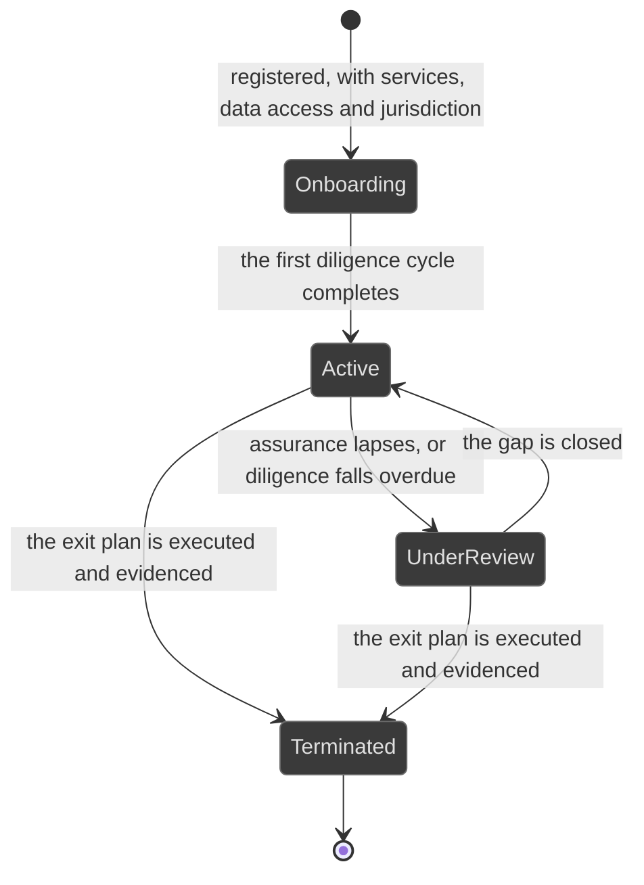
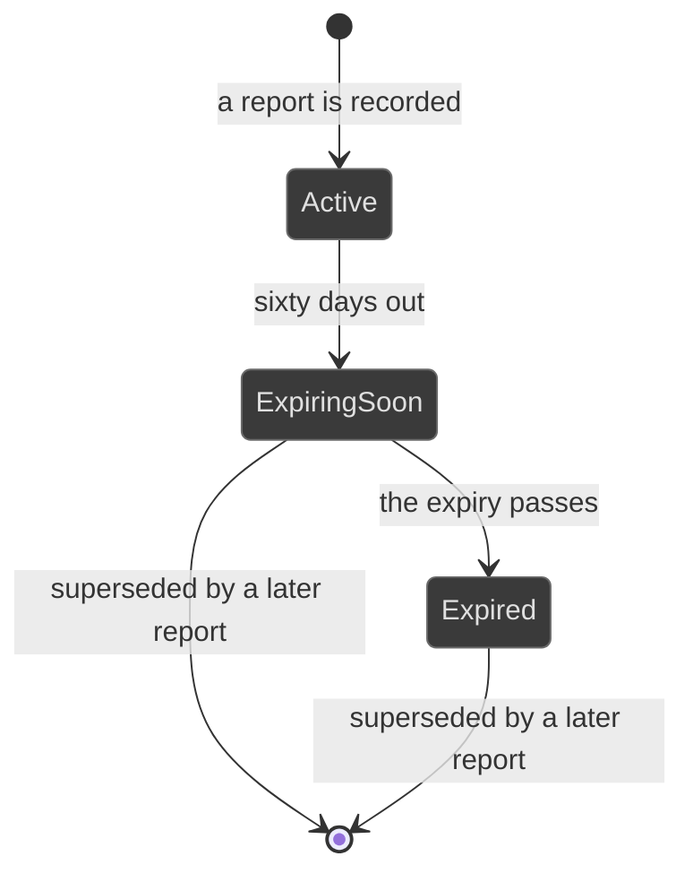

# Workflows: third party

Generated by Prototype to Product Kit v2.1 · 2026-08-27
Last updated: 2026-08-27

**Module** [[M-12]] · **Index** [[workflows]] · **Matrix** [[traceability]]

**Where this is built** [[SLICE-34]]

**Screens it drives** SCR-028, SCR-029, in [[screen-inventory#1. Screens]]

**Entities it moves** listed on [[M-12]], defined in [[data-model#1. Entities]]

**Rules that span entities** [[workflows#3. Explicitly illegal moves that span entities]] ·
**derived states** [[workflows#2. Derived states, displayed and never stored]] ·
**chasing** [[workflows#5. Time-driven behaviour]]

---

## Third party

**What this entity is for.** A third party is an outsourcing or supply
arrangement the firm remains accountable for. The register's job is to make the
exposure of an arrangement a computed fact rather than an opinion, so that
nobody can type Low next to a material outsourcing whose assurance lapsed two
years ago (FRD §5.19).

### States

| ID | Label shown to user | Meaning | Terminal |
|---|---|---|---|
| VND-S1 | Onboarding | Registered, diligence not yet complete | no |
| VND-S2 | Active | In service, with diligence current | no |
| VND-S3 | Under review | Something is wrong: assurance lapsed, diligence overdue, or a diligence cycle is running | no |
| VND-S4 | Terminated | The arrangement has ended and the exit was evidenced | yes |

### Transitions

| ID | From | To | Trigger | Who may | Must be true first | State change | Side effects | Audit | API write | In prototype |
|---|---|---|---|---|---|---|---|---|---|---|
| VND-T1 | n/a | Onboarding | The owner registers the arrangement | Risk Manager, Compliance Manager, Control Owner | Services and their criticality, the classes of personal data touched, jurisdiction, sub-outsourcing, the right to audit and the data-processing agreement are supplied | Arrangement created | The tier is derived immediately, and every point of it is attributed | `vendor.register` | `POST /vendors` | SIMULATED |
| VND-T2 | Onboarding | Onboarding | The owner records the independent assurance held | The relationship owner | A kind, a reference, an issue date and an expiry are supplied | Assurance record created | The tier moves. Assurance expiry is chased on a sixty-day horizon | `vendor.assurance` | `POST /vendors/:id/assurance` | SIMULATED |
| VND-T3 | Onboarding | Onboarding | The owner documents and tests the exit plan | The relationship owner | For a material arrangement, a documented plan and a test date are required | `exitPlanDocumented`, `exitPlanTestedOn` | The tier moves. A material service with no tested exit plan raises a queue item | `vendor.exitPlan` | `POST /vendors/:id/exit-plan` | SIMULATED |
| VND-T4 | Onboarding | Active | The first diligence cycle completes | Risk Manager, Compliance Manager | A diligence campaign task on this arrangement is Approved | `state`, `lastDueDiligenceOn` | The next diligence is scheduled by the arrangement's cadence and chased on the ladder | `campaign.review` naming the arrangement | `POST /campaigns/:id/tasks/:taskId/approve` | SIMULATED |
| VND-T5 | Active | Under review | Assurance lapses, or diligence falls overdue | System | The latest-expiring report has expired, or `nextDiligenceOn` has passed | none stored; the derived state moves | The tier rises automatically; the owner is chased; the arrangement appears in the Risk Committee's concentration view | `vendor.underReview` with the system as actor | internal | NOT PRESENT |
| VND-T6 | Under review | Active | A diligence cycle completes, or current assurance is recorded | Risk Manager, Compliance Manager | The gap is closed | `lastDueDiligenceOn` or a new assurance record | The tier falls; the diligence clock resets | `campaign.review` or `vendor.assurance` | as above | SIMULATED |
| VND-T7 | Active or Under review | Terminated | The exit plan is executed and evidenced | Risk Manager, Compliance Manager, Executive | The exit was tested against its documented steps and the evidence is attached | `state` | The arrangement leaves the live register and keeps its history | `vendor.terminate` naming the exit evidence | `POST /vendors/:id/terminate` | NOT PRESENT |
| VND-T8 | any | any | Several material services depend on one provider | System | More than one material service names the same provider | none | The register surfaces the concentration, because a per-vendor risk view misses the systemic one | `vendor.concentration` | internal | SIMULATED, computed in the browser |

### Explicitly illegal moves

| ID | The move | Why refused |
|---|---|---|
| VND-I1 | Typing a tier over the derived one | A register that lets someone type Low next to a material outsourcing with lapsed assurance is the thing this avoids. `BR-DRV-03` |
| VND-I2 | Presenting a tier without its attributed drivers | Attribution is what lets the tier be argued with rather than merely believed. `BR-DRV-03` |
| VND-I3 | Chasing assurance expiry on the seven-day window a control exception gets | An annual instrument needs a renewal in motion months before a short-lived deviation does. Sixty days. `BR-ESC-07` |
| VND-I4 | Marking an arrangement below material while it carries a material service | The mismatch is itself the finding, because it means the arrangement is escaping the diligence and exit obligations that go with materiality. `BR-DRV-03` |
| VND-I5 | Terminating without evidencing the exit | The exit plan exists precisely so the exit can be shown to have worked. §5.19 |

### Diagram

---

## Third-party assurance

**What this entity is for.** An assurance record is one independent report the
firm relies on: its type, its reference, when it was issued and when it expires.
Its currency is what the tier reads, so an expired report cannot sit quietly
behind a low tier (FRD §5.19 step 2).

| ID | Label shown to user | Meaning | Terminal |
|---|---|---|---|
| ASU-S1 | Active | In force | no |
| ASU-S2 | Expiring soon | Inside the sixty-day window before expiry | no |
| ASU-S3 | Expired | Past its expiry | yes |

All three are derived from the expiry date. None is stored.

| ID | Trigger | Who may | Must be true first | State change | Side effects | Audit | API write | In prototype |
|---|---|---|---|---|---|---|---|---|
| ASU-T1 | The owner records a report | The relationship owner | A kind, a reference, an issue date and an expiry are supplied | Record created | The tier recomputes. The report itself belongs in the evidence vault | `vendor.assurance` | `POST /vendors/:id/assurance` | SIMULATED |
| ASU-T2 | Sixty days before expiry | System | n/a | none stored | The owner is chased on the ladder pointed at the expiry | `reminder.fire` | internal | SIMULATED |
| ASU-T3 | The expiry passes | System | n/a | none stored | The arrangement's tier rises and it moves to Under review | `vendor.assuranceLapsed` | internal | NOT PRESENT |
| ASU-T4 | The owner records qualifications carried in the report | The relationship owner | n/a | `qualifications` | A qualified report is not a clean one, and the tier reads it as such | `vendor.assurance` | same | SIMULATED |

| ID | Illegal move | Why refused |
|---|---|---|
| ASU-I1 | Storing the expiry state | `BR-DRV-08` |
| ASU-I2 | Treating the newest report as the one in force | The one in force is the latest expiring. §7.2 |
| ASU-I3 | Recording a report with no evidence item behind it | The report is the artifact an auditor tests. `BR-EVD-07` |

